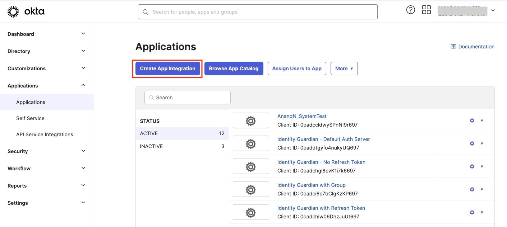
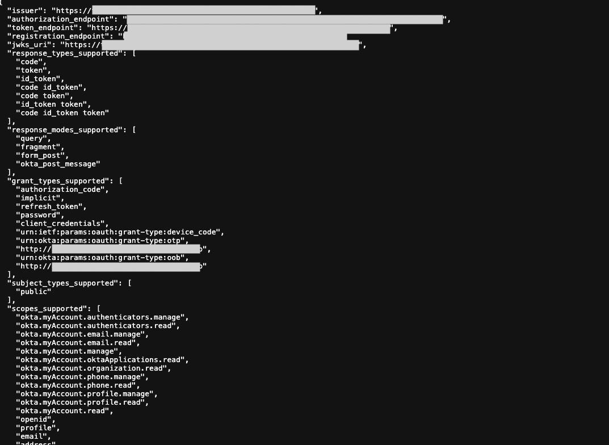

## Overview

Install and configure **Identity Guardian** via [Zebra DNA Cloud](/zebradna) (My Apps > Zebra Collection), [Zebra StageNow,](/stagenow) or your organization's own Enterprise Mobility Management (EMM) system. Administrators establish usage policies and controls for Identity Guardian via [Managed Configurations](../mc/). This enables companies to personalize device restrictions and access.

Through [Zebra DNA Cloud's](../usage/#zdnacloud) dashboard, administrators gain insight into user activities such as sign-in/sign-out events and usage durations, promoting user accountability.

Identity Guardian simplifies application authentication by integrating with your organization's identity provider (IdP). It enables [single sign-on (SSO)](#sso) where users only need to log in once and it handles subsequent application log-ins, streamlining the process.

**Notes:**

- **Identity Guardian, being an application that must be sideloaded, is _not_ operational when the device is started in safe mode.** Therefore, Zebra discourages administrators from starting devices in safe mode. To disable safe mode, apply the corresponding XML through your EMM or scan the relevant barcode using the StageNow client on the device. The XML and StageNow barcode are made available depending on your Android version:
  - For Android 11, download <a href="./safe-mode-A11.zip" download>here.</a>
  - For Android 13, download <a href="./safe-mode-A13.zip" download>here.</a>
- **When using the 42Gears EMM system,** apps installed via Zebra DNA Cloud in app update mode must be set as high priority.

---

## Requirements

**Identity Guardian requirements:**

- Zebra devices running **Android 11 or higher** are supported. See [Zebra Support Portal](https://www.zebra.com/us/en/support-downloads/software/utilities/identity-guardian.html) for the supported devices.
- For **biometric authentication,** a front-facing camera is required on the device
- **Licenses:**
  - An **Identity Guardian license** is required for advanced features including facial biometric authentication, Single Sign-On (SSO) support and device API support. See [Licensing](../licensing/).
  - Zebra Professional-series devices require a **[Mobility DNA Enterprise license](/licensing)** for basic functionality
- **An Enterprise Mobility Management (EMM) system, such as [Zebra DNA Cloud](/zebradna) or a third party system, that supports Managed Configurations (also known as Managed App Configurations)** is required to configure Identity Guardian on the device.
- After installation on the device, **Identity Guardian _must_ be launched for the configurations to be applied.**
- **Single sign-on (SSO) support:** Compatibility with Microsoft Entra ID (formerly Azure Active Directory) and PingID platforms using OAUTH and OAUTH+OIDC authentication protocols.
<!-- - **Single sign-on (SSO) support:** Compatibility with Microsoft Entra ID (formerly Azure Active Directory), PingID and OKTA platforms using OAUTH and OAUTH+OIDC authentication protocols. -->

---

## Download

Download and install Identity Guardian from the [Zebra support portal](https://www.zebra.com/us/en/support-downloads/software/utilities/identity-guardian.html).

---

## EMM

Deploy and configure Identity Guardian on devices using an Enterprise Mobility Management (EMM) system, such as [Zebra DNA Cloud](/zebradna) or a third party system, which supports Managed Configurations.

<i class="fa fa-exclamation-triangle" style="color:#FFA500;"></i> After installation, Identity Guardian _must_ be launched for the configurations to take effect.

The EMM system may offer the option to auto-launch the app. If this option is not available, the following commands may be used to launch Identity Guardian:

- For Android, such as from another app, use this command:

        adb shell am start -n com.zebra.mdna.els/com.zebra.mdna.els.userEnrollment.activity.EnrollmentActivity

- For an EMM, such as VMware Workspace ONE UEM (AirWatch), use this command to launch via intent:

        mode=explicit,broadcast=false,action=android.intent.action.MAIN,package=com.zebra.mdna.els,class=com.zebra.mdna.els.userEnrollment.activity.EnrollmentActivity

 

**Generic procedure to setup Identity Guardian using an EMM:**

1. **Enroll the devices to the EMM.**
2. **Upload the [Identity Guardian APK](https://www.zebra.com/us/en/support-downloads/software/utilities/identity-guardian.html) to the EMM,** for example via Android Enterprise or the EMM's App Store. _Make sure to auto-launch the app after installation._
3. **Create a new application policy to configure the appropriate Identity Guardian settings.** Consider the following:
   - **For _shared devices,_** create two distinct profiles:
     - **Enrollment -** This is required when implementing facial biometrics. It generates unique user barcodes for authentication. To configure this, go to **Usage Mode > Application Mode** and select **Enrollment.**
     - **Authentication -** This configures the authentication methods for users to sign into the device. To configure this, go to **Usage Mode > Application Mode** and select **Authentication.**
   - **For _personally assigned devices,_** a single profile encompasses both enrollment and authentication configurations. To configure this, go to **Usage Mode > Application Mode** and select **Personally Assigned.**
4. **Assign and apply the application policy to the devices.** For _shared devices,_ apply the Enrollment profile first.
5. For enrollment, **follow the steps on the device to proceed through user enrollment.** These steps are based on the Enrollment Configuration settings from step 3.
   - For _shared devices,_ refer to [shared device user enrollment](../usage/#userenrollment).
   - For _personally assigned devices,_ refer to [personl device user enrollment](../usage/#userenrollment-1).
6. **For _shared devices,_ create the Authentication policy and apply this policy to the devices.** For _personally assigned devices,_ skip to step 7.
7. After device enrollment, **the Identity Guardian authentication screen is displayed.** The user is now ready to sign into the device based on Authentication Configuration settings from step 3. Refer to [Device Sign In](../usage/#devicesignin).

In the following subsections, video demonstrations are available tailored for specific EMMs.

### Zebra DNA Cloud

This section provides video demonstrations to guide through the process of setting up Identity Guardian, in this case on a shared device, using the Zebra DNA Console.

For shared devices, two separate configuration profiles can be created based on the **Application Mode** selected under the **Usage Mode** section:

- **Enrollment -** Use this mode if facial biometrics is utilized to create unique user barcodes for authentication.
- **Authentication -** This configures the authentication methods employed for users to sign into the device.

**This first video guides through the process of creating and deploying an enrollment profile, specifically for a _shared device._** Learn how to define configurations for a user's first-time enrollment, including registering facial features, obtaining user role data, setting up a pin code, and more.

<iframe width="560" height="315" src="https://www.youtube.com/embed/q_ip86rQzak?si=PFDRNZOgWAFS74HG" title="YouTube video player" frameborder="0" allow="accelerometer; autoplay; clipboard-write; encrypted-media; gyroscope; picture-in-picture; web-share" referrerpolicy="strict-origin-when-cross-origin" allowfullscreen></iframe>

**Note:** For _personally assigned devices,_ select **Personally Assigned** from **Application Mode** under the **Usage Mode** section. This creates a profile encompaassing both enrollment and authentication configurations.

 

**This second video walks through the process of creating and deploying an authentication profile, specifically for a _shared device._** It guides through the process of establishing configurations for user authentication each time a user signs into the device. These configurations include scanning a barcode, setting up SSO, defining the passcode, among others. The enrollment profile, created from the previous video, can be used as a template to modify and create this authentication profile.

<iframe width="560" height="315" src="https://www.youtube.com/embed/F_ogf0akWks?si=XdFBH_Lw_AA6zfnL" title="YouTube video player" frameborder="0" allow="accelerometer; autoplay; clipboard-write; encrypted-media; gyroscope; picture-in-picture; web-share" referrerpolicy="strict-origin-when-cross-origin" allowfullscreen></iframe>

**This video demonstrates various scenarios of user device authentication.** In this example, one group of authentication settings is applied to a _shared device_ with the following configurations:

- **Comparison source:** Barcode
- **Primary authentication:** SSO
- **Secondary authentication:** Passcode
- **Fallback authentication:** Admin bypass passcode

<iframe width="560" height="315" src="https://www.youtube.com/embed/SGTOuzPMF-k?si=4DsWxyzL8LPi5ZvC" title="YouTube video player" frameborder="0" allow="accelerometer; autoplay; clipboard-write; encrypted-media; gyroscope; picture-in-picture; web-share" referrerpolicy="strict-origin-when-cross-origin" allowfullscreen></iframe>

### SOTI MobiControl

This video guides through the process of setting up Identity Guardian using SOTI MobiControl, specifically for _shared devices._ It provides a guide to deploy the Identity Guardian APK file, automatically launch the app, create and apply an enrollment profile, as well as create and apply an authentication profile for _shared devices._

<iframe width="560" height="315" src="https://www.youtube.com/embed/FPuqEzwKtII?si=WJhC9CVXr2nNypxG" title="YouTube video player" frameborder="0" allow="accelerometer; autoplay; clipboard-write; encrypted-media; gyroscope; picture-in-picture; web-share" referrerpolicy="strict-origin-when-cross-origin" allowfullscreen></iframe>

**Note:** For _personally assigned devices,_ select **Personally Assigned** from **Application Mode** under the **Usage Mode** section. This creates a profile encompassing both enrollment and authentication configurations.

### 42Gears SureMDM

This videos walks through the process of setting up Identity Guardian using SureMDM by 42Gears, specifically for _personally assigned devices._ It provides a guide to deploy the Identity Guardian APK file, automatically launch the app, and create a policy to configure the desired settings for enrollment and authentication on _personally assigned devices._

<iframe width="560" height="315" src="https://www.youtube.com/embed/nZvkedIM3yM?si=qilQeoHclssDjoHW" title="YouTube video player" frameborder="0" allow="accelerometer; autoplay; clipboard-write; encrypted-media; gyroscope; picture-in-picture; web-share" referrerpolicy="strict-origin-when-cross-origin" allowfullscreen></iframe>

**Note:** For _shared devices,_ create two separate configuration profiles according to the selected **Application Mode** under the **Usage Mode** section:

- **Enrollment -** Use this mode if facial biometrics is utilized to create unique user barcodes for authentication.
- **Authentication -** This configures the authentication methods employed for users to sign into the device.

---

## SSO

Identity Guardian integrates with identity providers (IdPs) simplifying authentication by only requiring users to log in once, and then leveraging single sign-on (SSO) to streamline the process. This single login grants users to gain access to multiple applications, eliminating the need to keep track of multiple logins for each app.

Supported identity providers:

- [Microsoft Entra ID](#microsoftentraid)
- [PingID](#pingid)
<!-- * [Okta](#okta) -->

For authenticating users with SSO, the Microsoft Authenticator and Custom Chrome Tabs are supported to communicate with SSO as the broker.

See [SSO Requirements](#requirements).

### Microsoft Entra ID

This section provides guidance to integrate Identity Guardian with Microsoft Entra ID (formerly Azure Active Directory):

&nbsp;&nbsp;&nbsp;&nbsp;&nbsp;[I. Register Zebra Identity Guardian](#iregisterzebraidentityguardian) 
&nbsp;&nbsp;&nbsp;&nbsp;&nbsp;[II. Configure SSO for Shared Devices](#iiconfiguressoforshareddevices) 
&nbsp;&nbsp;&nbsp;&nbsp;&nbsp;[III. Configure Microsoft Authenticator App](#iiiconfiguremicrosoftauthenticatorapp) 
&nbsp;&nbsp;&nbsp;&nbsp;&nbsp;[IV. Configure Zebra Identity Guardian App](#ivconfigurezebraidentityguardianapp) 

 

#### I. Register Zebra Identity Guardian

**To establish a trust relationship between Identity Guardian and the Microsoft identity platform, register Zebra Identity Guardian** as an Android application in Microsoft Entra ID (IdP). _Consult Microsoft's documentation for guidance on registering an application with the Microsoft identity platform._

Please ensure to enter or select the following when registering Identity Guardian:

- For the supported account type, select "Single tenant."
  
- When configuring the Android app, enter the following:
  - **Package name:** com.zebra.mdna.els
  - **Signature hash:** KqmK9tYXpw+eW2lke7US3iG9EAQ=
    
- Download the code sample and save the file as `auth_config_single_account.json`. This will be used in a subsequent step to configure the app settings on the device.
  
   

#### II. Configure SSO for Shared Devices

**If Microsoft Authenticator is used for single sign-on (SSO) on shared devices, it is possible to integrate a third-party device compliance partner solution with Microsoft Intune.** This allows for the collection of device compliance data in conjunction with Intune's own compliance results. The combined data can be used to formulate access policies, providing enhanced protection for your organization and its data. Examples of third-party device compliance partners include solutions such as SOTI MobiControl, VMware Workspace ONE UEM (formerly AirWatch), and others. _Consult your EMM or Microsoft's documentation for guidance on adding a third-party device compliance partner in Intune._

 

#### III. Configure Microsoft Authenticator App

**For optimal use of shared device mode with SSO through Microsoft Authenticator, ensure the Microsoft Authenticator app is installed on the devices.** This facilitates automatic SSO single sign-in and single sign-out across apps on the device.

To install and configure Microsoft Authenticator app:

1.  Download and install the Microsoft Authenticator app from Google Play via an EMM, such as SOTI MobiControl or VMware Workspace ONE UEM.
2.  In the EMM, enable **Shared Device Mode** and enter the **Shared Device Mode Tenant Identifier** (obtained from the Microsoft Entra ID).

    

    _SOTI MobiControl Managed App Config_

     

#### IV. Configure Zebra Identity Guardian App

**To enable user access to the device through SSO, install and set up Identity Guardian on the devices:**

1. Deploy and install Zebra Identity Guardian app on the devices.
2. Launch the app using an EMM. _This step must be performed at least once._
3. Enter the [Managed Configuration](../mc) settings for the app via your EMM:

   - Select the application mode:
     - **Application Mode:** Authentication
       
       _zDNA Cloud Managed Config_
   - Configure the Verification Setup to validate the user access:

     - **Primary Authentication Factor:** SSO
     - **Secondary Authentication Factor:** [Select FACE, PASSCODE, SSO or NONE]
     - **Fallback Authentication Factor:** [Select FACE, PASSCODE, NONE, SSO or ADMIN BYPASS PASSCODE]
     - **Primary Authentication Timeout:** [Enter value in ms, e.g. "300000"]
     - **Fallback Authentication Timeout:** [Enter value in ms, e.g. "300000"]
       
       _zDNA Cloud Managed Config_

   - Configure the Lock-screen Event options:
     - **On Unlock:**
       - **Verification Setup:** [Enter the desired authentication scheme, e.g. "Verification Setup1"]
     - **On Reboot:**
       - **Verification Setup:** [Enter the desired authentication scheme, e.g. "Verification Setup1"]
     - **On AC power connected:**
       - **Verification Setup:** [Enter the desired authentication scheme, e.g. "Verification Setup1"]
     - **On AC power disconnected:**
       - **Verification Setup:** [Enter the desired authentication scheme, e.g. "Verification Setup1"]
     - **On device manual check in:**
       - **Verification Setup:** [Enter the desired authentication scheme, e.g. "Verification Setup1"]
     - **On user change:** - **Verification Setup:** [Enter the desired authentication scheme, e.g. "Verification Setup1"]
       
       _zDNA Cloud Managed Config_
   - Configure the SSO Authentication Configuration for the app to communicate with Microsoft SSO to authenticate the user:
     - **Single Sign On Provider:** Microsoft
     - **Authentication Protocol:** OAuth 2.0 (OIDC)
     - **Scope:** [Enter the string based on the SSO server settings]
     - **Configuration Settings:** [Enter the following string, but replace "client_id" and "authority_url" with your values from `auth_config_single_account.json` file downloaded from step I.]
       <pre class="prettify">
          <code>
               {
                   "client_id" : "[ENTER YOUR CLIENT ID]",
                   "authorization_user_agent" : "DEFAULT",
                   "redirect_uri" : "msauth://com.zebra.mdna.els/KqmK9tYXpw%2BeW2lke7US3iG9EAQ%3D",
                   "account_mode" : "SINGLE",
                   "broker_redirect_uri_registered": true,
                   "shared_device_mode_supported": true,
                   "authorities" : [
                       {
                           "type": "AAD",
                           "authority_url": "[ENTER YOUR AUTHORITY URL]"
                       }  
                   ]
               }
          </code>
       </pre>
       
       _zDNA Cloud Managed Config_

4. If mapping the SSO response to application-specific roles, enter the following (see [Managed Configurations](../mc) for more information):
   - **Configuration Role Identification -** Enables the recognition and mapping of the Single Sign-On (SSO) response to application-specific roles. Click **Add Role Identifier** as needed.
     - **Role Identifier -** Establishes links between roles in SSO responses and their corresponding roles within the Identity Guardian app.
       - **Identity Guardian Role Name -** Enter the Identity Guardian user role to be assigned based on SSO response during user sign-in
       - **Key-value Pair for Role Assignment -** Add one or more SSO key-value pairs to identify and map users to a predefined Identity Guardian user role. Click **Add SSO Key-Value Pair** as needed.
         - **SSO Key-Value Pair -** Choose whether the SSO response, which contains the user key and values, should be mapped to a corresponding user role in Identity Guardian
           - **SSO Key -** Enter the SSO key to map it to an Identity Guardian role.
           - **SSO Value -** Enter the SSO value(s) to map to the Identity Guardian role. Use commas to separate multiple entries.
             
             _zDNA Cloud Managed Config_
5. See [Managed Configurations](../mc) to configure any other non-SSO settings.
6. Deploy the Managed Configurations to the devices through your EMM.

When a device gets updated with the new configurations, Zebra Identity Guardian activates the lock screen. The user is then required to authenticate themselves using Single Sign-On (SSO) to gain access to the device. See [User Guide](../usage/) for more information.

---

### PingID

This section provides guidance to integrate Identity Guardian with PingID.

**To enable user access to the device through SSO, install and set up Identity Guardian on the devices:**

1. Deploy and install Zebra Identity Guardian app on the devices.
2. Launch the app using an EMM. _This step must be performed at least once._
3. Enter the [Managed Configuration](../mc) settings for the app via your EMM:
   - Select the application mode:
     - **Application Mode:** Authentication
       
       _zDNA Cloud Managed App Config_
   - Configure the Verification Setup to validate the user access:
     - **Primary Authentication Factor:** SSO
     - **Secondary Authentication Factor:** [Select FACE, PASSCODE, or NO_COMPARISON]
     - **Fallback Authentication Factor:** [Select FACE, PASSCODE, NONE, SSO or ADMIN BYPASS PASSCODE]
     - **Primary Authentication Timeout:** [Enter value in ms, e.g. "300000"]
     - **Fallback Authentication Timeout:** [Enter value in ms, e.g. "300000"]
       
       _zDNA Cloud Managed Config_
   - Configure the Lock-screen Event options:
     - **On Unlock:**
       - **Verification Setup:** [Enter the desired authentication scheme, e.g. "Verification Setup1"]
     - **On Reboot:**
       - **Verification Setup:** [Enter the desired authentication scheme, e.g. "Verification Setup1"]
     - **On AC power connected:**
       - **Verification Setup:** [Enter the desired authentication scheme, e.g. "Verification Setup1"]
     - **On AC power disconnected:**
       - **Verification Setup:** [Enter the desired authentication scheme, e.g. "Verification Setup1"]
     - **On device manual check in:**
       - **Verification Setup:** [Enter the desired authentication scheme, e.g. "Verification Setup1"]
     - **On user change:** - **Verification Setup:** [Enter the desired authentication scheme, e.g. "Verification Setup1"]
       
       _zDNA Cloud Managed Config_
   - Configure the SSO Authentication Configuration:
     - **Single Sign On Provider:** PingId
     - **Authentication Protocol:** OAuth 2.0 (OIDC)
     - **Scope:** openid email profile
     - **Userid Identifier:** [Specify the user key for identifying the signed-in user]
     - **Configuration Settings:** [Enter the specified string, but replace the following values with those from your own SSO response: logoutURL, revokeURL, tokenURL, authorizationURL, clientId, userInfoUrl]
       <pre class="prettify">
       <code>
       {
            "redirectURI" : "com.zebra.mdna.els:/loginComplete",
            "logoutURL" : "[enter your logout URL]",
            "revokeURL" : "[enter your revoke URL]",
            "tokenURL" : "[enter your token URL]",
            "authorizationURL" : "[enter your authorization URL]",
            "clientAuthType" : 0,
            "clientId" : "[enter your clientID]",
            "certificatePhrase" : "",
            "userInfoUrl" : "[enter your userInfo URL]",
            "certificate" : ""
       }
       </code>
       </pre>
       
       _zDNA Cloud Managed App Config_
4. If mapping the SSO response to application-specific roles, enter the following (see [Managed Configurations](../mc) for more information):
   - **Configuration Role Identification -** Enables the recognition and mapping of the Single Sign-On (SSO) response to application-specific roles. Click **Add Role Identifier** as needed.
     - **Role Identifier -** Establishes links between roles in SSO responses and their corresponding roles within the Identity Guardian app.
       - **Identity Guardian Role Name -** Enter the Identity Guardian user role to be assigned based on SSO response during user sign-in
       - **Key-value Pair for Role Assignment -** Add one or more SSO key-value pairs to identify and map users to a predefined Identity Guardian user role. Click **Add SSO Key-Value Pair** as needed.
         - **SSO Key-Value Pair -** Choose whether the SSO response, which contains the user key and values, should be mapped to a corresponding user role in Identity Guardian
           - **SSO Key -** Enter the SSO key to map it to an Identity Guardian role.
           - **SSO Value -** Enter the SSO value(s) to map to the Identity Guardian role. Use commas to separate multiple entries.
             
             _zDNA Cloud Managed Config_
5. See [Managed Configurations](../mc) to configure any other non-SSO settings.
6. Deploy the Managed Configurations to the devices through your EMM.

When a device gets updated with the new configurations, Zebra Identity Guardian activates the lock screen. The user is then required to authenticate themselves using Single Sign-On (SSO) to gain access to the device. See [User Guide](../usage/) for more information.

<!--
### Okta

This section provides guidance to integrate Identity Guardian with Okta.

&nbsp;&nbsp;&nbsp;&nbsp;&nbsp;[I. Register Zebra Identity Guardian](#registerzebraidentityguardian-2) 
&nbsp;&nbsp;&nbsp;&nbsp;&nbsp;[II. Configure Zebra Identity Guardian App](#iiconfigurezebraidentityguardianapp) 
 

#### I. Register Zebra Identity Guardian

1. In the Okta web portal, create a new application. From the left menu, select **Applications > Applications.** Click on **Create App Integration.**
    
2. Select **OIDC,** then select **Native Application.** Click **Next.**
    
3. Perform the following:
    - Enter the **App integration name.**
    - Select **Authorization Code** as the **Grant type.**
    - If needed, select **Refresh Token.** This option renews the access token every hour. Without it, the access token expires after an hour, resulting in a forced logout.
    - For **Sign-in redirect URIs** and **Sign-out redirect URIs,** enter the following: `com.zebra.mdna.els:/loginComplete`
    
4. Perform the following:
    - For **Controlled access,** select **Allow everyone in your organization to access.** Then select **Enable immediate access with Federation Broker Mode.**
    - Click **Save.**
    
5. If needed, add an authorization server from **Security > API.**
    
6. If needed, add scopes in the authorization server.
    
7. Add claims to the authorization server.
    
8. In the **Settings** tab of the authorization server, click to open the **Metadata URI.**
    
8. Metadata is displayed, similar to the following:
    
9. Record the following values needed in the next section:
    * authorizationScope
    * end_session_endpoint (logoutURL)
    * token_endpoint (tokenURL)
    * authorization_endpoint (authorizationURL)
    * userInfoUrl
    * revokeURL (revocation_endpoint)
 
 

#### II. Configure Zebra Identity Guardian App

**To enable user access to the device through SSO, install and set up Identity Guardian on the devices:**

1. Deploy and install Zebra Identity Guardian app on the devices.
2. Launch the app using an EMM. _This step must be performed at least once._
3. Enter the [Managed Configuration](../mc) settings for the app via your EMM:
   - Select the application mode:
     - **Application Mode:** Authentication
       
       _zDNA Cloud Managed Config_
   - Configure the Verification Setup to validate the user access:
     - **Primary Authentication Factor:** SSO
     - **Secondary Authentication Factor:** [Select FACE, PASSCODE, SSO or NONE]
     - **Fallback Authentication Factor:** [Select FACE, PASSCODE, NONE, SSO or ADMIN BYPASS PASSCODE]
     - **Primary Authentication Timeout:** [Enter value in ms, e.g. "300000"]
     - **Fallback Authentication Timeout:** [Enter value in ms, e.g. "300000"]
       
       _zDNA Cloud Managed Config_
   - Configure the Lock-screen Event options:
        - **On Unlock:**
            - **Verification Setup:** [Enter the desired authentication scheme, e.g. "Verification Setup1"]
        - **On Reboot:**
            - **Verification Setup:** [Enter the desired authentication scheme, e.g. "Verification Setup1"]
        - **On AC power connected:**
            - **Verification Setup:** [Enter the desired authentication scheme, e.g. "Verification Setup1"]
        - **On AC power disconnected:**
            - **Verification Setup:** [Enter the desired authentication scheme, e.g. "Verification Setup1"]
        - **On device manual check in:**
            - **Verification Setup:** [Enter the desired authentication scheme, e.g. "Verification Setup1"]
        - **On user change:** - **Verification Setup:** [Enter the desired authentication scheme, e.g. "Verification Setup1"]
        
       _zDNA Cloud Managed Config_
   - Configure the SSO Authentication Configuration for the app to communicate with Microsoft SSO to authenticate the user:
     - **Single Sign On Provider:** Okta
     - **Authentication Protocol:** OAuth 2.0 (OIDC)
     - **Scope:** [Enter the string based on the SSO server settings, e.g. "openid email profile offline_access"]
     - **Configuration Settings:** [Enter the following string, but replace "authorizationScope", "logoutURL", "tokenURL", "client_id", "authorizationURL", "userInfoUrl", and "revokeURL" with your values seen from Metadata URI from step I.]
       <pre class="prettify">
          <code>
            {
                "authorizationScope": "[enter the string based on the SSO server settings, e.g. "openid email profile offline_access"]",
                "redirectURI" : "com.zebra.mdna.els:/loginComplete",
                "logoutURL" : "[enter your logout URL]",
                "tokenURL" : "[enter your token URL]",
                "authorizationURL" : "[enter your authorization URL]",
                "clientAuthType" : 0,
                "clientId" : "[enter your client ID]",
                "certificatePhrase" : "",
                "userInfoUrl" : "[enter your userInfo URL]",
                "revokeURL" : "[enter your revoke URL]",
                "certificate" : "",
                "clientSecret":"",
                "enablePKCE": true
            }
          </code>
       </pre>
       
       _zDNA Cloud Managed Config_
4. If mapping the SSO response to application-specific roles, enter the following (see [Managed Configurations](../mc) for more information):
   - **Configuration Role Identification -** Enables the recognition and mapping of the Single Sign-On (SSO) response to application-specific roles. Click **Add Role Identifier** as needed.
     - **Role Identifier -** Establishes links between roles in SSO responses and their corresponding roles within the Identity Guardian app.
       - **Identity Guardian Role Name -** Enter the Identity Guardian user role to be assigned based on SSO response during user sign-in
       - **Key-value Pair for Role Assignment -** Add one or more SSO key-value pairs to identify and map users to a predefined Identity Guardian user role. Click **Add SSO Key-Value Pair** as needed.
         - **SSO Key-Value Pair -** Choose whether the SSO response, which contains the user key and values, should be mapped to a corresponding user role in Identity Guardian
           - **SSO Key -** Enter the SSO key to map it to an Identity Guardian role.
           - **SSO Value -** Enter the SSO value(s) to map to the Identity Guardian role. Use commas to separate multiple entries.
             
             _zDNA Cloud Managed Config_
5. See [Managed Configurations](../mc) to configure any other non-SSO settings.
6. Deploy the Managed Configurations to the devices through your EMM.

When a device gets updated with the new configurations, Zebra Identity Guardian activates the lock screen. The user is then required to authenticate themselves using Single Sign-On (SSO) to gain access to the device. See [User Guide](../usage/) for more information.
-->

---

### Secure Setup for Faster Logins

Identity Guardian can simplify Single Sign-On (SSO) logins by prompting users for SSO authentication only once, post device enrollment. For frequent situations like device lock, it offers efficient options like biometric or pin-based access, eliminating the need for repeated SSO logins. It maintains the original SSO session's integrity, ensuring exclusive user access and simultaneous logout from all apps, creating a secure and streamlined login process.

To implement this authentication strategy, follow the procedure below based on whether the device model is shared or personally assigned.

 

#### Shared Devices

Administrator setup - refer to [Managed Configurations](../mc/):

1. Set SSO authentication in the following managed configurations:
   - **Usage Mode**
     - **Application Mode:** Authentication
   - **Authentication Configuration**
     - **User Verification Methods**
       - **Verification Setup1:** [Select or enter all desired options and include SSO as one of the authentication factors.]
     - **Lock-screen Event Options**
       - **On user change:** [Select the verification that includes SSO authentication, e.g. Verification Setup1]
2. For the rest of the following **Lock-screen Event Options,** select the verification that does _not_ include SSO authentication, e.g. Verification Setup2 (includes face or passcode):
   - On Unlock
   - On Reboot
   - On AC Power Connected
   - On AC Power Disconnection
3. In **Authentication Configuration,** set the following to _false_ under **Force Logout Options:**
   - On Lock
   - On Reboot
   - On AC Power Connected
   - On AC Power Disconnected

End user authentication:

1. [Enroll the user.](../usage/#userenrollment) Make sure to enter the SSO user ID in the Employee ID field.
2. Once the enrollment process is complete, the user is required to authenticate themselves on the device by scanning their user barcode once.
   - If **the scanned barcode matches with the enrolled user,** the SSO session remains active. For subsequent logins, the user is prompted to authenticate via facial biometrics or user passcode, depending on the setup by the administrator.
   - If **the scanned barcode does _not_ match with the enrolled user,** it prompts for SSO credentials since an “On user change” event occurred. These SSO credentials remain active on the device.
3. After the user authenticates, the user is no longer required to re-enter their SSO credentials unless one of the following occurs:
   - The user logs out manually from the device
   - The user is automatically logged out of the device if any of the Force Logout Options are met from Authentication Configuration in the managed configurations.
   - The SSO session times out.

 

#### Personally Assigned Devices

Administrator setup - refer to [Managed Configurations](../mc/):

1. Set SSO authentication in the following managed configurations:
   - **Usage Mode**
     - **Application Mode:** Personally Assigned
   - **Authentication Configuration**
     - **User Verification Methods**
       - **Verification Setup1:** [Select or enter all desired options and include SSO as one of the authentication factors.]
     - **Lock-screen Event Options**
       - **On user change:** [Select the verification that includes SSO authentication, e.g. Verification Setup1]
2. For the rest of the following **Lock-screen Event Options,** select the verification that does _not_ include SSO authentication, e.g. Verification Setup2 (includes face or passcode):
   - On Unlock
   - On Reboot
   - On AC Power Connected
   - On AC Power Disconnection
3. In **Authentication Configuration,** set the following to _false_ under **Force Logout Options:**
   - On Lock
   - On Reboot
   - On AC Power Connected
   - On AC Power Disconnected

End user authentication:

1. [Enroll the user.](../usage/#userenrollment) Make sure to enter the SSO user ID in the Employee ID field.
2. Once the enrollment process is complete, the user is required to authenticate themselves on the device by facial biometrics or passcode entry once. If successful, the SSO session remains active.
3. After the user authenticates, the user is no longer required to re-enter their SSO credentials unless one of the following occurs:
   - The user logs out manually from the device
   - The user is automatically logged out of the device if any of the Force Logout Options are met from Authentication Configuration in the managed configurations.
   - The SSO session times out.

---

## See Also

- [About Identity Guardian](../about)
- [Licensing](../licensing/)
- [User Guide](../usage)
- [Managed Configurations](../mc)
- [APIs](../api/)
- [FAQ](../faq/)
