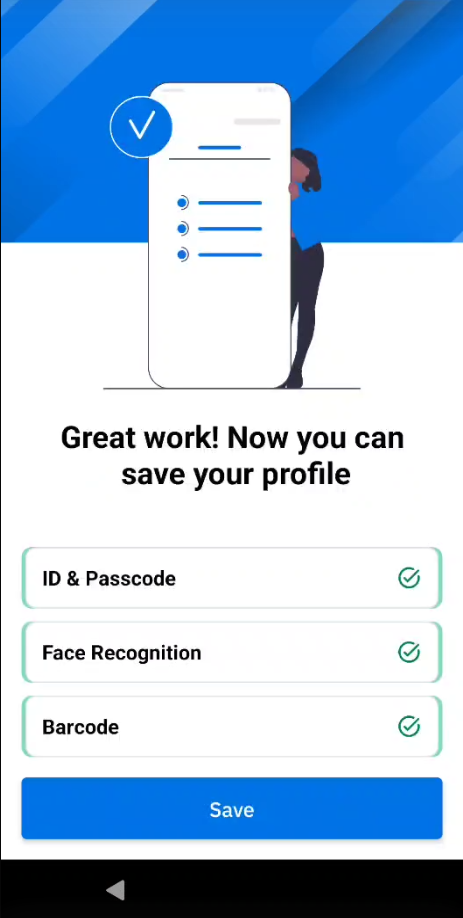
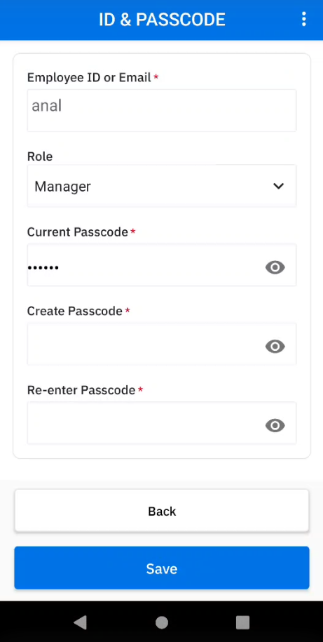
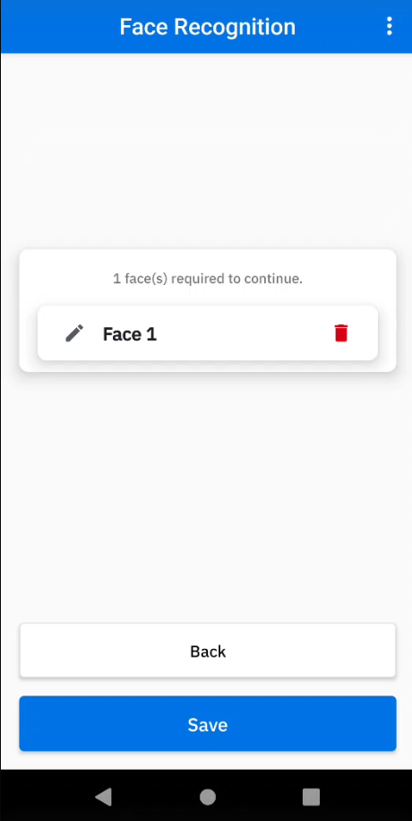
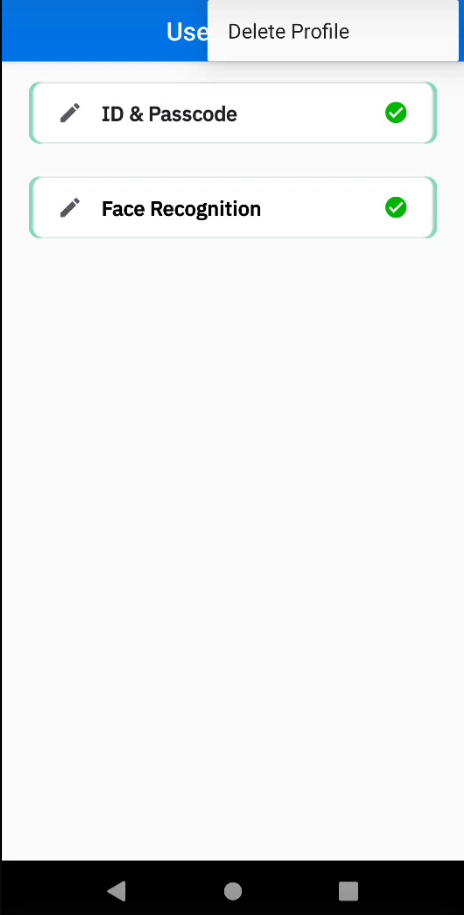

## Overview

Identity Guardian offers 2 types of models for secure and personalized device access:

- **[Shared Device](#shareddevice) -** A device that is designated for use by multiple individuals. User data is securely encrypted and encapsulated within a personal barcode, generated via facial recognition and can be easily discarded to erase personal data.
- **[Personally Assigned Device](#personallyassigneddevice) -** A device that is issued and allocated specifically to an individual for their dedicated use. User data is securely embedded within the Android framework, making it inaccessible even to the organization.

After the administrator [configures](../setup/#configuration) Identity Guardian, setup the user profiles based on the method of access. For users who opt into using facial biometrics, Identity Guardian provides Terms and Conditions to the user, which they must accept to use the biometric portion of the solution. The Terms & Conditions may be customized by the administrator through ZDNA.

---

## Shared Device

In **shared device** environments where multiple users share a single device, Identity Guardian ensures secure and personalized access. It simplifies the authentication process, granting users complete control over their data without storing personal information on the device or cloud. This is achieved by **providing each user with a unique, encrypted barcode that stores their personal data.** Furthermore, **for enhanced security, multifactor authentication can be configured, which could include a passcode, facial biometrics, and/or single sign-on (SSO).** Alternatively, SSO can be established as the primary authentication instead of issuing individual barcodes.

Shared devices are capable of recognizing an unlimited number of registered users. A user's predefined organizational role can be used to offer personalized experiences on shared devices. Each user's data is encrypted and stored within a unique barcode, located in the `/enterprise/usr/Profiles` folder, which the user can control. Users can simply discard the barcode to remove their personal data. Optionally, facial biometrics can be utilized to generate this barcode. For temporary user profiles, barcodes can be set to automatically expire at a specified date and time.

<i class="fa fa-exclamation-triangle" style="color:#FFA500;"></i> **Note:** If a user loses their barcode, it can only be retrieved from the device, from folder: `/enterprise/usr/Profiles`.

### User Enrollment

Before users can sign in or authenticate to the shared device, they are required to first register with Identity Guardian. The enrollment profile is created and deployed by administrators, who then launch Identity Guardian on the shared device. For more details, see [EMM Setup](../setup/#emm). Organizations can designate a specific device for user enrollment and may choose to guide the user through this initial setup. The options made available to users during the on-device enrollment process may differ, depending on the [Enrollment Configurations](../mc/#enrollmentconfiguration) set by the administrator.

To enroll users on shared devices:

1. In Identity Guardian, tap **Start.**
   
2. (Optional) This is a 6 digit PIN set by the administrator. Tap **Continue.**
   
3. Setup ID and passcode:
   - Enter ID or email
   - (Optional) Select the appropriate user role (options vary based on your adminstrator setup)
   - (Optional) Enter the expiration date for the barcode. This applies for temporary users.
   - Create a passcode based on the requirements set by the administrator.
   - Re-enter the passcode
     
4. (Optional) Capture facial biometrics. _If opting out, tap **Skip** and skip to step 7 below._ Otherwise, tap **Add** and continue with the subsequent steps.
   
5. Read the Terms & Conditions. Tap **Confirm** to accept.
   
6. Position your face within the device screen for the photo capture. Capture 1 to 3 facial photos that may vary based on the individual's look, for example, with eyeglasses, hat, etc. Confirm the photo capture(s). Tap **Add** to capture additional photos. Tap **Next** when done.
   
7. The barcode is generated. Tap **Next.**
   
8. Tap **Save** to save the profile.
   
9. Tap **Continue.** The enrollment profile creation is complete.
   

Upon completion of user enrollment on the shared device, the administrator proceeds to deploy the authentication profile, which enbles users to [sign into the device](../usage/#devicesignin).

---

## Personally Assigned Device

In **personally assigned device** environments where individual devices are assigned to specific users, these **users retain control over their encrypted personal data,** with the ability to delete it as needed. This is achieved by safeguarding user data with the Android framework - **the data is stored within Identity Guardian's isolated storage,** located within Android's access-controlled application platform. This ensures that even the organiztion itself cannot access the data.

Identity Guardian integrates with identity providers (IdPs) to streamline the authentication process. It uses the single sign-on (SSO) system, which requires users to authenticate just once. This system not only manages security but also simplifies the process, _allowing users to access multiple applications in a single log-in session._ **For enhanced security, administrators have the option to customize multifactor authentication settings, which could include a passcode, facial biometrics, and/or SSO.** In contrast to _shared devices,_ _personally assigned devices_ do not utilize barcodes.

<!-- Subsequent device unlocks, reboot, etc. requires user entry based on setup : PIN, facial recognition, etc. -->

### User Enrollment

Follow the instructions below for user enrollment:

1. Open **Identity Guardian.**
2. Tap **Start.**
   
3. Enter corporate PIN. This is a 6 digit PIN set by the administrator. Tap **Continue.**
   
4. Setup ID and passcode, then tap **Next.**
   - Enter ID or email
   - (Optional) Select the appropriate user role (options vary based on setup by your adminstrator)
   - Create a passcode, which can contain up to 6 alphanumeric characters.
   - Re-enter the passcode.
     
5. (Optional) Capture facial biometrics. _If opting out, tap **Skip** and skip to step 7 below._ Otherwise, tap **Add** and continue with the subsequent steps.
   
6. Read the Terms & Conditions. Tap **Confirm** to accept.
   
7. To add a facial photo, tap **Add.** Position your face within the device screen for the photo capture. Capture 1 to 3 facial photos that may vary based on the individual's look, for example, with eyeglasses, hat, etc. Confirm the photo capture(s). Tap **Add** to capture additional photos. Tap **Next** when done.
   
8. Tap **Save** to save the profile.
   
9. Tap **Continue.** The profile creation is complete.
   

### Edit Profile

To edit a profile on a personally assigned device:

1. Open Zebra Biometric app.
2. Enter your passcode.
   
3. Select the item to edit:
   - ID & Passcode
   - Face Recognition
     
4. If **ID & Passcode** is selected, make the appropriate edits and tap **Save:**
   - **Role -** select the desired role
   - **Passcode -** enter the current passcode and the new passcode
     
5. If **Face Recognition** is selected, delete the existing facial photo and replace it by capturing a new photo.
   

### Delete Profile

To delete a profile on a personally assigned device:

1. Open Zebra Biometric app.
2. Enter your passcode.
   
3. Tap on the menu icon at the top right and select **Delete Profile.**
   

After the profile is deleted, the enrollment screen appears to re-enroll the device and authenticate the user.

---

## Device Sign In

After a user is enrolled, the authentication screen is displayed on the device. This screen also appears based on the lock-screen event options defined by the administrator in the managed configurations. These options can be triggered from various events such as when a user signs out, locks or reboots the device.

To sign in a device, tap **Unlock.**

The device prompts the user to authenticate via the primary authentication method selected by the administrator, such as facial biometric or passcode entry. If the primary authentication method fails, the secondary authentication method is presented for the user to execute. Unlicensed devices present a passcode to be entered rather than requesting for a facial biometric.

**If Microsoft Authenticator app is in use,** perform the following after the user unlocks the screen:

1. The Microsoft Authenticator app is launched prompting for user authentication. Enter the login credentials:
<table>
    <tr>
        <td></td>
        <td>&nbsp;&nbsp;&nbsp;&nbsp;&nbsp;</td>
        <td></td>
    </tr>
</table>

2. After authentication is successful, the user gains access to the device.
3. When a user launches any app that utilizes Microsoft Authenticator app as broker, the app automatically signs in without prompting for user name or password.

### User Authentication Scenarios

**This video demonstrates various scenarios of user device authentication.** In this example, one group of authentication settings is applied to a _shared device_ with the following configurations:

- **Comparison source:** Barcode
- **Primary authentication:** SSO
- **Secondary authentication:** Passcode
- **Fallback authentication:** Admin bypass passcode

<iframe width="560" height="315" src="https://www.youtube.com/embed/SGTOuzPMF-k?si=4DsWxyzL8LPi5ZvC" title="YouTube video player" frameborder="0" allow="accelerometer; autoplay; clipboard-write; encrypted-media; gyroscope; picture-in-picture; web-share" referrerpolicy="strict-origin-when-cross-origin" allowfullscreen></iframe>

---

## Device Sign Out

Sign Out only applies to shared devices. To sign out a device, perform one of the following:

- Open Identity Guardian app (Zebra Biometric) and tap **Sign out.**
    
- Swipe down to open the notification drawer. From the Identity Guardian notification, tap **Sign Out.**
    
- Lock the device.
- Restart the device (if configured by the administrator).

After a device is signed out, the lock screen is visible:

---

## ZDNA Cloud

With the [Zebra DNA Cloud](/zebradna) platform, Identity Guardian provides administrators with visibility into user activities. This includes the ability to track who has signed in and out of devices, the security measures in place, usage times, and more. Additionally, administrators have the ability to expire users, reset PIN passcodes, and override screen locks.

For more information, see the [ZDNA Cloud](https://techdocs.zebra.com/zebradna/latest/usage/) documentation.

---

## See Also

- [About Identity Guardian](../about)
- [Licensing](../licensing/)
- [Setup](../setup)
- [Managed Configurations](../mc)
- [APIs](../api/)
- [FAQ](../faq/)
