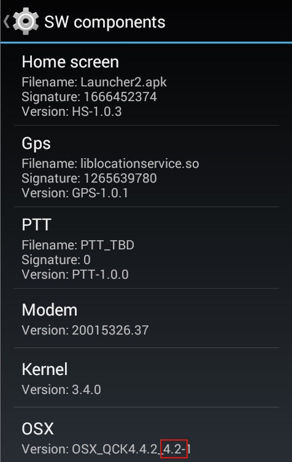

## Overview
The versions of MX and/or OSX on a device determine whether certain settings and/or features are supported. The Zebra-proprietary OSX layer provides extensions to the base operating system to implement functionality not offered by Android. **The root OSX version number always matches the root number of the Android version that it extends**. For example, OSX 4.x will always be found on devices running Android 4.x. 

The same is not always true of MX, which provides a uniform interface into privileged and unprivileged APIs on a variety of Android versions, but does not extend the OS. For some features, the Android version alone is enough to determine a feature set. For others, a specific pairing of MX and Android is required, and still others need a certain combination of MX and OSX. 

##### The MX/OSX version can be obtained: 

* [Manually using the Settings panel](#usingthesettingspanel) on the device (not fully supported pre-KitKat)
* [Programmatically using EMDK](#usingemdkforandroid) for Android
* [By submitting XML](#submittingxml) to the MX CSP through Zebra StageNow (or EMDK and Profile Manager)
* [Using ADB](#usingadb) to query a connected device from a PC or Mac 

-----

### Using the Settings Panel 
**The Settings panel of some devices running Android versions prior to KitKat 4.4 do not display MX and OSX information**. To determine the MX and/or OSX version present on such a device, one of the other procedures must be used. 

**To view MX and/or OSX versions using the Settings panel**: 

&#49;. In the Settings panel, **tap "About Device" (or Phone), then tap SW Components**. 

&#50;. **Locate MX in the list of components**.   

&#51;. **The left-most two digits** indicate the major and minor MX and OSX versions. 

_Settings panel showing OSX 4.4 and MX 4.4_
 

_Settings panel of a Zebra TC20 device showing OSX 7.1UL and MX 7.0_
 

**Note: On some devices, version information is returned in two groups of digits separated by an underscore (_) character. The numbers relevant to the version are those immediately <u>following</u> the underscore, as below**:

_This panel shows OSX 4.2 running Android Jelly Bean (kernel 3.4.0)_
 

-----

### Using EMDK For Android

Version numbers can be obtained programmatically through the `VersionManager` Android API in EMDK using the following Java code:

    :::java
    // Get an instance of VersionManager
    versionManager = (VersionManager) EMDKManager.getInstance(EMDKManager.FEATURE_TYPE.VERSION);
    
    // Use the getVersion method, passing in the version_Type.mx enum
    mxVersion = versionManager.getVersion(VERSION_TYPE.MX)
    
-----

### Submitting XML
System Administrators can obtain version numbers through Zebra's StageNow tools or a compatible mobile device management system by submitting the following XML to the `MX` CSP: 

    :::xml
	<wap-provisioningdoc>
		<characteristic type="MX">
			<parm-query name="Version"/>
		</characteristic>
	</wap-provisioningdoc>
    
 The result contains the MX version (which in this case is "4.4") returned in the `MXMFVersion` parameter shown below: 
 
 	:::XML
	<wap-provisioningdoc>
		<characteristic type="MX" version="4.4">
			<parm name="MXMFVersion" value="4.4.3.6"/>
		</characteristic>
	</wap-provisioningdoc>
    
-----

### Using ADB
The MX version can be obtained from a PC or Mac by querying a USB-connected device using the **adb shell command** shown below:

    $ adb shell getprop
    
The output must be filtered using `grep` or a similar tool. For Zebra-branded devices, use the string `ro.symbol.osx.version` in the grep argument, as shown below with the result:

    $ adb shell getprop | grep ro.symbol.osx.version
    [ro.symbol.osx.version]: [QC_OSX_4.4-3]

The result above shows **a device with MX 4.4**. The number following the hyphen ("-3") indicates the release number of the latest OS patch applied to the device.

For legacy Motorola Solutions-branded devices, use the string `ro.motosln.enterprise.version` in the grep argument, as shown below with the result:

    $ adb shell getprop | grep ro.motosln.enterprise.version
    [ro.motosln.enterprise.version]: [MX_TI4AJ.1.1_3.5.1-1]

The result above shows **a device with MX 3.5**. 

#### Other useful ADB shell commands: 

    // get the OSx version:
    getprep ro.symbol.osx.version 

    // get the OS build version:
    getprep ro.build.display.id 

    //get the OS build date: (helps determine build differences)
    getprep ro.build.version.date 

    //get the device model: 
    getprep ro.product.device

    //get the Android version:
    getprep ro.build.version.release

    //get the Android security patch level:
    getprep ro.build.version.security_patch

-----

Related Guides: 

* [EMDK for Android](../../../../emdk-for-android)
* [Setting up ADB](http://zebra-stage.github.io/enterprise-browser/1-6/guide/setup/#connections)
* [Zebra StageNow](../../../../stagenow)

