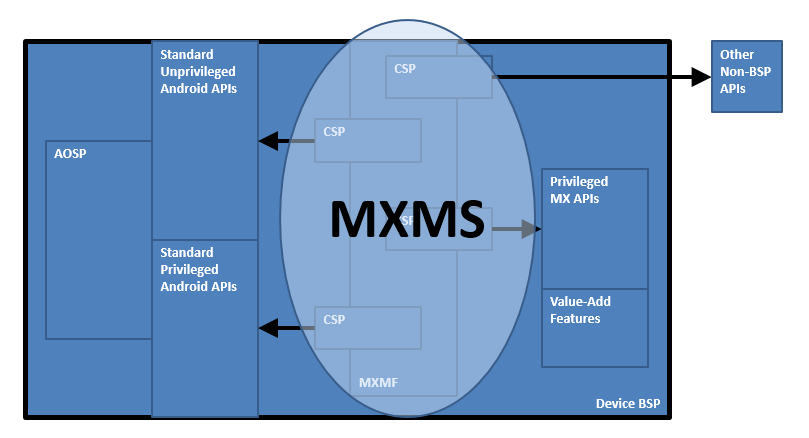

## Overview

The MX Management System (MXMS) is an XML-based communication framework that provides a common interface for managing the capabilities and behaviors of Zebra Android devices. The XML documents used by the framework conform to the [Open Mobile Alliance specification for Client Provisioning](http://www.openmobilealliance.org/wp/) (OMA-CP) and the Microsoft [MSPROV DTD format](https://msdn.microsoft.com/en-us/library/bb737266.aspx) on which it's based ([read more](http://www.advancedinstaller.com/user-guide/wince-winmobile-xmlprov.html)). The framework affords developers and administrators an extensible, efficient, reliable and scalable means to configure and administer devices in their organization. MXMS exposes capabilities provided by the underlying CSPs on a device, which provide uniform access to privileged and unprivileged APIs. Each CSP exposes its capabilities using DSD files included with the MDM Toolkit. A DSD tool, loaded with the DSD files for a particular device or set of devices, can generate XML code that when sent to the MXMS running on the device, can change the devices' configuration and/or behavior.

## Definition of Terms

### Android Open Source Project (AOSP)

AOSP is the method that Google uses to release and distribute the source code for the Android Operating System for royalty-free use by the open source community. OEMs are free to use, modify, and extend AOSP as needed, subject to certain standard licensing requirements. Each BSP for any of the Zebra Android devices includes an operating system that was derived--directly or indirectly--from AOSP. These BSPs also generally include modifications and/or enhancements beyond AOSP that provide additional value to Zebra customers.

### Board Support Package (BSP)

A BSP is the method used by Zebra device teams to deliver the operating system for Zebra devices. Every device ships with a specific BSP version--reported via the "Build number" field--pre-installed that is suitable for use on that device model. The BSP version that ships in devices of a particular model may or may not be updated when a new BSP becomes available for that device model. A BSP generally can be updated by downloading a newer (or sometimes older) BSP from the Zebra support website and applying it to the device via the OS Update Process for that device.

### Configuration Service Provider (CSP)

A CSP is a device code module that implements the ability to set and query the configuration of a subsystem on a device (e.g. Clock, Wi-Fi, etc.). The capabilities that are supported and exposed by a CSP are defined by a corresponding DSD. 

A CSP is a plug-in to the MXMF which can ship as part of the MXMF, be included in a BSP along with the MXMF, or be downloaded to a device as needed. Before it can be used on a device, a CSP must be registered with the MXMF on that device and all calls to a CSP must go through the MXMF. The MXMF and CSPs communicate through XML files that conform to the **XML.DTD**, as described in the **MX MF XML DTD** document.

### Document Type Definition (DTD)

A DTD is a standards-based non-XML document that defines the syntax of a class of related XML documents. It is used to specify the elements that are allowed to appear within all XML documents that are used for a specific purpose. 

The following DTDs are used by the MXMF:

* **XML.DTD** (described in the document **MX MF XML DTD**)
	* This DTD defines the syntax of XML Documents that can be consumed by CSPs that registered with the MXMF and that can be used to set and query the configuration of the device systems associated with those CSPs
* **DSD.DTD** (described in the document **MX MF DSD DTD**)
	* This DTD defines the syntax of DSD documents that are used to define the capabilities of CSPs

### Document Semantics Definition (DSD)

A DSD is an XML document that conforms to the **DSD.DTD** as described in the document **MX MF DSD DTD**, and that corresponds to and describes the capabilities of a CSP. It is used by tools to enable programmatic generation of XML that can then be consumed by a CSP. Some examples of these tools are EMDK Profile Manager, StageNow, and MDM Console.

A DSD is created and maintained by the author of a CSP and each CSP must have a corresponding DSD that must be supplied when the CSP registers with the MXMF. A CSP and its corresponding DSD should generally be produced, maintained, and distributed together.

### Mobility Extensions (MX)

MX is the umbrella term used to refer collectively to the entire experience offered by Zebra Android devices. This means that MX represents all the value that a BSP offers over and above that provided by AOSP, including:

* Changes and extensions to the Core Operating System (as implemented by OSX)
* Value-Add Features (i.e. Multi-User, Whitelisting)
* The MX Management Framework (MXMF)
* Configuration Service Providers (CSPs)
* Changes and extensions to standard applications (i.e. Settings UI, Browser, Email Client, etc.)

### MX Management Framework (MXMF)

MXMF is a device subsystem that provides an interface to applications that wish to set or query the configuration of device subsystems. It does not directly implement any set or query functions, but provides a framework that supports and hosts CSPs that do so. MXMF can be built into a BSP or can be added to a BSP after a device is shipped (via a patch applied via the OS update process). Applications and the MXMF communicate through an interchange of XML files that conform to the **XML.DTD**, as described in the **MX MF XML DTD** document.

### Operating System Extensions (OSX)

OSX is the term used to refer to a Zebra-proprietary implementation of changes and extensions to the standard AOSP as included in a BSP. The version of OSX in a device is the primary way to determine which changes and extensions are present in the operating system of that device. **The root OSX version number always matches the root number of the Android version that it extends**. For example, Android 5.x would always be extended by OSX 5.x. As a general rule, the version of OSX in a device can be changed ONLY by loading a different BSP (containing a different version of OSX) into that device using the OS update process. 

### MX Management System (MXMS)

MXMS is a term used to refer to the MXMF and all CSPs that are registered with the MXMF at a given point in time. It provides the ability to set and/or query the configuration of the device subsystems for which CSPs are registered with MXMF. Two types of CSPs are included:

* CSPs that are built into the MXMF, such as the CertMgr CSP
* CSPs that are built into a device and pre-registered with MXMF, such as the Wi-Fi CSP

MXMS can be thought of as "the MXMF and a collection of currently registered CSPs." Although applications submit XML to the MXMF, it is more accurate to describe the MXMS (not just the MXMF) as the entity through which applications set and/or query configuration settings.

>**Note:** All components described above may or may not be present on a device. Specifically, MXMF and the CSPs may be absent. Therefore, some or all of the components required for the device might need to be installed before they could be configured.

## MX Architecture and Data Flow

System components:

* MXMS
	* MXMF
	* CSPs
		* Unprivileged
		* Privileged
	* AOSP APIs
		* Unprivileged
		* Privileged
	* OSX APIs
		* Privileged
	* Core Applications

### Overview

### Android Device BSP

## MX on Devices

The MX version on a specific device can be effected by:

* OS Updates
* EMDK for Android Device Runtime Updates

While new CSPs can be introduced with each version of MX, and pre-existing CSPs can receive new capabilities, MX updates will not generally remove or change pre-existing behaviors or capabilities unless specifically noted.

-----

Related guides: 

* [Which version of MX/OSX is installed?](../mx-version-on-device)
