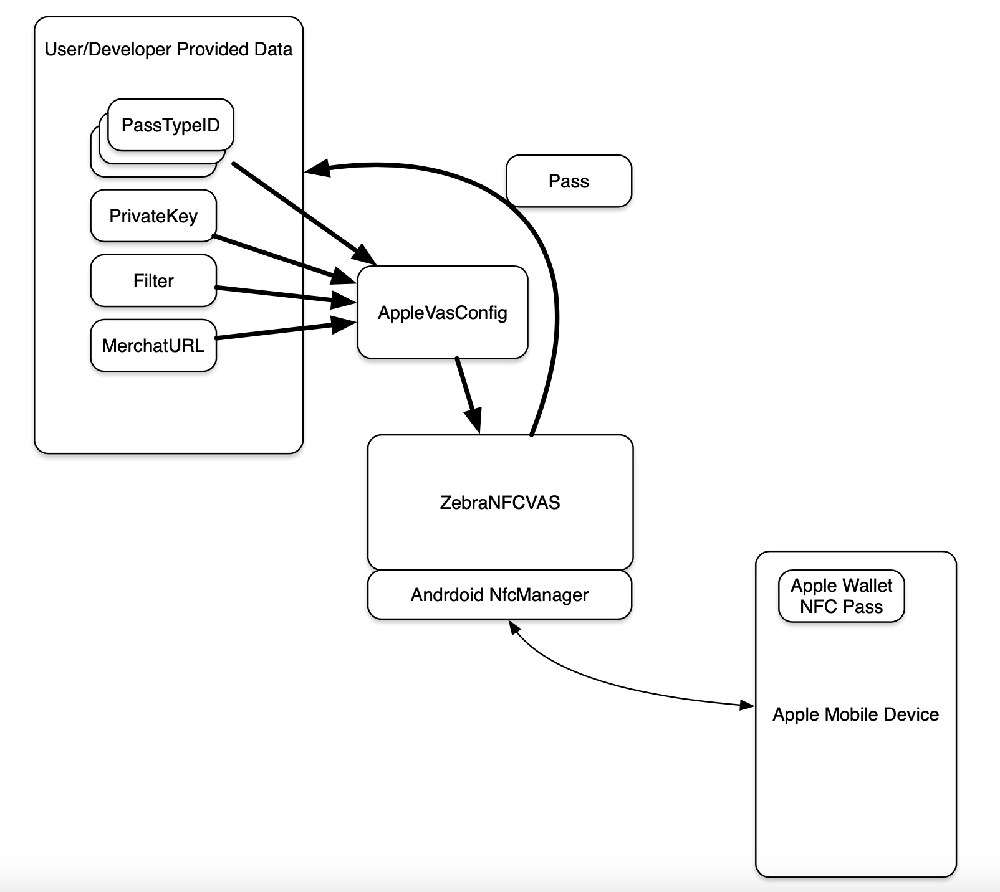

## Overview 

This section discusses how to read an Apple VAS pass

-----

## Prerequisites

At a minimum, the following information is required to read an Apple VAS pass:
* Pass Type ID - a reverse order dotted domain description of the pass owner (e.g. com.zebra.testpass)
* Private Key - if the pass is to be decrypted automatically by the SDK, then the private key must be provided. If it is not provided the payload returned will be encrypted.

**Note:** The MerchantId cannot be set, but can be read from the AppleVasConfig object. The MerchantId is simply the SHA256 of the PassTypeID.

-----

## Procedure

Implement the method onPassDetected(Pass pass). This method will receive the Pass object when a pass is actually read.

1. **Create an AppleVasConfig object -** This is the object that the SDK uses to know how to interact with a presented pass
2. **Set the appropriate configuration values into the AppleVasConfig object -**
    * Can do this in the constructor
    * Can alternatively use individual APIs to set up the configuration object
        * setPassTypeIds() 
        * setPrivateKey()
3. Create a ZebraNFCVAS object
4. **Set the AppleVasConfig object into the ZebraNFCVAS object.** This tells the SDK what configuration data to use during the pass reading process
5. **Call connectToReader() -** this establishes the connection with the NFC subsystem
6. **Call enableReadPassMode().** This turns off the card emulation and peer-to-peer functionality in the polling. It also configures the polling to only read the technology type we need.
7. **Wait for onPassDetected() to be called**
    * Process the pass data however the application needs
8. **Call disableReadPassMode() before going in to the background or ending the activity.** This returns the polling loop to the standard configuration.

-----

## Related Guides

