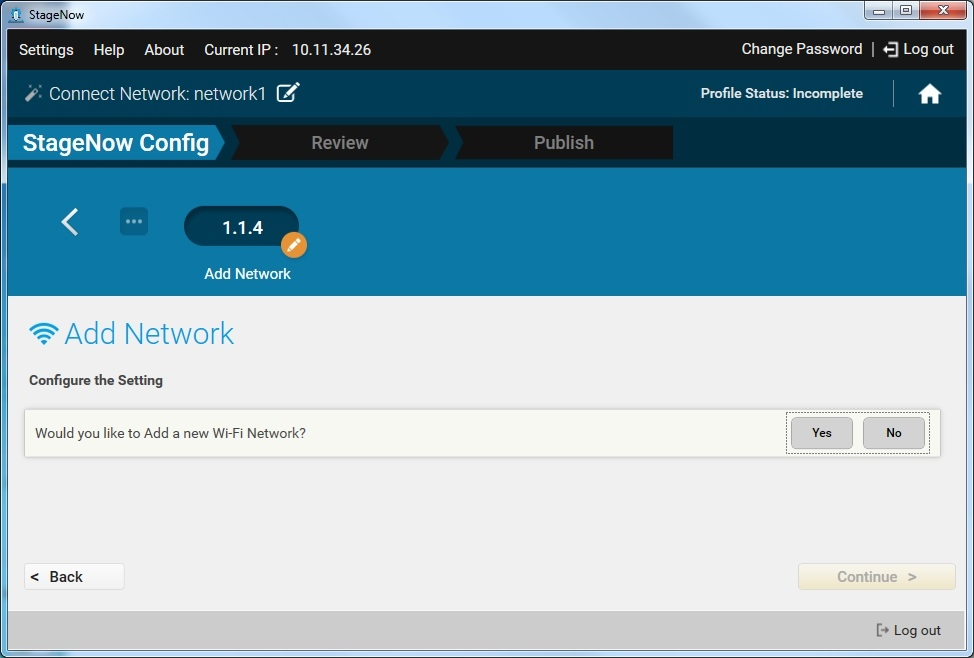
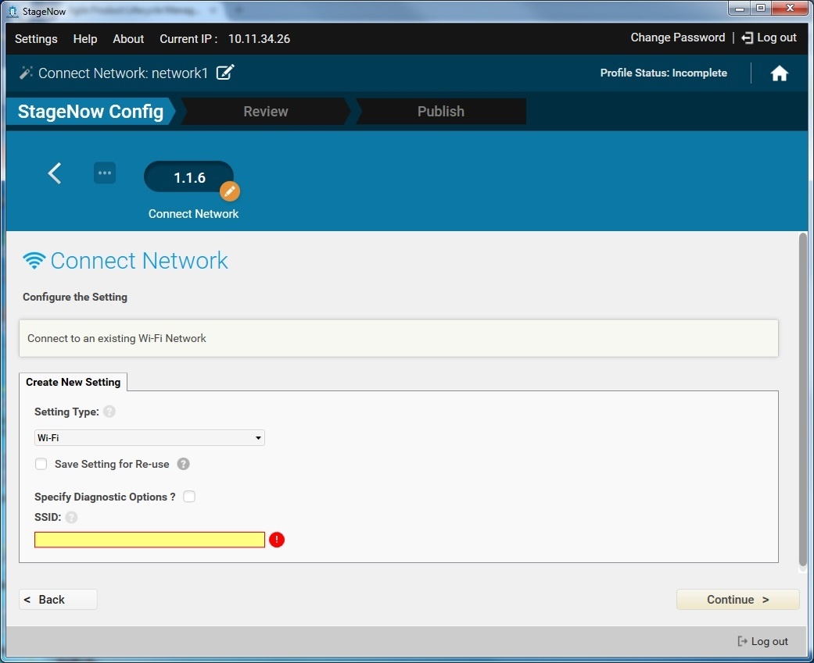
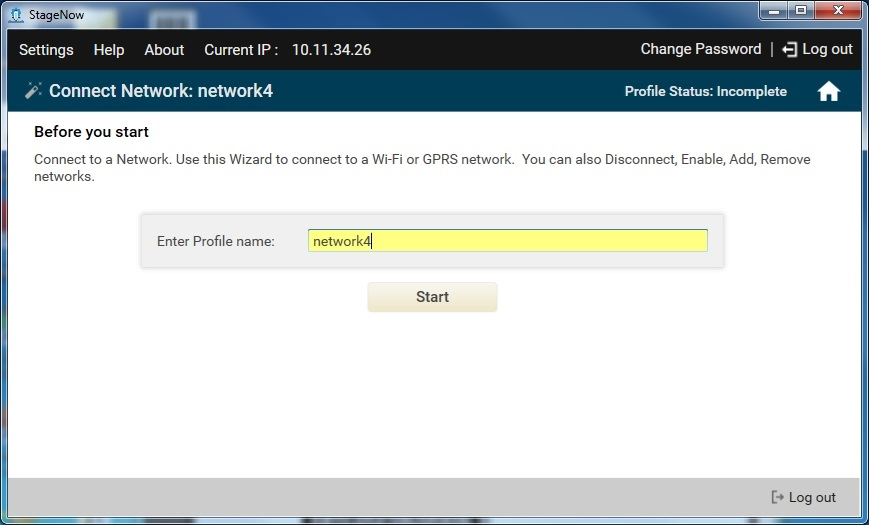
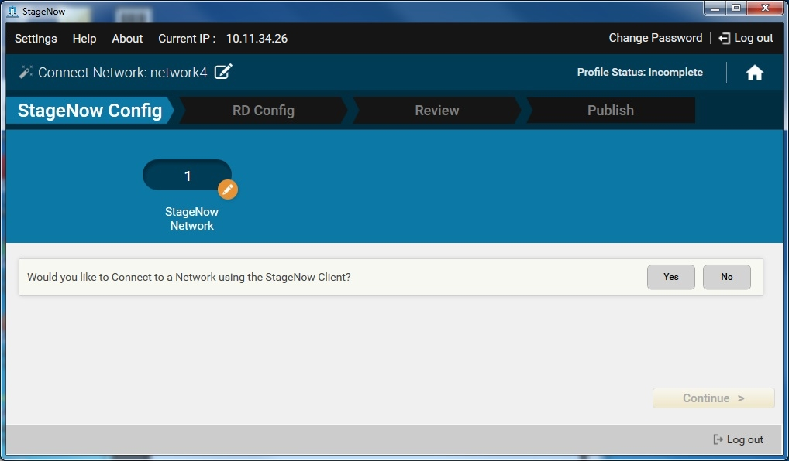
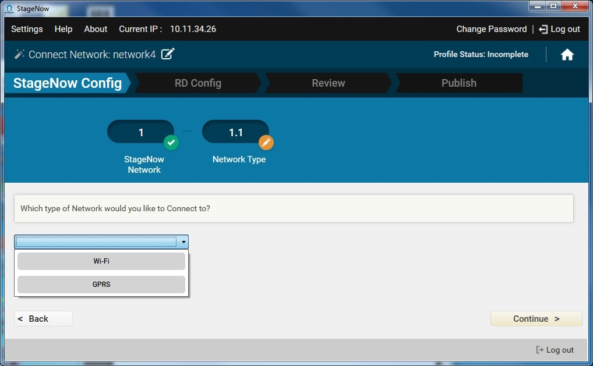
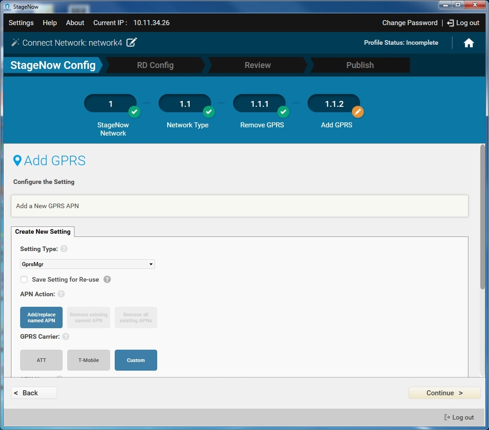
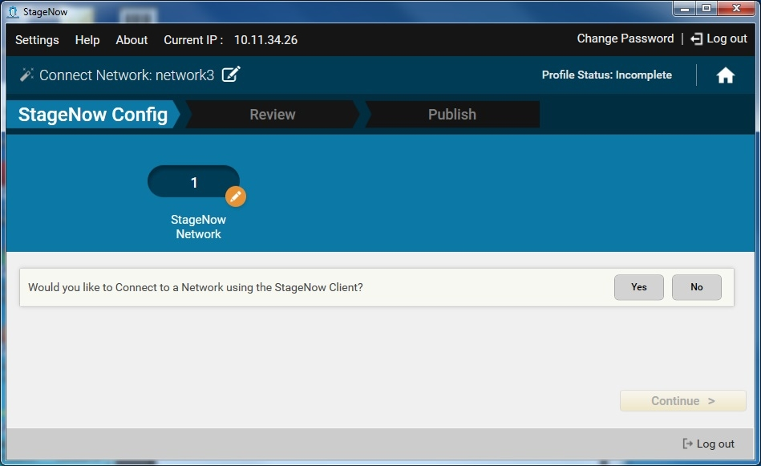
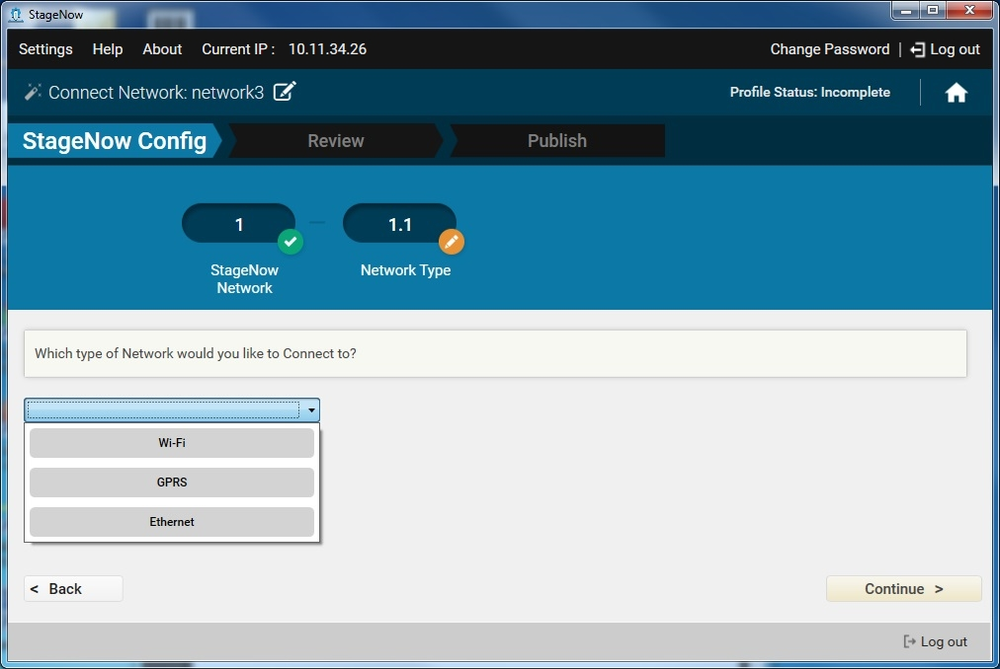

Use this Wizard to connect to a Wi-Fi, GPRS, or Ethernet network. 

##Connecting to a Wi-Fi Network
Wi-Fi network connection supports multiple network types including certificate-based networks. You can also enable, disable, add, or remove networks. 

To create a Connect Wi-Fi Network profile:

1. Select Create New Profile.

2. Select the MX version from the drop-down menu.

3. Select the Connect Network Wizard, and select Create.

    

4. Enter a name for the profile and select Start.

    

    Note: During profile creation, the top right of the window indicates the status of the profile, e.g., Incomplete.

5. If you selected MX 6.0 from the MX version drop-down menu, see [MX 6.0 Selection](../../stagingprofiles?MX%206.0%20Selection), and then proceed to Step 7.

6. To choose to connect to this network using StageNow bar codes, select Yes, and then select Continue. Otherwise, select No to skip to the RD Config section (if available).

    

7. Select the Wi-Fi network type from the drop-down menu, and select Continue.

    a. Select whether or not to manage certificates related to Wi-Fi networks, and then select Continue. This allows you to initialize the Android KeyStore, remove a certificate, install CA (server) and client certificates, . Select Yes if you have a certificate-based network. See [Setting Types / Certificate mgr](../../csp/cert) for more information.

    b. Select whether or not to disconnect from the currently connected network. Select Yes if the device is already connected to a network.

    c. Select whether or not to disable all Wi-Fi networks.

    d. Select whether or not to add a Wi-Fi network. 

    

    e. Select whether or not to enable an existing Wi-Fi network.

    f. The Wizards prompts you to connect to a Wi-Fi network. This setting window is pre-populated with certain information that you can not change. Other options are available for selection if desired. See [Setting Types / Wi-Fi](../../csp/wifi) for instructions.

    

    g. Select Continue.

8. If offered, select whether to connect to this network using the Rapid Deployment (RD) Client. Note that the RD Config section only appears if you turned on Legacy Mode in the [Settings](../../gettingstarted?Settings) screen. Select Yes for  devices that don't include the StageNow Client. See [Rapid Deployment (RD) Client](../../stageclient?Rapid%20Deployment%20Client) for more information.

9. If you selected Yes, choose whether to set up Wi-Fi options and/or Wi-Fi profiles. See [Setting Types / Wifi mgr](../../csp/wifi).

10. Select Continue to proceed to the [Review window](../../stagingprofiles?Review).

##Connecting to a GPRS Network
GPRS network connection supports adding or removing a network.  

GPRS networks often require providing carrier-specific information in order to establish a data connection. If this is the case, choose the GPRS option in the Wizard to provide this information.

To create a Connect GPRS Network profile:

1. Select Create New Profile.

2. Select the MX version from the drop-down menu.

3. Select the Connect Network Wizard, and select Create.

    

4. Enter a name for the profile and select Start.

    

    Note: During profile creation, the top right of the window indicates the status of the profile, e.g., Incomplete.

5. If you selected MX 6.0 from the MX version drop-down menu, see [MX 6.0 Selection](../../stagingprofiles?MX%206.0%20Selection), and then proceed to Step 7.

6. To choose to connect to this network using StageNow bar codes, select Yes, and then select Continue. Otherwise, select No to skip to the RD Config section, if available.

    

7. Select the GPRS network type from the drop-down menu, and select Continue.

    a. Select whether to remove all GPRS APNs, and select Continue.

    

    b. Select whether to add a GPRS APN.

    c. The setting window that appears is pre-populated with certain information that you can not change. Other options are available for selection if desired. See [Setting Types / Gprs](../../csp/gprs) for instructions on using the GPRS manager.

    

    d. Select Continue.

8. If offered, select whether to connect to this network using the Rapid Deployment (RD) Client. Note that the RD Config section only appears if you turned on Legacy Mode in the [Settings](../../gettingstarted?Settings) screen. Select Yes for  devices that don't include the StageNow Client. See [Rapid Deployment (RD) Client](../../stageclient?Rapid%20Deployment%20Client) for more information.

    

9. If you selected Yes, choose whether to set up Wi-Fi options and/or Wi-Fi profiles. See [Setting Types / Wifi mgr](../../csp/wifi).

10. Select Continue to proceed to the [Review window](../../stagingprofiles?Review).

##Connecting to an Ethernet Network
Note: If you are connecting the device to the StageNow staging server (FTP) using Ethernet, first disconnect from or disable any existing WiFi connections on the device. Otherwise the device attempts to stage via the WiFi network, and staging fails when you dock the device into the Ethernet cradle.

To create a Connect Ethernet Network profile:

1. Select Create New Profile.

2. Select MX 4.4 from the drop-down menu. Note that MX 4.3 does not support Ethernet connection.

3. Select the Connect Network Wizard, and select Create.

    

4. Enter a name for the profile and select Start.

    

    Note: During profile creation, the top right of the window indicates the status of the profile, e.g., Incomplete.

5. If you selected MX 6.0 from the MX version drop-down menu, see [MX 6.0 Selection](../../stagingprofiles?MX%206.0%20Selection), and then proceed to Step 7.

6. To choose to connect to this network using StageNow bar codes, select Yes, and then select Continue. Otherwise, select No to skip to the RD Config section (if available).

    

7. Select Ethernet from the drop-down menu, and select Continue.

    

8. Select Continue to enable Ethernet on the device.

9. Select whether or not to wait for the device to acquire an IP address. See [Setting Types / ConditionMgr](../../csp/condition) for more information.

10. Select Continue.

11. If offered, select whether to connect to this network using the Rapid Deployment (RD) Client. Note that the RD Config section only appears if you turned on Legacy Mode in the [Settings](../../gettingstarted?Settings) screen. Select Yes for  devices that don't include the StageNow Client. See [Rapid Deployment (RD) Client](../../stageclient?Rapid%20Deployment%20Client) for more information.

12. If you selected Yes, choose whether to set up Wi-Fi options and/or Wi-Fi profiles. See [Setting Types / Wifi mgr](../../csp/wifi).

13. Select Continue to proceed to the [Review window](../../stagingprofiles?Review).
