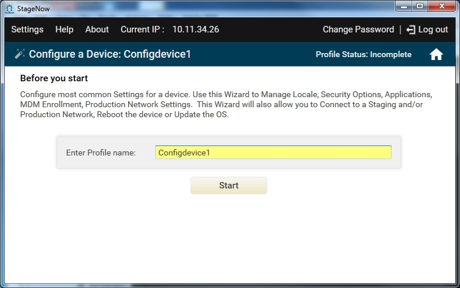
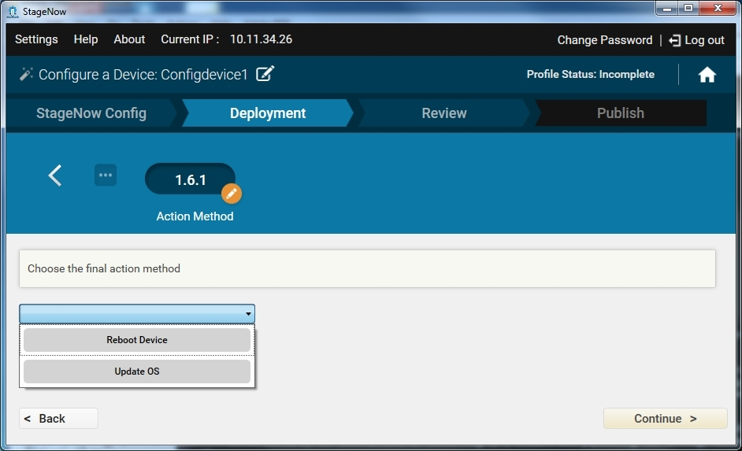

Use this Wizard to configure the most common device settings such as locale, security options, applications, MDM enrollment, and production network settings.  This Wizard also allows you to connect to a staging and/or production network, reboot the device, or update the OS. 

To create a Configure Device profile:

1. Select Create New Profile.

2. Select the MX version from the drop-down menu.

3. Select the Configure a Device Wizard, and select Create.

    

4. Enter a name for the profile and select Start.

    

    Note: During profile creation, the top right of the window indicates the status of the profile, e.g., Incomplete.

5. If you selected MX 6.0 from the MX version drop-down menu, see [MX 6.0 Selection](../../stagingprofiles?MX%206.0%20Selection), and then proceed to Step 7.

6. To choose to connect to this network using StageNow bar codes, select Yes, and then select Continue. Otherwise, select No to skip to the RD Config section (if available). Note that the RD Config section only appears if you turned on Legacy Mode in the [Settings](../../gettingstarted?Settings) screen. See [Rapid Deployment (RD) Client](../../stageclient?Rapid%20Deployment%20Client) for more information.

7. If you chose to connect using StageNow bar codes, see [Profiles / Connect Network](../../Profiles/ConnectNetwork) for instructions on connecting to a network and populating the settings window.

    Note: This Wizard includes a Deployment section. Deployment requires that the host computer and the device(s) are on the same network. 

8. If offered, select whether to connect to this network using the Rapid Deployment (RD) Client. Note that the RD Config section only appears if you turned on Legacy Mode in the [Settings](../../gettingstarted?Settings) screen. Select Yes for devices that don't include the StageNow Client. See [Rapid Deployment (RD) Client](../../stageclient?Rapid%20Deployment%20Client) for more information.

9. If you selected Yes, choose whether to set up Wi-Fi options and/or Wi-Fi profiles. See [Setting Types / Wifi mgr](../../csp/wifi).

10. In the Deployment section of the wizard, select whether to configure the device. If you select No, proceed to the [Review window](../../stagingprofiles?Review).

11. Select whether to manage applications. If you select Yes, see [Profiles / Manage Applications](../../Profiles/manageapps) for instructions.

12. Select whether to configure device security. If you select Yes, see [Profiles / Manage Device Security](../../Profiles/managesecurity) for instructions.

13. Select whether to localize the device, set the current locale, and set the default input method.  If you select Yes to any of these, see [Setting Types / UiMgr](../../csp/ui) for instructions.

14. Select whether to enroll in an MDM. If you select Yes, see [Profiles / Enroll in an MDM](../../Profiles/enrollmdm) for instructions.

15. Select whether to connect to another network to use after staging. If you select Yes, see [Profiles / Connect Network](../../Profiles/ConnectNetwork) for instructions.

16. Select whether or not to reboot the device or update the OS. 

    

17. If you select Yes, select either Update OS or Reboot Device.

    * If you select Reboot Device, see [Setting Types / PowerMgr](../../csp/power) for instructions.
    * If you select Update OS, see [Profiles / Perform OS Update](../../Profiles/osupdate) for instructions.

18. Select Continue to proceed to the [Review window](../../stagingprofiles?Review).

