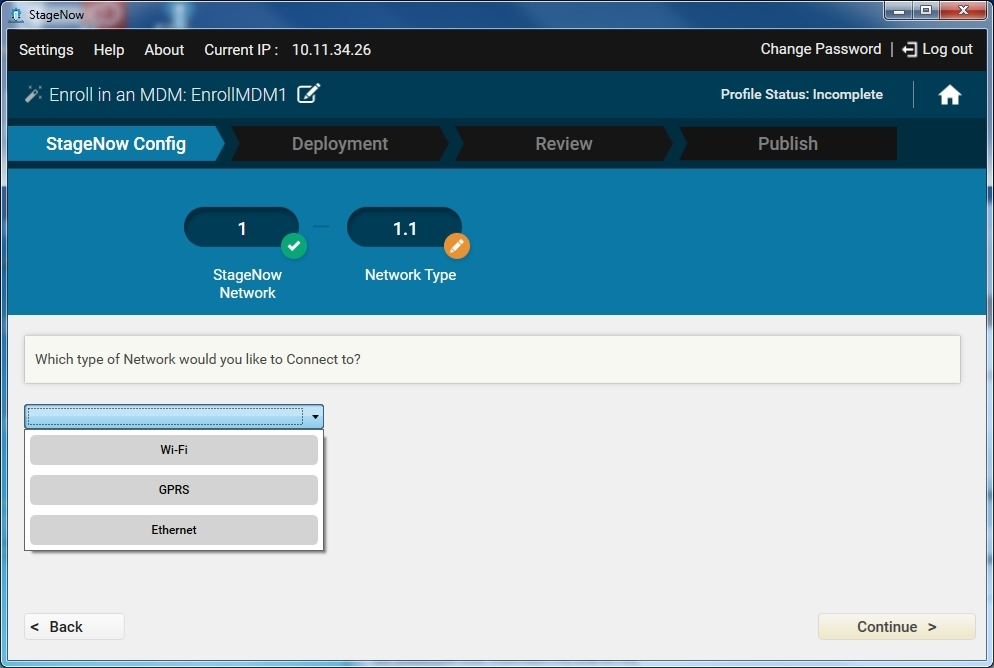
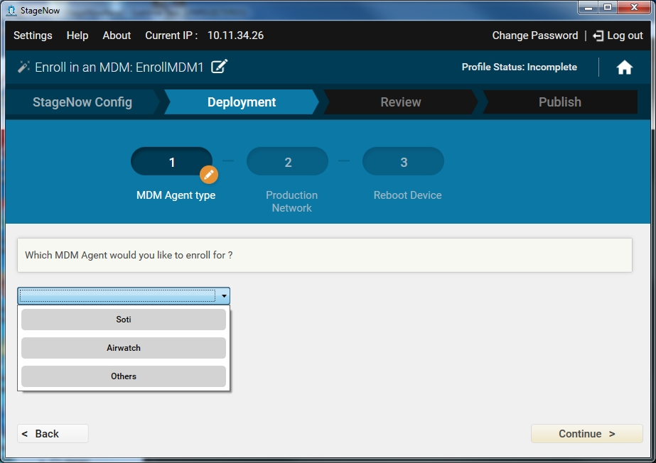

Use this Wizard to enroll a device for management by an MDM.  This downloads, installs, configures, and launches an MDM agent.  This Wizard also allows you to connect to a staging and/or production network and reboot the device. 

##Enrolling in an MDM for MX Versions 4.3, 4.4, and 5.0

1. Select Create New Profile.

2. Select the MX version from the drop-down menu. If any MX 4.4 features are required, e.g., connecting via Ethernet for staging, select MX 4.4.

3. Select the Enroll in an MDM Wizard, and select Create.

    

4. Enter a name for the profile and select Start.

    Note: During profile creation, the top right of the window indicates the status of the profile, e.g., Incomplete.

5. To choose to connect to this network using StageNow bar codes, select Yes, and then select the type of network. Select Continue. See [Profiles / Connect Network](../../Profiles/ConnectNetwork) for instructions on connecting to a network and populating the settings window.

    

    Note: This wizard includes a Deployment section. Deployment requires that the host computer and the device(s) are on the same network. 

6. If offered, select whether to connect to this network using the Rapid Deployment (RD) Client. Note that the RD Config section only appears if you turned on Legacy Mode in the [Settings](../../gettingstarted?Settings) screen. Select Yes for devices that don't include the StageNow Client. See [Rapid Deployment (RD) Client](../../stageclient?Rapid%20Deployment%20Client) for more information.

7. If you selected Yes, choose whether to set up Wi-Fi options and/or Wi-Fi profiles. See [Setting Types / Wifi mgr](../../csp/wifi).

8. In the Deployment section of the wizard, select a method for performing the enrollment and select Continue.
* For No, I want to Download the file to my device, see [Setting Types / File mgr](../../csp/file) for instructions.
* For Yes, I want to Install the file, see [Setting Types / AppMgr](../../csp/app) for instructions, and skip to Step 10.

    

9. Select whether or not to download an MDM agent support APK. If you select Yes, see [Setting Types / File mgr](../../csp/file) for instructions. 

10. Select whether or not to download an MDM configuration file. If you select Yes, see [Setting Types / File mgr](../../csp/file) for instructions.

11. Select whether or not to install an MDM. If you select Yes, see [Setting Types / AppMgr](../../csp/app) for instructions.

12. Select whether or not to connect to a production network. If you select Yes, select a network type.  See [Profiles / Connect Network](../../Profiles/ConnectNetwork) for instructions on connecting to a network and populating the settings window.

13. Select whether or not to reboot a device. If you select Yes, see [Setting Types / Power](../../csp/power) for instructions.

14. Select Continue to proceed to the [Review window](../../stagingprofiles?Review).

##Enrolling in an MDM for MX Version 5.1, 5.2, and 6.0

To create an Enroll in an MDM profile for MX 5.1, 5.2, or 6.0:

1. Select Create New Profile.

2. Select the MX 5.1 from the drop-down menu. 

3. Select the Enroll in an MDM Wizard, and select Create.

    

4. Enter a name for the profile and select Start.

    Note: During profile creation, the top right of the window indicates the status of the profile, e.g., Incomplete.

5. If you selected MX 6.0 from the MX version drop-down menu, see [MX 6.0 Selection](../../stagingprofiles?MX%206.0%20Selection), and then proceed to Step 7.

6. To choose to connect to this network using StageNow bar codes, select Yes, and then select the type of network. Select Continue. See [Profiles / Connect Network](../../Profiles/ConnectNetwork) for instructions on connecting to a network and populating the settings window.

    

    Note: This wizard includes a Deployment section. Deployment requires that the host computer and the device(s) are on the same network. 

7. If offered, select whether to connect to this network using the Rapid Deployment (RD) Client. Note that the RD Config section only appears if you turned on Legacy Mode in the [Settings](../../gettingstarted?Settings) screen. Select Yes for devices that don't include the StageNow Client. See [Rapid Deployment (RD) Client](../../stageclient?Rapid%20Deployment%20Client) for more information.

8. If you selected Yes, choose whether to set up Wi-Fi options and/or Wi-Fi profiles. See [Setting Types / Wifi mgr](../../csp/wifi).

9. In the Deployment section of the wizard, select the MDM agent for which to enroll.

    

    Note: If you select Others, go back to Step 8 of the previous procedure. 

10. Select whether to download a configuration file. If you select Yes, see [Setting Types / File mgr](../../csp/file) for instructions.

11. If you selected AirWatch, select whether to enroll an Mx Service. If you select Yes, select a method for performing the enrollment and select Continue.

* For No, I want to Download the file to my device, see [Setting Types / File mgr](../../csp/file) for instructions.

* For Yes, I want to Install the file, see [Setting Types / AppMgr](../../csp/app) for instructions.

* Select whether to launch an Mx Service APK.

12. If you selected AirWatch, select whether to enroll for MDM Agent. 

13. Select whether to download a Remote Control APK file.

* For No, I want to Download the file to my device, see [Setting Types / File mgr](../../csp/file) for instructions.

* For Yes, I want to Install the file, see [Setting Types / AppMgr](../../csp/app) for instructions.

* Select whether to launch the Remote Control APK. If you select Yes, see [Setting Types / Intent](../../csp/intent) for instructions.

14. Indicate whether the APK file is already present on the device.

* For No, I want to Download the file to my device, see [Setting Types / File mgr](../../csp/file) for instructions.

* For Yes, I want to Install the file, see [Setting Types / AppMgr](../../csp/app) for instructions.

15. If you selected SOTI in Step 8, select whether to launch the SOTI APK.  If you select Yes, see [Setting Types / Intent](../../csp/intent) for instructions.

16. Select whether or not to connect to a production network. If you select Yes, select a network type.  See [Profiles / Connect Network](../../Profiles/ConnectNetwork) for instructions on connecting to a network and populating the settings window.

17. Select whether or not to reboot a device. If you select Yes, see [Setting Types / Power](../../csp/power) for instructions.

18. Select Continue to proceed to the [Review window](../../stagingprofiles?Review).
