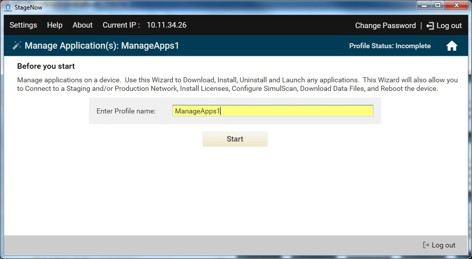
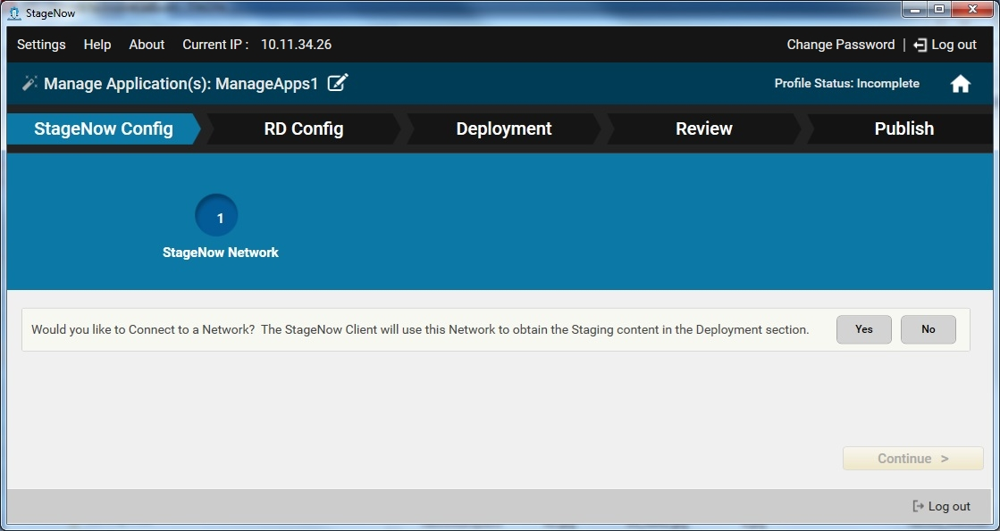
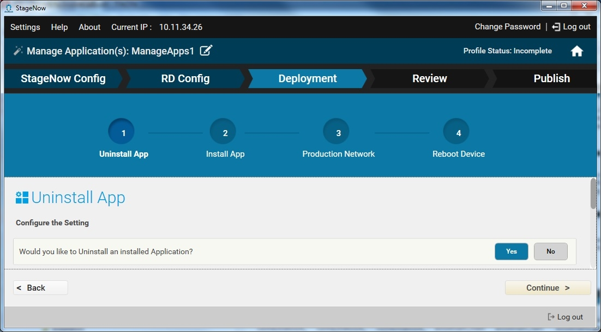

Use this Wizard to manage applications on a device. This downloads, installs, uninstalls and launches any applications. This Wizard  also allows you to connect to a staging and/or production network, install licenses, configure simulScan, download data files, and reboot the device. 

To create a Manage Applications profile:

1. Select Create New Profile.

2. Select the MX version from the drop-down menu. Note that MX 4.4 does not support installing licenses and configuring simulscan, so select MX 4.3 if these options are required.

3. Select the Manage Applications Wizard, and select Create.

    

4. Enter a name for the profile and select Start.

    

    Note: During profile creation, the top right of the window indicates the status of the profile, e.g., Incomplete.

5. If you selected MX 6.0 from the MX version drop-down menu, see [MX 6.0 Selection](../../stagingprofiles?MX%206.0%20Selection), and then proceed to Step 7.

6. To choose to connect to this network using StageNow bar codes, select Yes, and then select Continue. Otherwise, select No to skip to the RD Config section (if available).

7. If you chose to connect using StageNow bar codes, see [Profiles / Connect Network](../../Profiles/ConnectNetwork) for instructions on connecting to a network and populating the settings window.

   Note: This wizard includes a Deployment section. Deployment requires that the host computer and the device(s) are on the same network. 

8. If offered, select whether to connect to this network using the Rapid Deployment (RD) Client. Note that the RD Config section only appears if you turned on Legacy Mode in the [Settings](../../gettingstarted?Settings) screen. Select Yes for devices that don't include the StageNow Client. See [Rapid Deployment (RD) Client](../../stageclient?Rapid%20Deployment%20Client) for more information.

9. If you selected Yes, choose whether to set up Wi-Fi options and/or Wi-Fi profiles. See [Setting Types / Wifi mgr](../../csp/wifi).

    

10. Select whether or not to uninstall an application. If you select Yes, see [Setting Types / AppMgr](../../csp/app) for information on uninstall options. 

11. Select whether or not to install an application. If you select Yes:

    a. Select whether or not the application requires license management (MX 4.3 only). See [Setting Types / LicenseMgr](../../csp/license) for information on license options.

    b. Select whether or not the application leverages SimulScan (MX 4.3 only). If you select Yes, select the application used to access SimulScan, and whether or not to download a template file or other file to the device. See [Setting Types / FileMgr](../../csp/file).

    c. Select how to install the application (.APK) file. To download the file, see [Setting Types / FileMgr](../../csp/file). To install the file, see [Setting Types / AppMgr](../../csp/app).

    d. Select whether to download an application data file. If you select yes, See [Setting Types / FileMgr](../../csp/file).

    e. Select whether to launch an APK file. If you select yes, See [Setting Types / Intent](../../csp/intent).

12. Select whether or not to connect to another network to use after staging. If you select Yes, see [Profiles / Connect Network](../../Profiles/ConnectNetwork) for instructions.

13. Select whether or not to reboot the device. If you select Yes, see [Setting Types / PowerMgr](../../csp/power) for information on reboot options.

14. Select Continue to proceed to the [Review window](../../stagingprofiles?Review).
