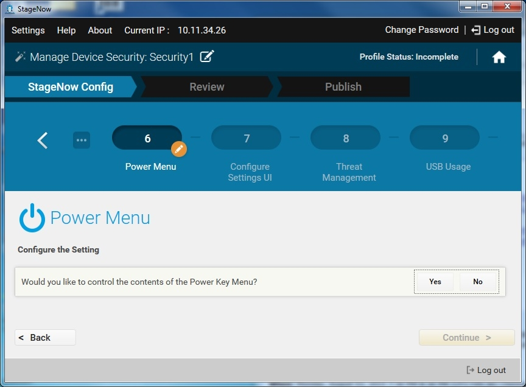

## Overview

> **StageNow 4.0 (and higher) supports Trusted Staging**, which can protect devices with MX 9.2 and higher from unauthorized staging.  See the [Trusted Staging Guide](../../trustedstaging) for usage details. 

-----

**The Manage Device Security Wizard** configures security options and policies for a device. Options for this Profile are listed below. 

**Security options**:

* Whitelisting and blacklisting apps
* Controlling screen time-out 
* Encrypting SD Card(s)
* **Control user access to**: 
 * Power-off menu
 * Android Settings panel
 * App installation from unknown sources
 * Threat management
* **Enable/disable**: 
 * SD Card(s)
 * Device camera(s) 
 * The GPRS subsystem
 * Wireless radio(s)
 * GPS locationing
 * USB port(s)

In addition, StageNow implements multiple layers of security in the barcode and NFC staging media it creates. 

**Security included in staging media**: 

* **Parm encryption -** All input text values considered sensitive (i.e. passwords) are encrypted using an asymmetric key algorithm.
* **Profile encoding -** Upon creation of a Profile, parm names are encoded, rendering them unreadable. 
* **Profile encryption -** Optionally, an admin can elect to encrypt an entire staging Profile using a shared (symmetric) key, which must be known before the barcode(s) or NFC tag(s) can be used.

-----

## Create a Security Profile

**To create a Manage Device Security Profile**:

1. Select Create New Profile.

2. Select the MX version from the drop-down menu.

3. Select the Manage Device Security Wizard, and select Create.

	

4. Enter a name for the Profile and select Start.

	

    Note: During Profile creation, Profile Status is indicated in the upper-right corner of the window, (e.g., "Incomplete").

5. Select whether to perform Application Whitelisting. If selecting Yes, see [Setting Types / AccessMgr](../../csp/access) for instructions. 

6. Select whether to Blacklist an Application. If selecting Yes, see [Setting Types / AppMgr](../../csp/app) for instructions. 

7. Select whether to control the Display Timeout. If selecting Yes, see [Setting Types / DisplayMgr](../../csp/display) for instructions. 

8. Select whether to control the Screen Lock Timeout. If selecting Yes, see [Setting Types / DevAdmin](../../csp/devadmin) for instructions. 

9. Select whether to control the Installation of Applications from Unknown Sources. If selecting Yes, see [Setting Types / DevAdmin](../../csp/devadmin) for instructions. 

10. Select whether to control the contents of the Power Key Menu. If selecting Yes, see [Setting Types / PowerKeyMgr](../../csp/powerkey) for instructions.

    

11. Select whether to control what the Settings UI can accomplish. If selecting Yes, see [Setting Types / SettingsMgr](../../csp/settingsmgr) for instructions.

12. Select whether to configure Threat Management. If selecting Yes, see [Setting Types / ThreatMgr](../../csp/threat) for instructions.

13. Select whether to control USB usage. If selecting Yes, see [Setting Types / UsbMgr](../../csp/usb) for instructions.

14. Select whether to control Wireless usage. If selecting Yes, see [Setting Types / WirelessMgr](../../csp/wireless) for instructions.

15. Select whether to control Camera usage. If selecting Yes, see [Setting Types / CameraMgr](../../csp/camera) for instructions.

16. Select whether to SD Card usage. If selecting Yes, see [Setting Types / SdCardMgr](../../csp/sdcard) for instructions.

17. Select whether to encrypt the SD Card. If selecting Yes, select the method for providing the Encryption Key.

   	

    Then see [Setting Types / EncryptMgr](../../csp/encrypt) for instructions.

18. Select Continue to proceed to the [Review window](../../stagingprofiles?Review).

