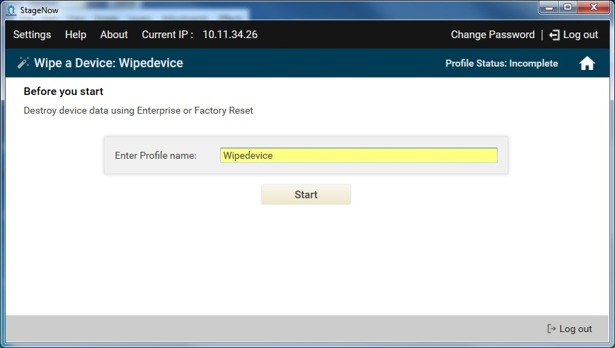
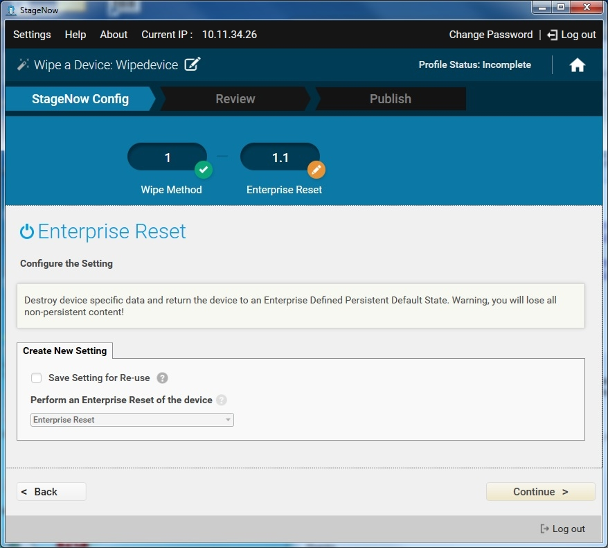

##Overview 

Use this Wizard to erase data on the device using Factory Reset (all data) or Enterprise Reset (only non-persistent data). **See important additional information [about reset actions](/mx/powermgr/#reboot)**. 

### Bypass Notes

* **Devices with MX 9.1 (or later) automatically skip the Android Set-up Wizard** and begin staging when a `.bin` file is found.
* **On devices with MX 7.1 or higher**, it is possible to automatically bypass the Android Setup Wizard (also known as the "Welcome Screen") following an Enterprise Reset using the Power Manager CSP. More [about Power Manager's Setup Wizard Bypass](/mx/powermgr/#setup-wizard-bypass) parameter. 
* **On devices with Android M and higher**, it's also possible to skip the Android Setup Wizard by scanning a barcode when the wizard appears or at any time thereafter. [See Setup Wizard Manual Bypass](#setupwizardmanualbypass) section below for details. 

-----

### Wipe a Device

**To create a "Wipe a Device" profile**:

1. Select "Create New Profile"

2. Select the MX version from the drop-down menu

3. Select the "Wipe a Device Wizard" and select "Create"

    

4. Enter a name for the profile. Select "Start" to proceed.

    

    Note: During profile creation, an indicator at the top-right corner of the window displays creation status.

5. Choose the desired erasure method. Select "Continue" to proceed.

    * Select Enterprise Reset to destroy device-specific data and return the device to its persistent default state. All non-persistent data is discarded.
    * Select Factory Reset to destroy all data and return the device to its factory defaults. No user content persists.

   

6. Select the required information, and then select Continue. See [Setting Types / Power](../../csp/power) for more information.

7. Select "Continue" to proceed to the [Review window](../../stagingprofiles?Review).

-----

### Setup Wizard Manual Bypass

>**With MX 9.1 and higher, the barcode for bypassing the Android Setup Wizard is embedded within the configuration barcode(s). This combines bypass and device configuration into a single step.** The processes and rules below apply to barcodes generated for devices with versions prior to MX 9.1. 

When staging manually, it's possible to skip the Android Setup Wizard on devices with **Android M and higher** by scanning the barcode below at any stage of the wizard. On devices with Android N and higher, scanning the barcode bypasses the Android **_and_** Zebra Setup Wizards (including Analytics opt-out). **If the Android Setup wizard is partially completed, data entered prior to the bypass scan is applied**. 

#### Bypass Limitations
Scan-to-Bypass is **<u>supported only on these Zebra devices and minimum BSPs</u>**: 

* **TC51, TC56, TC70x and TC75x**:
 * **Android Marshmallow** with Full Image `01-21-04.1-MG` (BSP21) with LG patch 8 or newer 
 
* **MC3300, TC51, TC56, TC70x, TC75x and VC80x**:
 * **Android Nougat** with Full Image `01-01-49NG-00-A` (BSP49) or newer
 
* **TC20/TC25 devices**:
 * **Android Nougat** with Full Image `04-14-30-0-NG-00-M1` or newer

##### `IMPORTANT NOTES:` 
* **On devices with MX 9.0**, any `.bin` file causes Setup Wizard bypass. 
* **On devices with MX 9.1 and later**, a security check ensures that bypass occurs only if the StageNow Profile was created using MX 9.1 or later. 
* **Devices with MX 9.1 (or later) automatically skip the Android Set-up Wizard** and begin staging when a `.bin` file is found.

##### Other Notes: 
* **Android Setup-wizard bypass applies only to GMS devices**; non-GMS devices do not employ the wizard.
* **Scan-to-bypass functionality is present in all BSPs newer than those listed above**.
* Go to **Settings > About phone > Build number** to display the BSP in a device.

#### Update Device
To update a device for use with the bypass barcode, visit to the relevant page below and follow instructions there. 

* **[TC51, TC56, TC70x, TC75x OS update page](https://www.zebra.com/us/en/support-downloads/software/operating-system/tc70-operating-system-gms.html)** - Android M, N or newer
* **[MC33 OS update page](https://www.zebra.com/us/en/support-downloads/mobile-computers/handheld/mc3300.html)** - Android N or newer
* **[VC80x OS update page](https://www.zebra.com/us/en/support-downloads/mobile-computers/vehicle-mounted/vc80x.html)** - Android N or newer
* **[TC20/TC25 OS update page](https://www.zebra.com/us/en/support-downloads/mobile-computers/handheld/tc20.html)** - Android N or newer

-----

#### Scan to skip wizards and run StageNow client:

 
