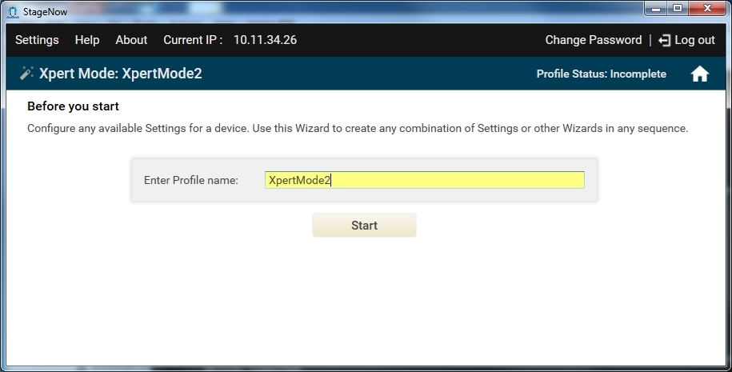
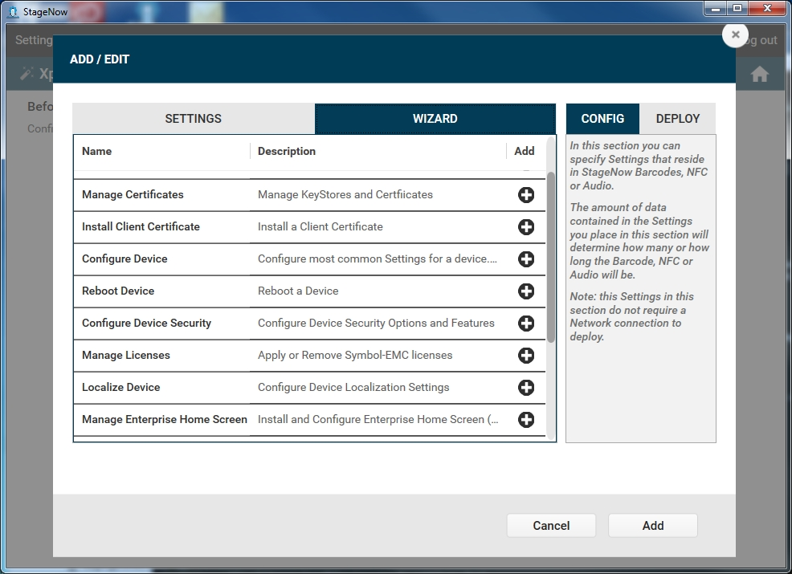
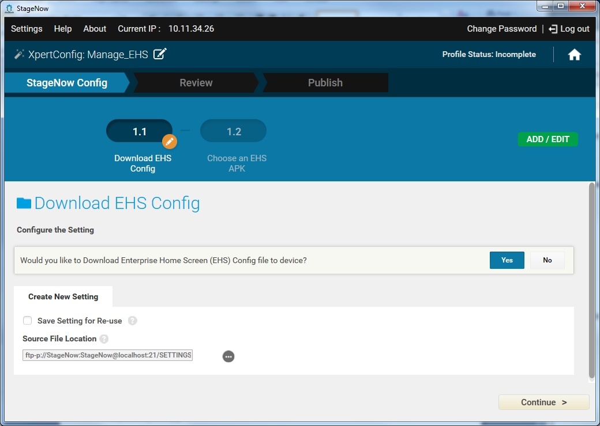

Xpert Mode allows enhanced control of the options and processes offered through the Profile Wizards and Setting Types in order to build custom profiles.

In this mode, the administrator can use any settings and/or any Wizards offered in the StageNow tool, in any order.  For example, an administrator can use the Configure a Device Wizard within the Expert Mode Wizard, but include additional settings as well as those offered in the standard Wizard. In this manner, administrators who are experts can take advantage of the flexibility offered by StageNow to use features not covered in the existing Wizards. Note that this does not apply in the RD section of the Xpert Wizard, which still restricts the administrator to selecting certain settings.

>Note:  
>All settings created within the configuration sections of the StageNow tool are stored in the staging bar code(s), audio file, or NFC tag, while settings created in the deployment section reside on the deployment server.

To create an Xpert Mode profile:

1. Select Create New Profile.

2. Select the MX version from the drop-down menu.

3. Select the Xpert Mode Wizard, and select Create.

    

4. Enter a name for the profile and select Start.

    

    Note: During profile creation, the top right of the window indicates the status of the profile, e.g., Incomplete.

5. On the ADD/EDIT window, select the SETTINGS tab to add settings to the Xpert Mode profile, and/or the WIZARD tab to add a Profile Wizard to the Xpert Mode profile.

6. Select the CONFIG or DEPLOY tab to select the portions of the Profile Wizard to include in the Xpert Mode profile.

7. Select the plus icon next to each setting and/or Wizard to add to the Xpert Mode profile, in the desired order to execute. This moves each item to the right pane (CONFIG or DEPLOY).

   

8. Select Add to move through the Profile Wizard and create the new Xpert Mode profile as described in [Creating a Staging Profile](../../stagingprofiles?Creating%20a%20Staging%20Profile).

   
   

## Updating an Xpert Mode Profile

During profile creation, select the ADD / EDIT button at any time to return to the ADD / EDIT Settings and Wizards window and add, modify or delete settings or Wizards in the profile. Select Update when finished. 

>Note:  
>Opening an existing Xpert Mode profile created in StageNow 2.1 imports the profile into the updated StageNow 2.2 Xpert Mode user interface described previously.

## Manage Enterprise Home Screen (EHS)
Enterprise Home Screen defines which applications appear on enterprise devices so only certain features are available to users. StageNow 2.2 allows you to easily configure Enterprise Home Screen on a Zebra Enterprise device via the Manage Enterprise Home Screen sub-wizard. Simply include this sub-wizard in an Xpert mode profile and follow the steps on the screen. Refer to the EHS user guide for information on the EHS configuration file and EHS APKs available as part of the EHS distribution. 

Include the EHS sub-wizard as any step of an Xpert mode profile, among other settings and sub-wizards. The following example uses the EHS sub-wizard only for simplicity. Before using this sub-wizard, obtain and extract the EHS distribution, which includes the EHS_L and EHS_R APKs, onto the workstation.

To configure EHS via the Xpert Mode Wizard:

1. Select Create New Profile.

2. Select either MX 4.4 or MX 5.0 version from the drop-down menu.

3. Select the Xpert Mode Wizard, and select Create.

    

4. Enter a name for the profile and select Start.

5. On the ADD/EDIT window, select the WIZARD tab.

    

6. Select the plus sign next to Manage Enterprise Home Screen.

7. Select Add.

8. On the Download EHS Config window, select Yes to download an EHS configuration file to the device to stage. Refer to the EHS documentation for more information on creating this file.

    

9. Browse to and select the file from the workstation and select Continue. The device path is pre-configured for ease. 

    

10. Select the type of APK to install and select Continue. Refer to the EHS documentation for device and EHS APK mappings. 

    

11. Select the location of the EHS_L (or EHS_R) APK to push to the device, and then select Continue.

    

12. Install the pushed APK on the device, ensuring the path is correct, and then select Continue.

    

13. Select Continue to set EHS as the default launch screen on the device.

14. See [Review](../../stagingprofiles?Review) to continue creating the EHS profile.

## Using Enterprise Home Screen Sub-Wizard With Other Settings and Wizards

Some configuration parameters in the Enterprise Home Screen configuration file can force the device to reboot in order to apply them. When creating an Xpert Mode profile using other settings and wizards, the administrator should avoid this intermediate reboot while applying the configuration. StageNow Client and MX Framework cannot resume the staging process after a device reboot. It is recommended to reboot the device as a last step in the wizard if required.

The following items force a device reboot, and list equivalent StageNow settings that achieve the same result. These settings avoid an uncontrolled reboot when applying a profile using the EHS wizard along with other settings:

* Disable Wi-Fi and Bluetooth ON/OFF in the quick settings panel:  Use Wireless Manager to manage Bluetooth and Wi-Fi Manager to manage Wi-Fi.

* Disable Airplane mode ON/OFF in the quick settings panel:  Use Settings Manager to manage Airplane mode.

* Clear the recent app list:  Reboot using Power Manager (make this the last step in the profile).

