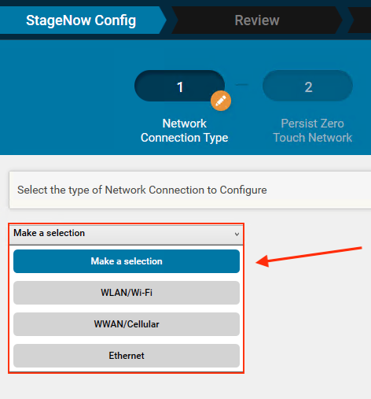
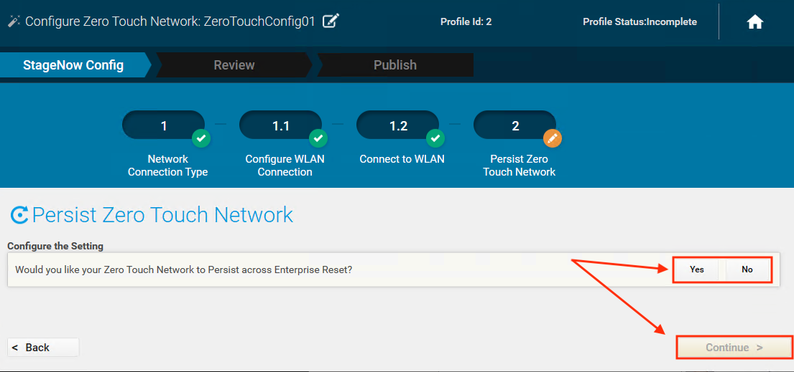
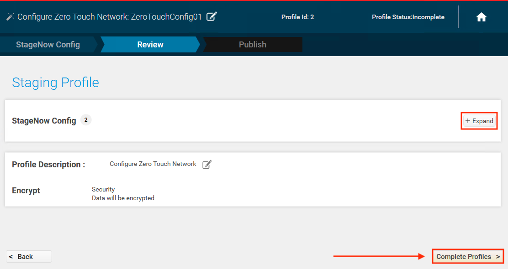
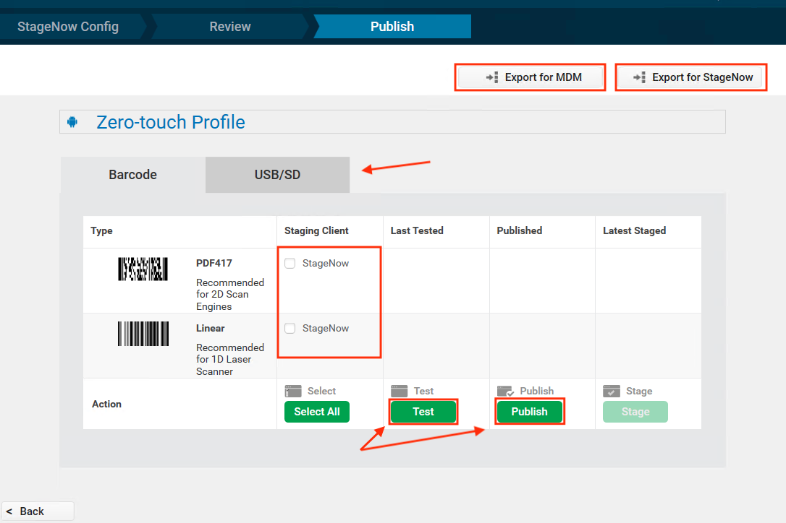

Use this Wizard to configure the network settings of a "factory fresh" or factory-reset device to enable connection to the internet through Ethernet, Wi-Fi or a non-public cellular APN. This enables the device to access internet-based Google Zero Touch servers, which perform Device Owner Enrollment in an Enterprise Mobile Management (EMM) system, rendering the device manageable with no user interaction. **Settings entered in this Wizard can be persisted on the device** following an Enterprise Reset, further automating subsequent enrollments. 

### Requirements

* **StageNow 4.2** or later
* Zebra device(s) running **Android 8.x Oreo** (or later) with **MX 10** (or later)
* **EMM with Zero Touch support** and credentials

-----

### Using Zero Touch Wizard

**NOTE**: To create a single Profile that can be used to stage multiple devices with different settings, [enable Dynamic Staging](../../dynamicstaging/#usingdynamicstaging).  

1. From the StageNow Home screen, **click "Create new Profile"** to bring up the Wizards list.  
 Then **select "Configure Zero Touch Network"** to start the Wizard:
 
 _Click image to enlarge; ESC to exit_. 
 
2. **Select the network type** for connecting the device to the internet. 
 **NOTE**: Only one network type may be selected:  
 
 _Click image to enlarge; ESC to exit_. 
 
3. **Enter the settings** for configuring the device for internet connectivity:  
 
 _Click image to enlarge; ESC to exit_. 
 
4. **Select Persistence preference**, then **click Continue**:  
 
 _Click image to enlarge; ESC to exit_. 
 
5. **Click "+ Expand"** to review settings, if desired. 
 Then **click "Complete Profiles"** to continue: 
 
 _Click image to enlarge; ESC to exit_. 
 
6. **Select deployment preferences**, including barcode or USB/SD (`.bin` file) and barcode type as applicable): 
 
 _Click image to enlarge; ESC to exit_. 
 
7. **Test Profile** to confirm desired behavior. 
 Then **click Publish** to make the Profile available to StageNow operators.  
8. **Select Export method** as needed.  

#### The Profile is now ready for deployment. 

> `IMPORTANT NOTE:` If a Zero Touch Profile is saved and imported onto the same or a different host workstation, it no longer functions for Zero Touch enrollment.
