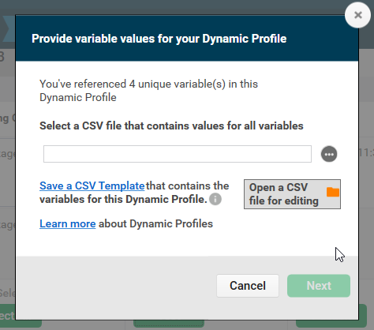
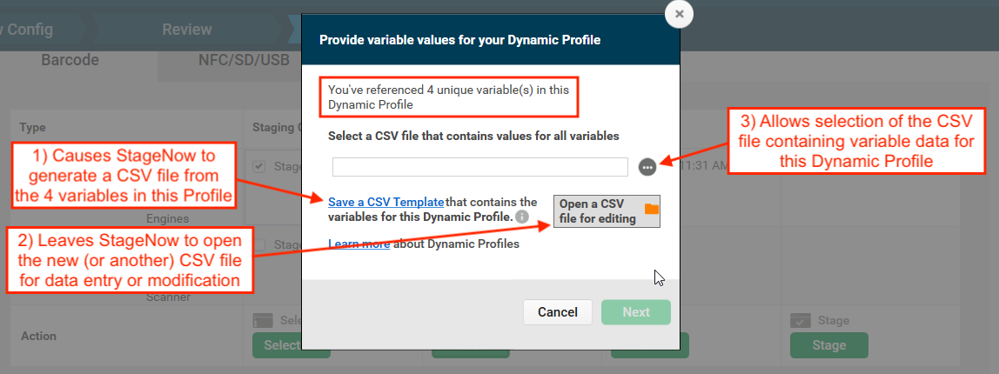
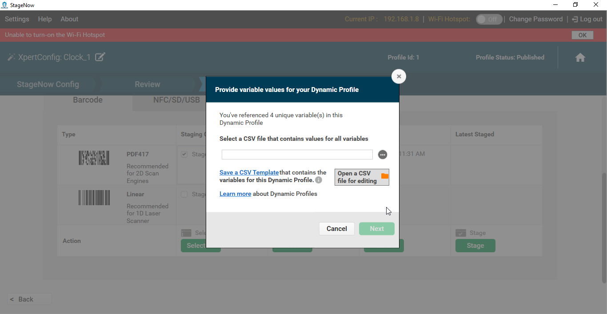
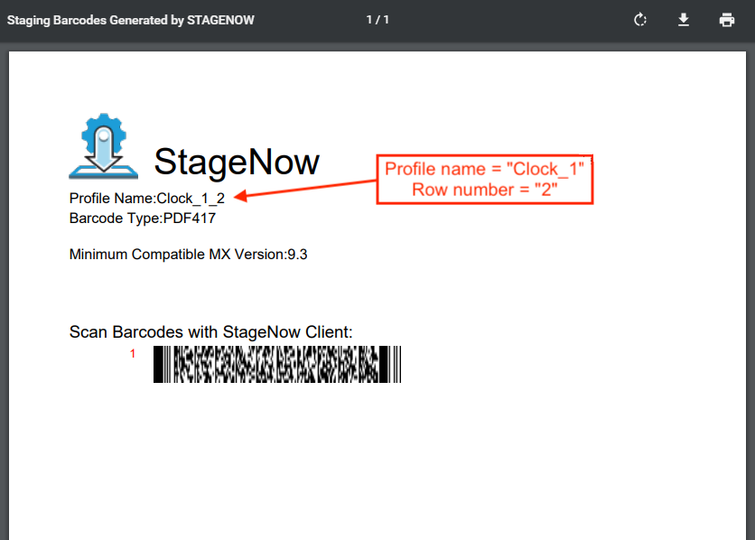

## Overview

**StageNow 4.1 (and later) supports Dynamic Staging**, which allows compatible data-entry fields in a StageNow Profile to be populated with values from a file when staging barcodes (or `.bin` files) are generated. This permits the Staging Administrator to create **many barcodes from a single Profile, each of which can configure devices differently** depending on variations of how and/or where the devices are to be used. Dynamic Staging also supports `.bin` files, which are used to stage devices from USB or SD card storage. 

**Dynamic Staging simplifies staging based on...** 

* Locale
* Language
* Input method
* Wi-Fi setting
* User credentials  
* Other customer variations

####NOTES: 
* **Only StageNow 4.1.1 (or later) can enable/disable Dynamic Staging**. Disabled by default; enable in Global Settings.
* **Upgrades to StageNow 4.1.1 are possible only from**: 
 * **StageNow 4.1.0** (replaced by v4.1.1 on the Zebra support portal) 
 * **StageNow 4.0.1**  
 * **StageNow 3.4.0** 
* **The "Host the Deployment Package Outside of StageNow FTP Server" option is not available** when using Dynamic Staging.

-----

### Requirements

* StageNow 4.1 (or later) installed
* Knowledge of which fields to populate dynamically and their corresponding variable names
* A `.csv` file containing variable names and matching data for all dynamic fields (can be created during staging setup)

<!-- 
<b>&#42;While a `.csv` file is required to *<u>generate</u>* staging barcodes, it does not have to be present when setting up a Dynamic Profile. After a Profile with one or more dynamic fields is created, StageNow can generate a `.csv` template file that the administrator can then populate with the required data.</b>

 -->

-----

### Variable Creation

Dynamic Staging variables are created in two primary ways: 

* **Exporting Variables from a Database -** Companies that maintain user data (locale, network settings, etc.) in databases or spreadsheets can export the relevant data to a `.csv` file and use the file to generate staging Profiles accordingly. **When a StageNow Profile is created for pre-existing variables, the <u>variable names entered in the Profile must exactly match those of the database</u>**.

* **Generating Variables "On the Fly" -** For companies that DO NOT maintain user databases (or that do not wish to use them for this purpose), variable names can be made up as the Dynamic Profile is being created. Once the Profile is finished, StageNow can generate a `.csv` template file that contains all the newly created variables that the administrator can then populate with the required data. **This is the Zebra-recommended method of creating a** `.csv` **file** because of the inherent accuracy of automatic output of variable names. 

Both of these scenarios are fully supported by StageNow and documented in the [Using Dynamic Staging section](#usingdynamicstaging). 

**There are many possible ways that Dynamic Staging could help save time**. For example, a company that configures devices at a central location and deploys them to branch locations throughout the United States might maintain **one** `.csv` **file for each store**, each of which might contain device data for that store's departments and the requisite device settings. To illustrate, if "Store 1" had 10 departments, the `Store_1.csv` file would contain 11 rows. The first row must contain the variable names. The next 10 rows are for the departments, and each contains the settings for that department's variables. Variable names common to all departments might include: 

* `%dept_name%`
* `%ssid%`
* `%wifi_passphrase%`
* `%default_scanner%`
* `%app_1%`
* `%app_2%`
* `%app_3%`

<!-- 
If some departments in a store have differing numbers of a given variable (for instance, apps in use), that store's `.csv` file should contain enough columns for the store with the greatest number of that variable. For example, if the greatest number of apps used by any department was three, and `Dept_2` used only two, the row for `Dept_2`'s data would contain names for only two apps; the cell for `Dept_2:%app_3%` would be blank. 
-->

-----

## Using Dynamic Staging

### Variable Usage Rules
* To avoid possible errors, the <u>`.csv` file **must NOT be open**</u> when Dynamic Staging is performed. 
* **Variable names** used in a StageNow Profile **must match exactly with those in the** `.csv` **file</u>**.
* **Variables can be used alone or in combination with static values** and/or other variables in the same field. 
* Each row in the `.csv` file represents one set of data for a Dynamic Profile.
* Row numbers within the `.csv` file are used to label barcode printouts for identification purposes. 
* Dynamic Staging **supports plain text files only**. 
* **Each variable MUST be separated by a semi-colon (;)** and each line must end with a semi-colon.
* Dynamic Variables are supported ONLY for device settings and Staging Operator instruction fields.
* **If a percentage sign is to be part of the variable data**, <u>the percentage sign must first be declared as a variable</u>. See example below. 

#### Using '%' as variable data
StageNow accepts all characters (including the semi-colon) as entries in Dynamic Variable fields ***except*** the percent sign (%), which requires special handling to avoid a "Malformed variable" error. **To use a percent sign as data in an entry field** (for example in an SSID name like `Store_01_SS%ID`), **the percent sign must first be declared as a variable**. 

**To include a percent sign (%) in a data entry field**:

1. In the `.csv` file to be used, **add a variable named "%percent%" with "%;"** as its only value.   
2. In the SSID field in StageNow, **enter "Store_01_SS%percent%ID"** as the value (for example). 
3. **Generate the barcode(s) as desired**. When the barcode is generated, StageNow will replace "%percent%" with the "%" character, as in the "Store_01_SS%ID" name above.  

-----

#### To Use Dynamic Staging:

##### Before beginning, enable Dynamic Staging in the Global Settings panel: 

_Click image to enlarge; ESC to exit_. 

##### Next, open a Profile to which to add or enable dynamically staged fields and follow the steps below. 

1. **Identify data-entry fields accompanied by a percent-sign** icon:  
 
 _Click image to enlarge; ESC to exit_. 
 
2. **Enter static text** (i.e. "GMT") **and/or variables** (i.e. `%zone%`) in any combination as desired:  
 
 _Click image to enlarge; ESC to exit_. 
 
 A warning appears until variables are entered using the correct syntax:  
 
 _Click image to enlarge; ESC to exit_. 
 
3. **Enter remaining static text and/or variables** as desired for all fields and **click the "Continue" button**:  
 
 _Click image to enlarge; ESC to exit_. 
 
4. To test a Dynamic Profile, **select a barcode type and click the "Test" button**:  
 
 _Click image to enlarge; ESC to exit_. 
 
5. A prompt appears for selecting (**or *creating***) the `.csv` file similar to the image below: 
  
  **To select an <i><u>existing</u></i> `.csv` file skip to Step 6**. 
 **To create a** `.csv` **file "on the fly"** from variables created in the Profile: 
  &nbsp;&nbsp;&nbsp;&nbsp;a. **Click "Save a CSV Template"** in the dialog shown below, **name and save the file** as prompted. 
  &nbsp;&nbsp;&nbsp;&nbsp;b. In the same dialog (as below), **click "Open a CSV file for editing**, navigate to and open the file saved in Step a. 
  &nbsp;&nbsp;&nbsp;&nbsp;c. **Enter data for all variables (separated by semi-colons)**, save and close the file.  
  `IMPORTANT:` **Use semi-colons to separate variable names and data, and at the end of each line** (see Notepad image, below).  
  
  The image below shows a correctly formatted `.csv` file: 
  
 _Click image to enlarge; ESC to exit_. 
 
6. **Select the** `.csv` **file that contains variable data for the Dynamic Profile**:   
 
 _Click image to enlarge; ESC to exit_. 
 
 **On success, a barcode sheet is produced for each row of the** `.csv` **file** similar to the image below.  
 **The Profile name is appended with the row number** on the printout for identification. 
 
 _Click image to enlarge; ESC to exit_. 
 
7. **`If errors occur`** refer to the [Troubleshooting section](#troubleshooting) below for instructions.  
8. When testing is completed, **click Publish**. A prompt appears for entering Staging Operator instructions.  
Combine variables and static text as desired. An example is shown below. 
 
 _Click image to enlarge; ESC to exit_. 
 
9. **Click "Publish Now"** to complete the process; distribute staging materials as normal. 

#### Dynamic Staging is complete

-----

## Troubleshooting

Dynamic Staging errors occur when StageNow is unable to acquire data from a `.csv` file for generating staging media. 

#### Typical causes: 

* The `.csv` file is missing data for one or more variables
* One or more variables were entered incorrectly in StageNow
* The `.csv` file is not present on the host workstation
* The `.csv` file is open or otherwise locked on the host workstation

> **NOTE**: The "Host the Deployment Package Outside of StageNow FTP Server" option is not available when using Dynamic Staging.

#### Error Diagnosis:  

1. If StageNow displays a "CSV Issues" message like the one below, **click "Save the log"** to generate a list of issues. 
 
 _Click image to enlarge; ESC to exit_. 
 
2. **Name and save the file** in the desired location: 
 
 _Click image to enlarge; ESC to exit_. 
 
3. **Click the "Open a log file for viewing" button**, navigate to and open the log file saved in the previous step. 
 A sample log file is shown below: 
 
 _Click image to enlarge; ESC to exit_. 
 
4. **Open the log in a text editor, make corrections to the** `.csv` **file as needed**.  
 Then **return to StageNow and click "Start Over"** button:  
 
 _Click image to enlarge; ESC to exit_. 
 
5. **Return to <a href="#step6">Step 6</a>** in the previous section and try Dynamic Staging again. 

-----
<!-- 
Then the administrator need only populate the file with the required data and select that `.csv` file when generating barcodes. 

Data-entry fields that support Dynamic Staging are indicated by a "percent sign" (%) icon similar to the image below.  

Variables can be used alone in a field or in combination with static values and/or other variables. 

For example, a valid string might read as follows: 

`192.168.%octet3%.%octet4%` to specify two static octets (192 and 168 separated by a "dot") and two variables (%octet3% and %octet4%, also separated by a dot). 

WORKFLOW

Use case- Allan: 

In general, the concept is to produce a staging profile that does different things on different devices. 

In its first iteration, dynamic parts are rendered static when barcodes or .bin files are created. 

One staging profile produces multiple barcode sheets or .bin files. 

STEPS 
1. Decide to have a dynamic profile
2. Determine what has to vary  in each profile
3. Use the "Create a template" feature (Zebra-recommended) 
4. Enter the required variables. it can be done as one master or separate CSVs for different stores.  

ONE FILE
all values, generate once
but has extra barcode sheets that might not be needed every time

One store, 10 department. one profile for each. 
one row per store
each profile references different subsets of the same file
might not have been created from a template

If customer has an access or SQL database with store info. 
output selected sets as csv files
might require referring to the file from within SN 

WORKFLOW 1- without a database of variables

WORKFLOW 2- with a database of variables

FROM POLARION:

Background:

Currently, StageNow supports Barcode and NFC Staging Modalities, but all Staging Profiles are inherently Static, which means that all values must be entered at the time the Staging Profile is created and remain fixed unless/until the Staging Profile is manually edited.
If an Administrator wishes to produce multiple variations of a Staging Profile, he must manually create a copy of the Staging Profile and edit it with the required changes and must repeat that process for each variation required.
This is error-prone and time-consuming and creates a mass of Staging Profiles to manage.
There is a strong request from the field to be able to perform Staging using multiple variations of a single Staging Profile in a more efficient manner.

Assumptions:

This may be the first increment of a larger Dynamic Staging Feature set and hence should be defined and implemented as generically possible so that it can serve as the base for future expansion.
Customers would prefer a simple and standard way to provide Data Sets to be used when generating variations for a Staging Profile (e.g. specify a .CSV file).
Customers may desire a way to manage and organize multiple Data Sets for use with the same or different Staging Profiles (e.g. a library of imported .CSV files).
Customers will likely need a way to organize and manage the multiple Barcode Sheets Sets or collections of NFC tag binaries generated via Dynamic Staging (e.g. name generated files based on variant values).
Customers may desire a way to visually differentiate Static and Dynamic Staging Profiles.
Customers may desire a way to visually differentiate Barcode Sheets Sets or NFC Instructions Sheets when generating variations for a Staging Profile.
Customers may desire a way to customize the Staging Operator instructions produced on the Barcode Sheets or NFC Instruction Sheets when generating variations for a Staging Profile.

Expectations:

The Staging Administrator can optionally choose to include a Variable anywhere the wish within any text-entry field presented within a Staging Profile.
Each Staging Profile can have as many or as few variables as the Staging Administrator wishes to use and can name variables any way he wishes.
A single text-entry field could contain mixtures of static data and variables in any combination.
Any Staging Profile containing at least one variable is a Dynamic Staging Profile and all other Staging Profiles are Static.
When the Staging Administrator or Staging Operator generates using a Dynamic Staging Profile, he will be required to supply a Data Set providing at least one or more values for every variable.
The Staging Administrator will be able to easily manage Dynamic Staging Profiles, Data Sets, and the Barcode Sheets, NFC Binary Files, Audio Files, etc. generated from them.
 -->