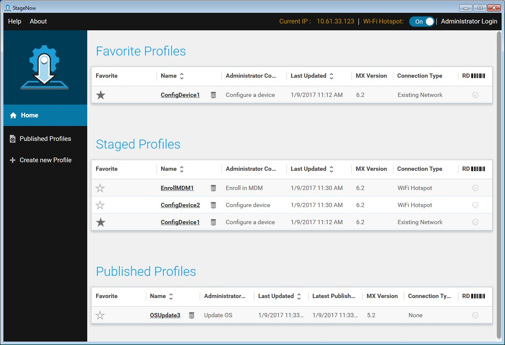
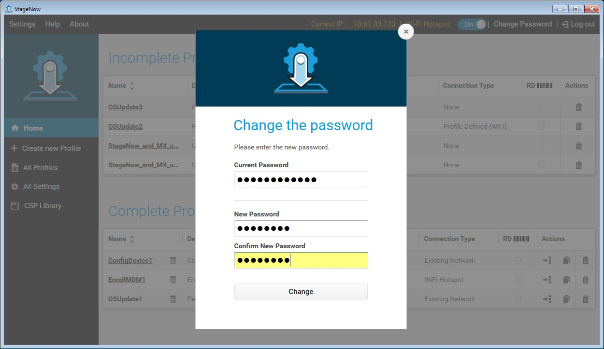
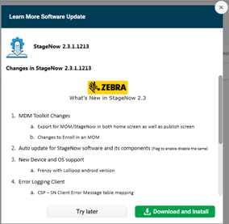
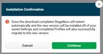
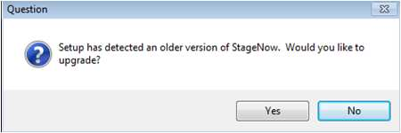
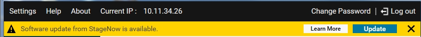
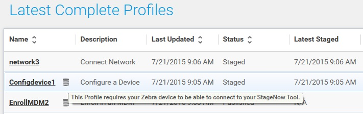
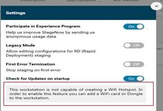

## Introduction
This section provides information on the StageNow Android Staging Solution, including an explanation of staging, its purposes, and users. 

> See [Installation Section](../installing) for help installing StageNow. 

## Staging
Staging is the process where a device administrator or operator configures a device and/or deploys firmware or software to a device to prepare it for production use. This entails configuring, deploying, and managing systems and devices.

An administrator can stage all devices within an enterprise, devices in a particular store or site, or on-site/per user.

## StageNow Staging Solution
StageNow is Zebra's staging solution for Android devices. It allows simple profile creation and easy device deployment with a simple barcode scan or tag read.

The StageNow Staging Solution includes the following components:

* The StageNow Workstation Tool offers a user interface that is accessed within a staging workstation (host computer). The staging administrator uses this tool to create staging profiles that configure device components in addition to other staging actions. The Workstation Tool includes a database and server which store and save content entered in the tool such as settings and staging profiles. 

    Note: The tool's built-in staging server is an FTP server to which devices download the staging content of the deployment section, files selected for download from the remote server, and RD staging files. Because multiple applications cannot use Port #21 (usually used by FTP servers) at the same time, administrators must ensure the Workstation Tool PC does not have another FTP server running in the background (or that it uses a different port). **The staging (FTP) server runs only when the tool is running**, and stops when the application closes. Therefore StageNow must be running when staging the device with profiles as described above.

* The StageNow Client resides on the device and provides a user interface for the staging operator to initiate staging. The operator uses a staging method (i.e. prints and scans a barcode or reads an NFC tag) to deliver staging data to the device. 

-----

### Devices Supported

**This version of StageNow supports all Zebra devices running Android 4.x KitKat or higher and MX 4.3 or later**. 

For more information, see the [StageNow About page](../about).

**Note: MX features supported on a given device depends on the versions of Android, MX and OSX installed on the device**. To determine the features available on a specific device, see the [MX Feature Matrix](/mx) and follow the instructions there. 

#### Older Android Versions 
Devices running Android version 5.x Lollipop and older that ship with the StageNow Client installed support all StageNow features. Devices with Jelly Bean and certain KitKat versions come with the Rapid Deployment (RD) Client. For staging, these devices can scan StageNow-generated RD bar codes, which cause the RD Client to connect to a network and then auto-install MX 5.0 for KitKat devices, MX 4.4 or lesser for Jelly Bean devices, and the StageNow Client on the device. The StageNow Client can then be used to scan StageNow profile barcodes for configuration. See [Rapid Deployment (RD) Client](../stageclient?Rapid%20Deployment%20(RD)%20Client) for more information on this process.

>Note:  
>To install StageNow client and MX on a Jelly Bean device, create a profile using wizards from MX 4.4 or lesser versions.

Once devices that did not include the StageNow Client are staged using the RD Client, they still might support only partial StageNow functionality due to limitations of the device OS. See the Feature Compatibility section of the specific [Setting Type](../CSPreference) to determine if a particular device supports a given feature. 

### StageNow Users

StageNow generally falls under two usage scenarios:

1. The staging administrator is the main user of the StageNow Workstation Tool and is responsible for the configuration, deployment, and management of systems and client devices. The administrator creates profiles which identify the staging to perform, collects the staging content (e.g., applications), determines the staging method used to deliver the content and uploads this material into the Workstation Tool.
2. The staging operator identifies the devices to stage and uses the Workstation Tool to view and select the profile(s) that the administrator published. The operator then prints the staging materials (e.g. barcodes) to use to stage the devices, and uses the StageNow Client on the devices to perform the staging. The operator can then deliver the devices to the end users.

### Staging Methods
Following are the staging methods available via StageNow. See [Device Staging](../stageclient) for details:

* Barcode - The operator generates barcode(s) containing profile information onto paper or the workstation screen and scans those barcodes with the device scanner or imager (or camera if no scanner or imager is present) to configure that device.

* NFC Tag - The operator exports profile data and programs it into an NFC tag, then reads the tag with the device's NFC tag reader by bringing the tag within a certain proximity of the device, to deploy the profile to the device.

> **AUDIO NOTE**: StageNow 4.1 (and later) no longer supports audio staging. 

## Home Screen
To open the tool, select the StageNow icon from the Start menu. 

If published profiles are available, the Staging Operator home screen appears.

The Operator home screen lists the latest profiles available. The top of the screen shows the [IP Address](../gettingstarted?Current%20IP%20Address) currently used (if any), useful for when you need to connect to the Staging Server. The top of the screen also includes a [Wi-Fi Hotspot](../gettingstarted?Wi-Fi%20Hotspot) option, which allows the desktop computer to act as WiFi hotspot for staging devices.

The main sections of this window include the following fields:

* Favorite - Select to add the profile to the Favorite Profiles list.

* Name - Administrator-provided name of profile. Profiles requiring the client device to be connected to the staging server appear with a [Server Icon](../gettingstarted?Server%20Icon) appended to the profile name.

* Administrator Comments - Any notes regarding the profile.

* Last Updated - The last time an administrator updated the profile.

* Latest Published - The last time the profile was published.

* MX Version - The version of MX used when creating the profile.

* Connection Type - How StageNow connects to a network (MX 6.x and higher).

* RD - Indicates whether the profile is RD enabled, i.e., whether RD barcodes can be printed from this profile.

If there are no published profiles for the Staging Operator, the Welcome screen appears.

Enter the Administrator password set up during installation, and select Login to open the Administrator home screen.

 

The Administrator home screen lists profiles grouped by stages of completion. 

### Current IP Address
The top of the screen shows the IP address currently used, useful for when you need to connect to the Staging Server.

If only one IP address is available, StageNow selects this.

If the StageNow system does not have an IP address, the Current IP section of the window displays Not Available. This can restrict printing StageNow barcodes or NFC tags.

If more than one IP address is available and neither is selected, the Current IP section of the window displays Not Selected. Click on this section to select the IP address to use for staging.

Select the IP, then select Set as Current. This IP address is retained in future operations, including after re-launch and system reboot. 

### Wi-Fi Hotspot
The StageNow tool allows a desktop computer equipped with a wireless network interface card to act as a Wi-Fi hotspot for staging devices. This allows staging without requiring an external Wi-Fi network and reduces the number barcodes to one with default security, or more than one with optional double security selected by the administrator.
It also eliminates the need for reprinting the barcodes even if there is a profile change.

If the Wi-Fi hotspot is off, you can turn it on via the button on the heading bar.

By default, the StageNow Tool enables the Wi-Fi hotspot upon launch. You can disable the hotspot upon launch via the [Settings](../gettingstarted?Settings) menu. 

#### Admin Privileges Required
If the Wi-Fi hotspot is disabled upon launching the StageNow Tool, turning in it on for the first time invokes the User Account Control window. This window does not appear again until the tool is closed and re-opened.

Select Yes to start the Wi-Fi hotspot service, or No to cancel the operation.

### Change Password
The top right corner of the screen offers an option to change the Administrator password.

Select Change Password to change the administrator password.

Enter the current password, and then enter the new password in the New Password and Confirm New Password fields.

Select Change. A window indicates that the password was changed successfully.

Select OK.

### Software Update
If a new StageNow version or updated components are available and the StageNow tools is connected to a network, a message appears below the menu bar indicating this.

To enable or disable this message, see [Settings](../gettingstarted?Settings) . 

>Note:  
>Only an Administrator can update to the latest software and components. The administrator can also log out, and then log into the StageNow tool again to check for the latest software or component updates.

Select Learn More for more information on what is new in the latest available version, or what component(s) are available. 

Select Try Later or X to dismiss this window and the auto-update tool bar.

#### StageNow Tool Update

1. Select Download and Install from the Learn More window, or Install Now on the auto-update tool bar, to upgrade to the later version.

2. If there are incomplete profiles, you must complete them or delete them before the update can occur.

   

3. Select Continue on the Installation Confirmation window.

   

4. The auto-update tool bar displays a progress bar, and then indicates the software is installing. Select Yes to the Question pop-up to continue the upgrade.

   

#### Component Update

Select Download and Install from the Learn More window, or Update on the auto-update tool bar, to upgrade the available software components.

The auto-update tool bar displays a progress bar, and then indicates that it is applying component updates. The StageNow tool restarts and updates the components.

#### Update Errors

The following errors can occur during update:

* If the install tool indicates the network was not found, select OK, check the network connection, and re-attempt installation.

* If there is a problem reaching the host server other than a network failure, select Download Again to re-attempt installation.

### Profile Lists
The various profile lists in the Home window include the following fields:

* Name - Administrator-provided name of profile. Profiles requiring the client device to be connected to the staging server appear with a [Server Icon](../gettingstarted?Server%20Icon) appended to the profile name.

* Description - Brief description of the profile.

* Last Updated - The last time an administrator updated the profile.

* MX Version - The version of MX used when creating the profile.

* Connection Type - How StageNow connects to a network (MX 6.X only).

* RD - Indicates whether the profile is RD enabled, i.e., whether RD barcodes can be printed from this profile.

* Actions - Offers the following actions to perform on the profile:

    * Export  - Export a profile for other administrator use within the StageNow tool, or export for an MDM.

    * Copy  - Copy the profile to create a similar profile with a different name.

    * Delete  - Delete the profile. 

### Server Icon
Profiles requiring the client device to be connected to the staging server appear with a server icon appended to the profile name, as shown next to the first profile name below.

The following table lists the situations in which the server icon would appear, indicating that server connection is required:

<table>
	<tr>
		<th>Profile Configuration</th>
		<th>Staging Client</th>
		<th>Server Required</th>

	</tr>
	<tr>
		<td>StageNow Config</td>
		<td>StageNow</td>
	</tr>
	<tr>
		<td></td>
		<td>RD</td>
		<td>N/A</td>
	</tr>	
	<tr>
		<td>StageNow Config + RD Config</td>
		<td>StageNow</td>
		<td></td>
	</tr>	
	<tr>
		<td></td>
		<td>RD</td>
		<td>X</td>
	</tr>	
	<tr>
		<td>StageNow Config + Deployment</td>
		<td>StageNow</td>
		<td>X</td>
	</tr>
	<tr>
		<td></td>
		<td>RD</td>
		<td>N/A</td>
	</tr>	
	<tr>
		<td>StageNow Config + RD Config + Deployment</td>
		<td>StageNow</td>
		<td>X</td>
	</tr>
	<tr>
		<td></td>
		<td>RD</td>
		<td>X</td>
	</tr>

</table>

## StageNow Menu
The top left corner of the StageNow Workstation Tool window offers the following three menu items.

### Settings
Selecting Settings in the top left corner of the tool offers five options. 

#### Participate in Experience Program
Turn this setting on to send anonymous usage data used to improve the StageNow experience in future versions. 

#### Legacy Mode
Turn this setting on to include the RD option when creating profiles. If this option remains off, the RD section does not appear during profile creation. 

* The Legacy Mode flag is off by default.

* If on, the RD section appears for all profiles.

* If off, the RD section is not shown to the administrator during profile creation.

* If off, the RD section is grayed out for existing profiles, with a link to enable Legacy Mode. Select the link to open the Settings screen shown above and turn on the Legacy Mode flag to enable RD section content.

* If off, the RD section does not appear if the administrator selected No for this section during profile creation.

#### First Error Termination
Turn this setting on to terminate the staging process upon first error. If left off, the staging process continues until the StageNow Client processes the last step in the profile. 

* If the First Error Termination flag is turned on, the staging process terminates on first error.

* If off, the staging process proceeds until the StageNow client processes the last step in the profile.

* For Xpert Mode, if First Error Termination is on, it only works if the ConditionMgr DSD is present in the profile.

#### Check for software updates on startup
Turn this setting on to display a message below the menu bar indicating when there is a new StageNow version available. 

#### Always turn WiFi Hotspot on at startup
The StageNow tool allows the desktop computer to act as WiFi hotspot for staging devices.

Turn this setting on to turn the Wi-Fi hotspot on when you start the StageNow tool. 

If the Wi-Fi hotspot is off, you can also turn it on via the button on the heading bar.

If your workstation doesn't support the Wi-Fi Hotspot feature, the message below appears on the Settings window.

### Help
This launches the StageNow user guide in the default browser. 

### About
This lists the StageNow version and briefly describes the Workstation Tool. 

## StageNow Encryption
The StageNow database is always encrypted and linked to the Administrator password.

Encrypting staging data for use outside of the StageNow Workstation Tool protects sensitive information.

* When exporting a profile, sensitive parameters are encrypted to protect confidential deployment information.

* Staging barcodes and NFC tags contain configuration data and are encrypted by default to protect against reading by unauthorized devices. Note that encryption can add a significant amount of information and require additional barcodes. Use extreme caution when turning off encryption in order to speed deployment, as sensitive parameters may be vulnerable to unauthorized access.

## Use Cases
The staging administrator uses pre-defined Wizards within the StageNow Workstation Tool to configure settings and create profiles which define software configuration and/or installation for mobile devices within an enterprise.  These Wizards represent common use cases for deploying information to devices. 

### StageNow Staging Process Overview
The general staging process is as follows. See the appropriate sections of this guide for more detail on each step.

1. The administrator determines the software configuration and/or installation required for mobile devices within the enterprise.

2. The administrator opens the StageNow Workstation Tool and selects one of the provided Wizards. A Wizard offers a series of screens in which the administrator defines the required configuration values to create a profile for the device(s).

3. The administrator progresses through the Wizard. Certain sections of each Wizard present setting templates. Selecting and saving values on this template creates a setting, which the administrator can save for later use when creating other profiles.

4. Upon completing the Wizard, the administrator creates a profile, or a series of settings.

5. The administrator reviews the profile for accuracy.

6. The administrator selects the method(s) for deployment, e.g., the type of barcode and/or an NFC tag.

7. The administrator verifies the functionality of the profile by generating and testing the staging material.

8. The administrator publishes the profile for device deployment.

9. The operator uses the Workstation Tool to select the profile published by the administrator required for device deployment.

10. The operator prints the staging barcode(s) or generates the NFC tag provided for the profile.

11. The operator uses the StageNow Client on the device to scan the barcode or read the NFC tag, deploying the profile information to that device.

### StageNow Wizards
StageNow offers the following Wizards for creating profiles to configure mobile devices within the enterprise:

* [Configure a Device](../Profiles/configdevice) - Configure the most common device settings such as locale, security options, applications, MDM enrollment, and production network settings.  This Wizard also allows you to connect to a staging and/or production network, reboot the device, or update the OS.

* [Connect Network](../Profiles/ConnectNetwork) - Connect to a Wi-Fi, GPRS, or Ethernet network. You can also enable, disable, add, or remove networks.

* [Enroll in an MDM](../Profiles/enrollmdm) - Enroll a device for management by an MDM.  Use this Wizard to download, install, configure, and launch an MDM agent.  This Wizard also allows you to connect to a staging and/or production network and reboot the device.

* [Manage Applications](../Profiles/manageapps) - Manage applications on a device. Use this Wizard to download, install, uninstall and launch any applications. This Wizard  also allows you to connect to a staging and/or production network, install licenses (MX 4.3 only), configure simulScan (MX 4.3 only), download data files, and reboot the device.

* [Manage Device Security](../Profiles/managesecurity) - Configure security options and policies for a device.  Use this Wizard to whitelist and blacklist applications, control screen time-outs, enable or disable an SD card, camera, GPRS, Bluetooth, GPS, USB, encrypt SD card, control PowerKey menu, settings UI, unknown soruces, and threat management.

* [Perform OS Update](../Profiles/osupdate) - Perform an OS update on a device. Use this Wizard to apply an update or a patch to the OS by downloading a zip file to the device or using an existing zip file on the device.  This Wizard also allows you to connect to a network.

* [Wipe a Device](../Profiles/wipedevice) - Destroy device data using Enterprise or Factory Reset. 

* [Xpert Mode](../Profiles/xpertmode) - Configure any available settings for a device. Use this Wizard to create any combination of settings in any sequence.

