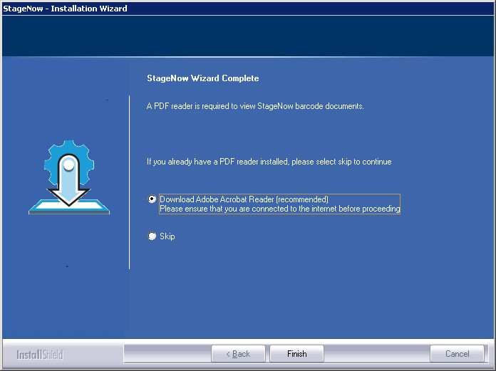
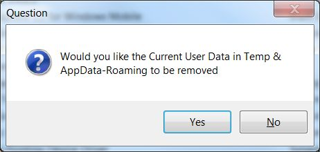

## Overview
This section provides instructions for installing, uninstalling and upgrading StageNow for Windows.

-----

### Prerequisites
The following are required to run the StageNow desktop tool:

* A PC with Microsoft Windows 7 or Windows 10 Pro
* 2 GB RAM minimum
* 6 GB minimum available storage (if .NET Framework not already installed)
* StageNow installer. (See the [StageNow download page](../download)) 
* Microsoft .NET Framework 4.5 (included with StageNow installer)
* A PDF reader (for displaying and printing staging barcodes)
* Wi-Fi access (for Wi-Fi Hotspot feature)
<!-- 1/21/2020- Audio staging removed from SN 4.1 
* The Java Runtime Environment (for audio staging)
 -->
-----

## Installing StageNow

Installing the StageNow Workstation Tool also auto-installs Microsoft .NET Framework 4.5, the Staging Database and the Staging Server.

See [Upgrading the StageNow Workstation Tool](../installing?Upgrading%20the%20StageNow%20Workstation%20Tool) if you have an older version of the StageNow Workstation Tool installed on the host PC.

**To install the Workstation Tool**:

1. Visit the [StageNow download page](../download) and download the setup package staging_solution.[Version Number].exe.

2. Double-click the setup package file.

3. If you do not already have .NET Framework 4.5, the installation process prompts you to install it.

4. Select Install. When Framework installation completes, a window appears stating that the wizard is preparing to install StageNow.

   

5. Select Next to continue.

6. Accept the terms of the license agreement and select Next.

   

7. Enter a User Name and Company Name, and specify who can use the Workstation Tool.

8. Select Next.

   

9. Enter a password for the administrator and select Next.  **<u>Note</u>: All StageNow profiles and data are associated with this password**.

10. Select Next to accept the default folder, or select Browse first to choose another installation folder.

   

11. Select Next to accept the current settings, or select Back to make a change. The wizard indicates that it is configuring the software for installation, then indicates that installation is almost complete.

   

12. If desired, select checkboxes to create a shortcut on the desktop, and/or to launch the StageNow Workstation Tool, and select Next.

   

13. Because staging material is presented in PDF files, the Wizard prompts you to download a PDF reader, or skip this if you already have a reader installed. Select the appropriate option and then select Finish. 

> **StageNow Workstation Tools is now ready to use**. 

-----

## Upgrading StageNow

If an older version of the StageNow Workstation Tool exists on the host PC, it can be upgraded.

**Important: Complete any partially completed profiles that exist on the host PC before upgrading**. Failure to so do could result in unpredictable or unwanted behavior. 

**To upgrade the StageNow Workstation Tool**: 

1. Download the setup package staging_solution.[Version Number].exe.

2. Double-click the setup package file. InstallShield detects the existing version and displays the following message.

   

3. Select Yes to proceed with the upgrade, or No to retain the existing version and abort the upgrade. If you select Yes, the next message asks whether to retain or discard existing StageNow data (Settings, Profiles, etc.)

   

4. Select the desired option to continue the upgrade. **Note**: If you choose to retain existing data, the install process does not request an administrator password as it retains the existing password.

5. See [Installing the StageNow Workstation Tool](../installing?Installing%20the%20StageNow%20Workstation%20Tool) for the remainder of the installation instructions.

-----

## Uninstalling StageNow

**To uninstall the StageNow Workstation Tool**:

1. Select Control Panel > Programs > Programs and Features.

2. Double-click StageNow. The Installation Wizard opens.

3. Follow the steps in the Wizard to complete the uninstallation.

   

4. Select Finish to complete the uninstallation.

-----

## On-device Staging Software 

The StageNow on-device client software supports all Zebra devices running Android KitKat and higher. These devices generally ship with the StageNow Client pre-installed and support all StageNow device configuration options.

Some older KitKat devices do not include the StageNow Client, but instead come with the Rapid Deployment (RD) Client. For staging, these devices can scan a StageNow-generated "RD barcode," which causes the RD Client to connect to a network and auto-install the StageNow client plus MX 5.0 for KitKat devices. The StageNow Client can then be used to scan StageNow profile barcodes for configuration. Due to limitations of the OS, such devices might still offer limited StageNow functionality. 

**Learn how to**: 

* **[Generate an RD Barcode](../stageclient/#rapiddeploymentclient)**
* **[Determine features supported on a specific device ](../csp/compatibility)**
