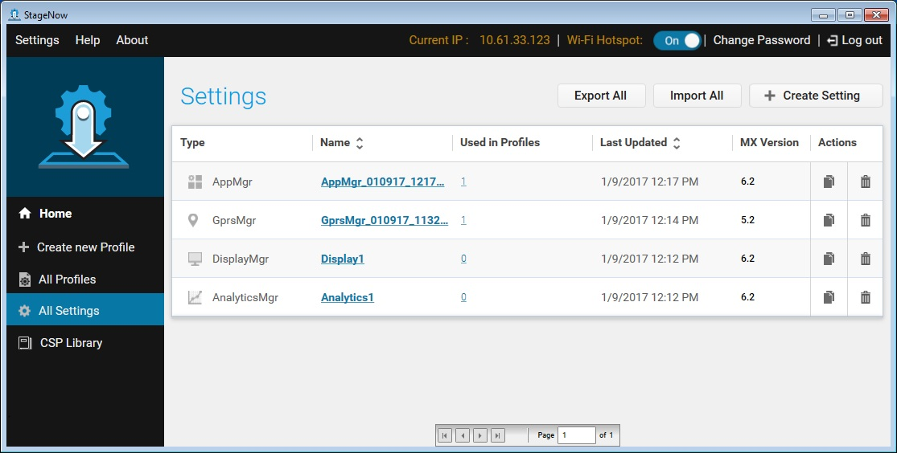
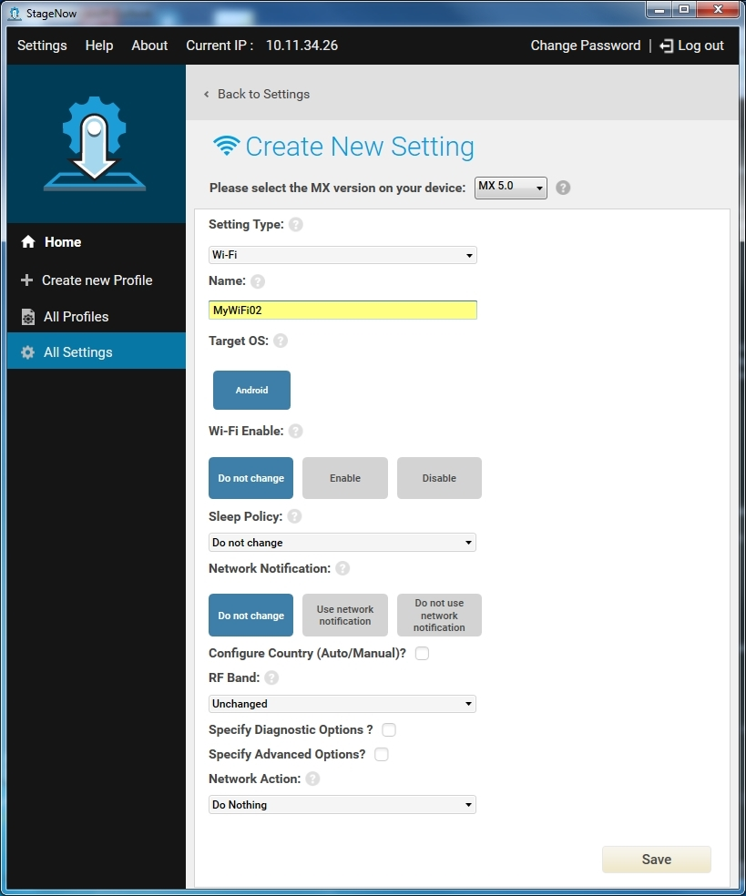
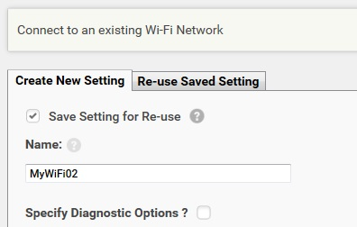
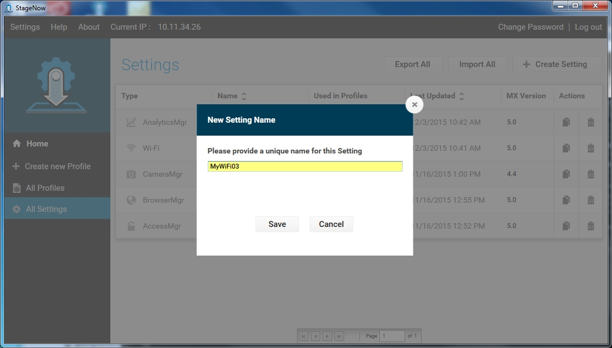
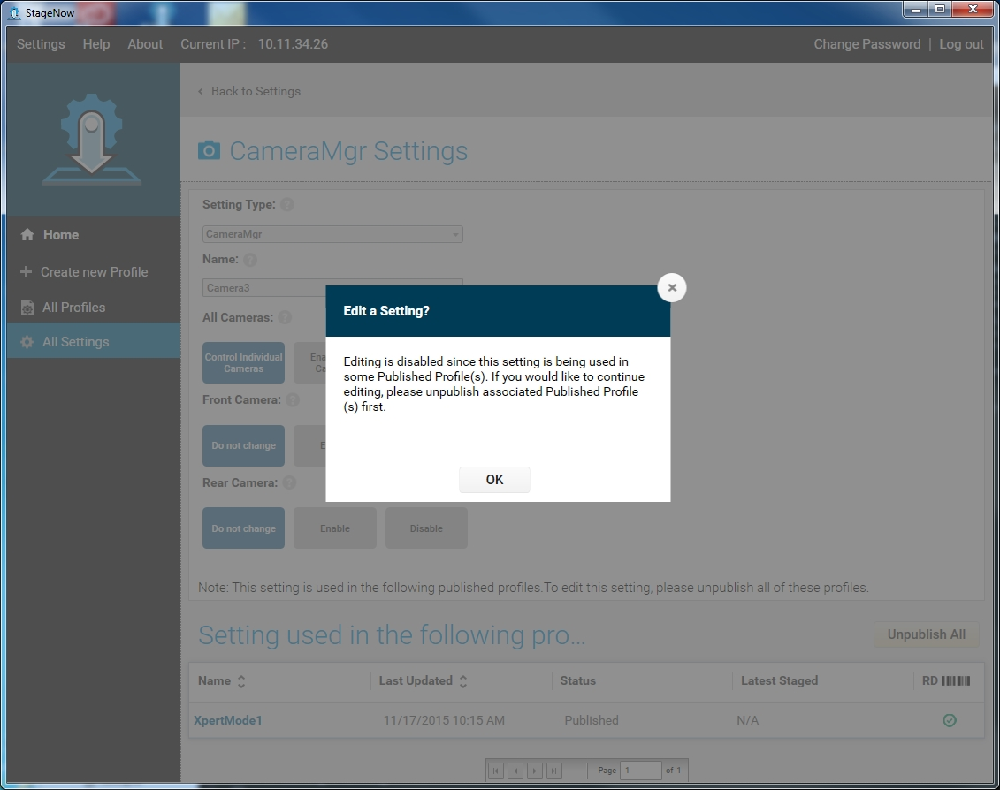
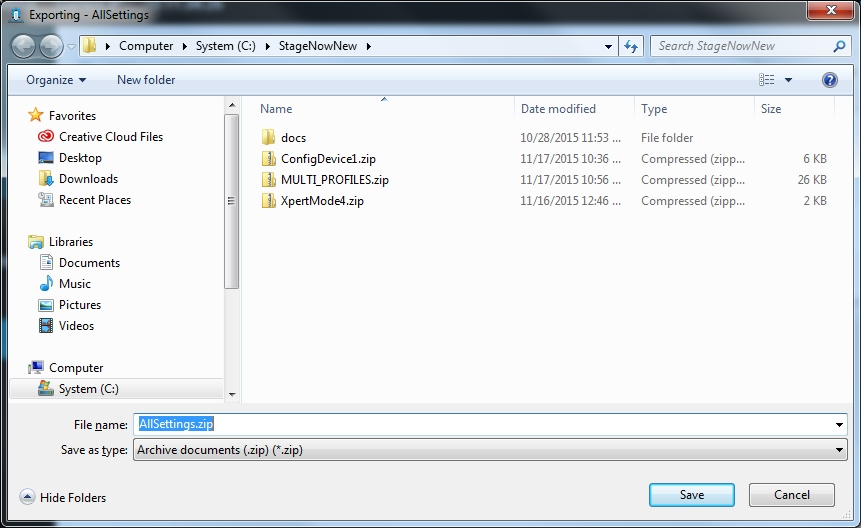
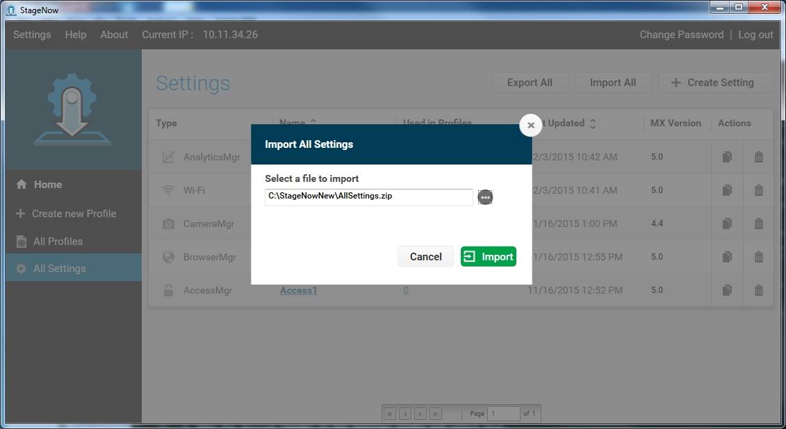

## Introduction
The staging administrator can create and manage settings that can be used and reused in profiles.

During profile creation, a configuration screen in which you enter values is a setting template. Selecting and saving values in each setting template creates a setting which configures a particular feature or function on a device. The setting can be saved for later use when creating other profiles. See [Save for Reuse](../settingconfig?Save%20for%20Reuse) for more information.

You can also create settings outside of Wizards. See [Creating a Setting](../settingconfig?Creating%20a%20Setting).

## Setting Types
See the [Setting Types](../CSPreference) section for all setting types available for setting creation.

## All Settings
Select All Settings from the options on the left to open a list of created Settings. Note that this lists includes all Save for Re-Use settings;  settings not saved for re-use during profile creation do not appear in this window.

This window includes the following fields:

* Type - Type of setting.

* Name - Administrator-provided name of setting. Click on the setting to view or modify it. To modify a setting that is used in one or more published profiles, you must select Unpublish in the pop-up window. Note that modifying such a setting  affects the behavior of all profiles that use this setting.

* Used in Profiles - The number of profiles in which the setting is used.

* Last Updated - The last time an administrator updated the setting.

* MX Version - The version of MX used when creating the setting.

* Actions - Offers the following actions to perform on the setting:

    * Copy  - Copy the setting to create a similar setting with a different name.

    * Delete  - Delete the setting. Note that you CAN NOT delete settings used in one or more profiles. 

## Creating a Setting

To create a setting for use in profiles:

1. Select All Settings from the options on the left to open the Settings window. 
 
2. Select Create Setting to open the Create New Setting window. 

    

3. Select the device MX version from the drop-down menu. The tool retains this selection when configuring future settings.

4. Select a setting type from the Setting Type drop-down list.

5. Select and enter the information required to complete the setting. See [Setting Types](../CSPreference) for the options available in each setting template.

6. Select Save. This adds the setting to the Settings list.

### Save for Reuse
After completing a Setting screen within a Profile Wizard, select the Save Setting for Re-use check box to make this setting available for subsequent profile creation in the same or other Wizards. Enter a Name for the setting. This is useful when creating multiple profiles that will use the same setting, e.g., if many profiles need to access the same network (Wi-Fi setting). This avoids unnecessary re-entry, as well as eliminates mistakes, and if the definition of the setting changes, the administrator can change it in one place instead of many.

During subsequent profile creations, select the Re-Use Saved Setting tab to select the existing (saved) setting for that Setting Type.

## Copying a Setting

You can copy a setting in order to create a new, similar setting. 

Note that when you create a copy of a setting, the copy is independent of the original setting, and editing either the original or the copy does not affect the other. If the original setting is referenced by one or more profiles, the copy is not, unless explicitly referenced after it is created.  

To copy a setting:

1. Select All Settings.

2. Select the Copy icon next to the setting to copy. 

3. Enter a new name for the setting, and select Save. 

    

4. See the next section for instructions on editing the new setting.

## Editing a Setting

To edit a setting:

1. Select the setting from the Setting list. If the setting is used in one or more published profiles, these profiles are listed at the bottom of the screen. Selecting any setting field invokes a pop-up requesting that you unpublish the associated profile in order to edit the setting.

    

2. Select OK, then Unpublish All in order to edit the setting. 

3. Make the desired changes in the Settings window and select Save.

If the setting is part of a tested profile, the associated profile changes its state from Tested to Complete.

## Deleting a Setting

To delete a setting:

1. Select the trash icon next to the setting.   Note that you CAN NOT delete settings used in one or more profiles.

2. Select OK to continue with the deletion.

    

3. A window indicates that the setting was successfully deleted. Select OK.

## Exporting Settings

To export all settings:

1. Select All Settings.

    

2. Select the Export All button.

    

3. The default name for the zip file containing all settings is AllSettings.zip. Select a location for the settings and select Save. A window indicates that the settings were exported successfully.

    

4. Select OK.

## Importing Settings

To import all settings:

1. Select All Settings.

    

2. Select the Import All button.

    

3. Select a zip file using the browse button, and select Open.

4. Select Import. A window indicates that the settings were imported successfully and the settings appear in the settings list.

