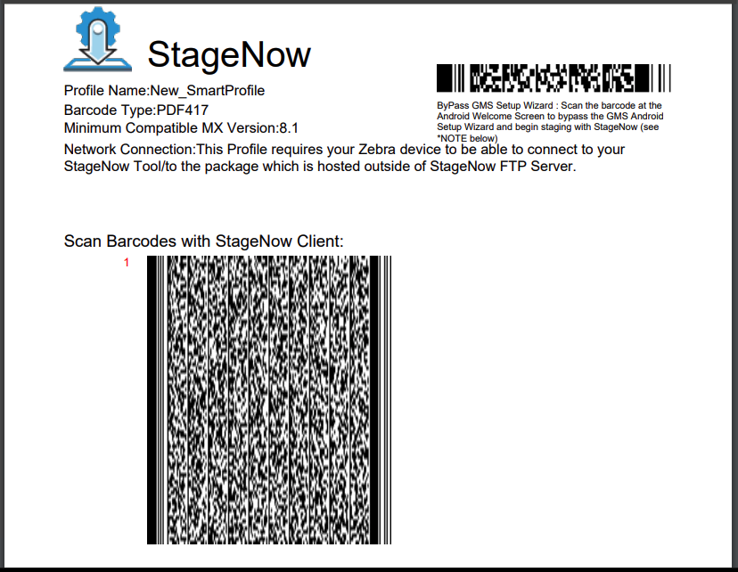

## Overview

**StageNow 5.0 (and later) supports Smart Profiles**, which automatically determine the necessary Profile steps for updating the OS on one or more devices. StageNow also now integrates with the LifeGuard database of updates, which removes the need administrators to manually identify the OS and LifeGuard image(s) required for upgrade operation(s).

### Requirements

* **StageNow 5.0** (or later) installed on Windows PC
* **MX 8.1** (or later) on target device(s)
* **Login credentials** for Zebra.com
* **An active [Zebra OneCare](https://www.zebra.com/us/en/services/zebra-onecare-support-services.html)** account 

> **`IMPORTANT:` If a target device is downgraded to MX 8.0 or earlier** and an upgrade is later required, the upgrade Profile must be created using [manual staging methods](../stagingprofiles/#icreateaprofile). 

-----

## Working with Smart Profiles

### I. Select LifeGuard Updates(s)

**Before creating a Smart Profile**, at least one LifeGuard device image must be selected from the "Browse LifeGuard Images" page. **If LifeGuard images have already been selected, [skip to Section II](#iicreateasmartprofile)**.   

#### To select LifeGuard image(s):

1. From the "<i class="fa fa-home" aria-hidden="true"></i> Home" screen, **click "My LifeGuard Updates"** in the left-hand pane. 

_Click image to enlarge; ESC to exit_.
 
 
2. **Click the "Browse for LifeGuard Updates" button** at the top of the screen.  

_Click image to enlarge; ESC to exit_.
 
 
3. On the login screen, **enter Zebra.com login credentials**. 
**Note: If a timeout occurs, click the "Try Again" button** (not shown) to return to the login screen:

_Click image to enlarge; ESC to exit_.
 
 
4. **Click "Allow"** to load the LifeGuard update database: 

_Click image to enlarge; ESC to exit_.
 
 
5. **Click "confirm"** to continue. **NOTE**: Do **NOT** change the Activation code: 

_Click image to enlarge; ESC to exit_.
 
 
6. **Wait a few moments** for LifeGuard updates to load. 
**`IMPORTANT:` Do NOT cancel this operation** or data corruption could result. 

_Click image to enlarge; ESC to exit_.
 
 
7. To select the desired LifeGuard updates(s) to work with: 
&nbsp;&nbsp;&nbsp;&nbsp;a. **Check the required boxes to filter search results**. 
&nbsp;&nbsp;&nbsp;&nbsp;b. **Click the "Show Results" button** to display the filtered list. 
&nbsp;&nbsp;&nbsp;&nbsp;c. **Click the "plus" icon** to display image in "My LifeGuard Updates" list.  
When the image list appears as desired, **[proceed to Section II](#iicreateasmartprofile)**. 

_Click image to enlarge; ESC to exit_.
 
 

#### Functions of LifeGuard Updates Page

**<u>Revoke button</u>** logs out of the current Zebra.com account. **To continue creating a Smart Profile after pressing**, repeat Steps 3, 4 and 5 above.  

**<u>Search Build Number</u>** allows for loading of a specific build version.  

**<u>Clear Selection</u>** removes all selected filters. 

**<u>Refresh</u>** reloads the available build images from the LifeGuard database. **A "grayed-out" button indicates that StageNow already contains the latest build data**. 

**<u>Release notes</u>** downloads that build's current release notes `.pdf` file for off-line reference. 

#### When desired build files are downloaded, proceed to the next section.

----- 

### II. Create a Smart Profile

When creating a Smart Profile, StageNow examines the selected LifeGuard update and calculates and creates all the Profile steps necessary to deploy the update to the target device(s). 

> **See [Notes section](#notes) below for important information**. 

#### To create a Smart Profile:

1. **Click "My LifeGuard Updates"** in the left-hand pane of the StageNow "<i class="fa fa-home" aria-hidden="true"></i> Home" screen:  

_Click image to enlarge; ESC to exit_. 
 
2. **Click the cloud icon(s) of the desired update(s)** to begin download(s). **NOTE**: If the desired file is already downloaded (indicated by a "check mark" in the image files column), skip to the next step. 
**`IMPORTANT:` Exiting the download screen cancels all current downloads**. 
 
 _Click image to enlarge; ESC to exit_. 
 
3. <u>After a file has been downloaded</u>, **click the Plus (+) symbol** to create a new Smart Profile:  
 
 _Click image to enlarge; ESC to exit_. 
 
4. **Enter a name for the Smart Profile**. Then **click the "Start" button**:
 
 _Click image to enlarge; ESC to exit_. 
 
5. If a network is required, **click "Yes" to configure network settings over which to download update(s) to the device(s)**.  Enter network settings on subsequent screens (not shown). **To vary network settings by location, see [Dynamic Staging](../dynamicstaging)**.   

_Click image to enlarge; ESC to exit_. 
 
6. **Click "Continue"** to create steps for ***downloading*** the build batch file:

_Click image to enlarge; ESC to exit_. 
 
7. **Click "Continue"** to create steps for ***executing*** the build batch file:

_Click image to enlarge; ESC to exit_. 
 
8. On Review screen, **click "View" to see the steps created above** (if desired).  **Click "Complete Profiles" to proceed**:

_Click image to enlarge; ESC to exit_. 
 
9. **Select the desired publishing medium and click the "Test" or "Publish" button**: 
 * **<u>Barcode</u>** generates one or more barcodes that execute the Smart Profile on any device that scans it. 
 * **<u>NFC/SD/USB</u>** generates a `.bin` file to be consumed on devices by the StageNow app. 
 <u>[More about publishing StageNow Profiles](../stageclient/#iiselectstagingmedium)</u> 

_Click image to enlarge; ESC to exit_. 

&#49;&#48;. **Select the desired options to test or publish the Smart Profile**:

_Click image to enlarge; ESC to exit_. 
 

#### Smart Profile creation is complete. After testing, deploy published staging media as required. 

-----

## Notes

* **<u>Zebra strongly recommends testing ALL Profiles before deployment</u> in production environments**.  
* StageNow supports multiple simultaneous downloads from the "My LifeGuard Updates" screen **<u>only while the screen is visible</u>**. 
* **Exiting the My LifeGuard Updates screen cancels all downloads in progress**.
* **To restart an interrupted download**, quit and relaunch StageNow. Then restart the download. 
* **DO NOT use a VPN** when attaching to the LifeGuard Updates database; it could result in unpredictable behavior.  

<!-- on "My LifeGuard Updates" screen

I think I have all these: 

1) on clicking of icon beside to "+" icon will take user to Lifeguard profiles where only profiles related to that build number will be shown.

2) Also there is no mention about "LifeGuard Profiles" page anywhere in document.

3) clicking on icon beside to delete button shall open build selection page which will show only those builds which are greater than the build selected as per the stored data.

4) Document does not also talk about "View  Lifeguard Profiles".

5) Also document should talk about  numbers of profile created ("0 profiles in image").

 -->

-----

