## Introduction

This guide describes how to use StageNow to select and process a StageNow barcode, NFC tag or binary (`.bin`) file from a USB or SD card storage, which configures target device(s) as desired for an organization and/or persists a settings Profile on the device(s) for later consumption (following an Enterprise Reset, for example). 

> **`IMPORTANT:`** Use this guide only <u><i>after</i></u> one or more [Profiles](../stagingprofiles) have been created. 

**NOTE**: Some older target devices come with the Rapid Deployment Client instead of the StageNow client app. This client can be used to upgrade to StageNow, but older OS versions might provide reduced capabilities. For more information, see the [Rapid Deployment Client section](#rapiddeploymentclient) later in this guide. 

#### Also see: 

* [Trusted Staging Guide](../trustedstaging) | Securing devices and the ability to configure them
* [Dynamic Staging Guide](../dynamicstaging) | Injecting values from a file into device configurations at staging
* [Bypassing the Android Setup Wizard](../Profiles/wipedevice/#setupwizardmanualbypass) | Applies to devices with MX 9.0 or later

<!-- 
http://zebra-stage.github.io/stagenow/5-0/Profiles/wipedevice/#setupwizardmanualbypass
 -->
-----

## Stage a Device

### I. Select a Staging Profile

**To select a profile with which to stage the device**:

1. On the host computer, select the StageNow icon from the Start menu to open the Workstation Tool. The Staging Operator home screen appears. See [Home Screen](../gettingstarted?Home%20Screen) for field descriptions.
  
  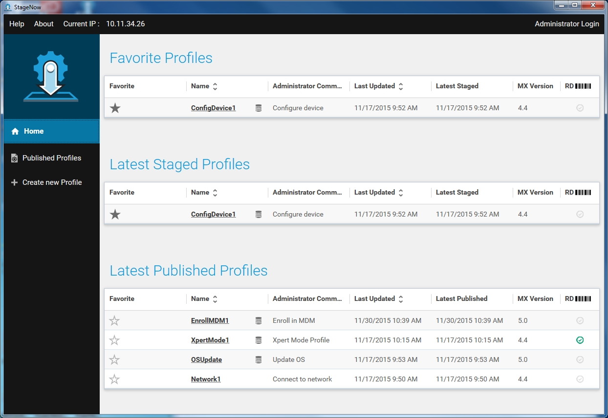

2. Select a profile with which to stage the device(s).

-----

### II. Select Staging Medium

#### Barcode, NFC or USB/SD Staging 
This method of staging writes the configuration information from the selected profile into barcodes, NFC tags or USB/SD card storage. Staging is initiated when the output is read (or heard) by the client device(s). 

1. Select the desired medium (Barcode or NFC) tab:

    

2. **Optional**: In the "My Comments" field, enter comments or special instructions to be displayed to the staging operator when staging begins. 

3. Select the desired output type (if applicable) or choose "Select All" to select all supported output types.

4. Select Stage to generate a PDF of the staging material.

        
    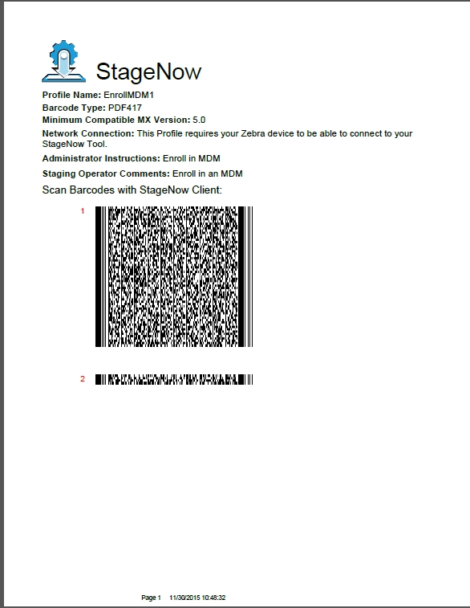

#### Selecting an Audio File for Staging

> **AUDIO NOTE**: StageNow 4.1 (and higher) no longer supports audio staging. 

<!-- 1/21/2020- audio staging removed from SN 4.1

This method of staging writes the configuration information from the selected profile into an audio file. Play the audio file in the vicinity of the client devices in order to initiate staging on these devices. 

1. Select the Audio tab. If this is the first time using this feature, a tour provides help screens that specify technical and environmental requirements for audio staging. 

2. Progress through the instruction screens and select DONE to dismiss the tour.

    

3. Select Play Audio to play the audio staging material in order to stage the devices. See [Audio Staging](../stageclient?Audio%20Staging) for information on preparing the client to receive the audio file.

    

If desired, select the Download icon to download the audio file to the host computer.

    

Navigate to the folder in which to place the audio file and select Save.

-----
-->

### III. Stage the Device(s)

On the target device, tap on the StageNow icon to launch the StageNow Client.

**Note**: The StageNow Client requires the DataWedge profile to read barcode data. However restoring DataWedge discards the current StageNow configuration. If StageNow cannot scan barcodes after restoring DataWedge, exit and re-launch the StageNow Client on the device.

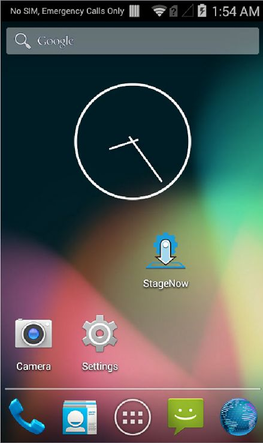

The application lists the available staging methods.

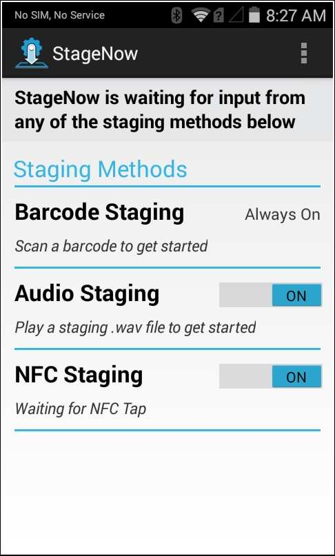

>**Note: MC40 devices do not support NFC**.

-----

### Barcode Staging
To deploy the selected profile to the device through staging barcodes:

1. The Barcode Staging option is always on. Scan the barcode(s) printed from the StageNow Workstation Tool.

    

2. The screen indicates the barcodes scanned via a check mark, and the barcodes left to scan. Continue scanning all staging barcodes. Upon successful deployment, the device displays the following screen:

  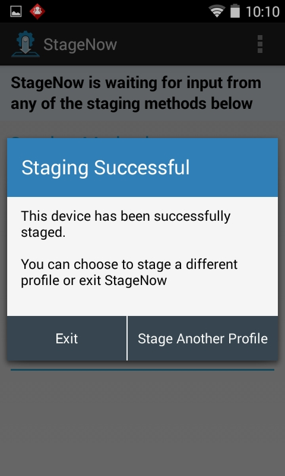

3. If errors occur during deployment, the pop-up shown below is displayed. Select "Yes" to view logs for troubleshooting. 

  

-----

<!-- ### Audio Staging

**NOTE: Audio staging is NOT supported on Zebra's SDM660-platform devices, which currently includes**:
* PS20
* TC52
* TC57
* TC72
* TC77

**To deploy the selected profile to the device via an audio file**:

1. On the client devices being staged, set the Audio Staging option to On.

    

2. Place the devices near the speaker of the host computer that will play the audio .wav file. 

**Note: For best results** use an external speaker in a quiet environment and ensure that there are no obstructions between the speaker and the devices.

3. Play the audio `.wav` file to initiate staging on the devices.

    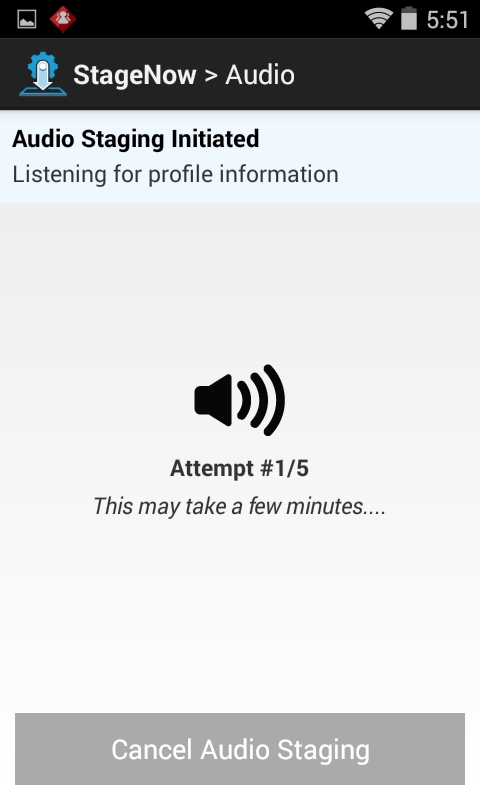

The client attempts up to 5 times to stage. If staging does not occur after the fifth attempt, there is an error in audio transmission and the following error pop-up appears. Select Cancel to cancel staging, Try Again to continue the staging attempts, or Help for audio staging tips.

  

Upon successful deployment, the device displays the success screen.

If errors occur during deployment, the following pop-up appears. Select Yes to view Logs for troubleshooting.

  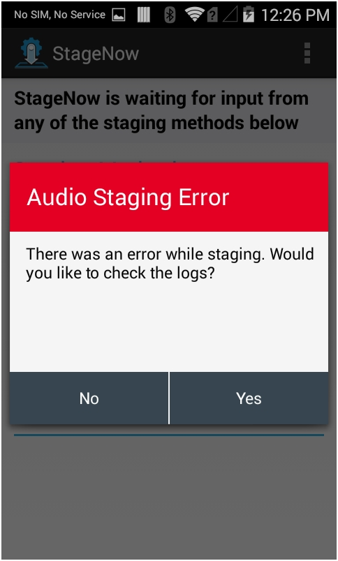

----- 
-->

### NFC Staging

To set up for NFC staging, the StageNow Workstation tool is used to create a `.bin` file that contains the staging instructions. The file is written to an NFC tag using the StageNow Writer app for Android. Once created, the NFC tag can then be read by the StageNow Client app running on an Android device equipped with an NFC reader. 

**Note**: The `.bin` file used for NFC staging also can be used to stage from a USB drive or SD card on devices that are not NFC-equipped. [Learn more](../stagingprofiles/#usbandsdcardprofilestaging). 

#### Requirements
* **To perform NFC staging**: 
 * Zebra device equipped with NFC reader
 * NFC tag containing staging instructions (`.bin` file)
* **To create NFC tags**:
 * [StageNow Workstation](../download) (Windows app)
 * StageNow Client (Android app; pre-installed on Zebra devices)
 * [StageNow NFC Writer](https://play.google.com/store/apps/details?id=com.zebra.ses.nfcwriter&hl=en_US) 1.3.5 or later (Android app)

#### **NFC tag support**
The current version of StageNow supports the following NFC tag specifications: 
* ISO 15693:
 * TI Tag-it HF-1 Plus
 * TI Tag-it TI2048
 * NXP ICode SLIX
* ISO 14443:
 * MIFARE Classic 4K
* ISO/IEC 18092:
 * FeliCa RC-S965

#### To create an NFC tag: 

1. **Copy the** `.bin` **file to the root of the internal SD card** on an NFC-equipped device: 
    
  _The sample `.bin` file is called "clockset" in the example above_.   
2. In the StageNow NFC Writer app on the device, **navigate to and tap the** `.bin` **file** copied in Step 1. 
  A screen similar to the image below appears (the "clockset" sample file is shown):
     
3. When the app displays the “Approach Tag” prompt, **touch the device to the target tag**. 
  Writing begins automatically, sometimes displaying a percentage of completion (depending on tag format):
     
5. **Writing is complete when "Tag written successfully" appears**: 
     

#### NFC tag writing is complete.  

For more information about creating `.bin` files, see the [Staging Profiles guide](../stagingprofiles/#nfcprofilestaging). 

-----

#### To stage a device using an NFC tag:

1. On the device to be staged, open the StageNow Client and confirm that NFC Staging is enabled:
  

2. Touch the device to the fully programmed NFC tag. After a moment, the following screens appear: 
  

3. Follow prompts to complete staging deployment. 

#### NFC Staging is complete. 

-----

#### NFC Errors

* If the size of `.bin` file exceeds available tag storage or another error occurs, a failure message is displayed:
    

* If an error occurs during deployment, a pop-up like the image below appears. Select "Yes" to view the activity log for troubleshooting.

  

-----

### USB, SD Card Staging
<!-- 11/8/19- this doc section is also on the /stagingprofiles page
 -->
StageNow 3.3 (and later) allows the `.bin` file(s) generated during the NFC Staging process to be used for staging a device from a USB drive or SD card.

**To <u>automatically</u> stage a device from a USB drive or SD card**:

1. **Generate** `.bin` **file(s)** using the [NFC Profile Staging](#nfcprofilestaging) procedures above. 
2. **Create a folder called** `/Stagenow` on a USB drive or SD card.
3. **Copy the** `.bin` **file(s)** to the new folder's root level. 
3. **Attach (or insert) the storage device and boot** the (new or enterprise-reset) device to be staged. 

##### `IMPORTANT NOTES:` 

* **On devices with MX 9.0**, any `.bin` file causes Setup Wizard bypass. 
* **On devices with MX 9.1 and later**, a security check ensures that bypass occurs only if the StageNow Profile was created using MX 9.1 or later. 
* **Devices with MX 9.1 (or later) automatically skip the Android Set-up Wizard** and begin staging when a `.bin` file is found. About [SUW bypass limitations](../Profiles/wipedevice/#setupwizardmanualbypass).

>**Note**: Staging Profiles stored on an SD card take precedence over USB.

**To <u>manually</u> stage a device from a file on the device**:

1. **Generate** `.bin` **file(s)** using the [NFC Profile Staging](#nfcprofilestaging) procedures above. 
2. **Copy the** `.bin` **file(s)** to any location on the device. 
3. **Launch the StageNow client** and tap the "Browse" button.
4. **Navigate to and tap the** `.bin` **file** copied in Step 2 to begin staging. 
<!-- 11/8/19- image file discovered to be missing

-->

-----

## Staging Wait Conditions
The following pop-up screens can appear during staging, indicating the device is performing an operation and that staging will complete when it is done.

### Initializing

Following a device reboot, Zebra components such as the MX Framework can require as much as two minutes to initialize and prepare for staging. If staging is initiated during this time, the StageNow Client indicates displays a pop-up similar to the image below: 

  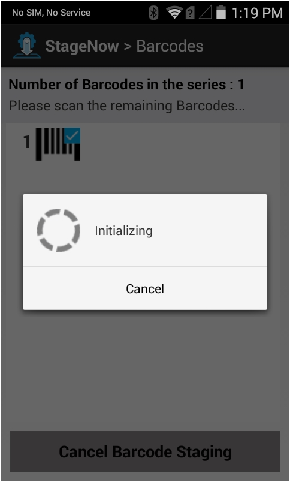

### Acquiring IP

A delay can sometimes occur if staging requires an IP address, such as during "scan-and-dock," when the operator scans a barcode and places the device in an Ethernet cradle. Staging pauses until the device acquires the IP address and performs network operations such as downloading a file from the StageNow staging server. under such scenarios, a pop-up appears similar to the image below:

  

### Downloading

The pop-up shown below indicates that the client is processing a staging profile that contains a command to download content from a staging server. This often indicates an OS update package.

  

-----

## StageNow Client Menu
In the StageNow application, select the three vertical dots at the top right of the window to open the StageNow menu.

  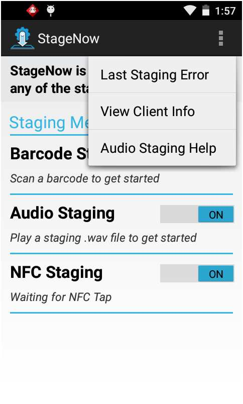

### Last Staging Error
If staging fails, a screen similar to the image below appears. To troubleshoot, review the log to determine the cause of the error by selecting "Yes" from the staging failure screen. To view the log later, select "Last Staging Error" from the StageNow Client menu. 

  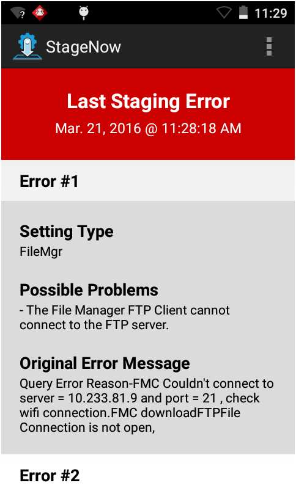

**HINT**: To identify the error(s) in the log, refer to the characteristic-error or parm-error in the log contents.

>**Note**: The Last Staging Error screen displays content only if there are errors in the staging operation. If the staging operation is successful, this screen is empty.

### Log Path

To configure the log file path, select the menu icon and select Log Path. 

  

The Log Path window opens.

  

Enter the new path and select Done to update the path, or cancel to retain the existing path.

### View Client Info
Select View Client Info to view software version information for the device.

  

Use this screen to determine whether the device has full or partial StageNow feature functionality.

* Full Functionality - the OSx Version is the same as the MXMF Version.

* Partial Functionality - the OSx Version is less than the MXMF Version. See the Feature Compatibility section of the specific [Setting Types](../CSPreference) to determine if the device supports that feature.

* No Functionality - no OSx Version.

<!-- 

### Audio Staging Help
**NOTE: Audio staging is NOT supported on Zebra's "SD660-platform" devices, which currently includes**:
* PS20
* TC52
* TC57
* TC72
* TC77

Select Audio Staging Help for tips for successful audio staging.
Select Dismiss on any screen to dismiss the help.

  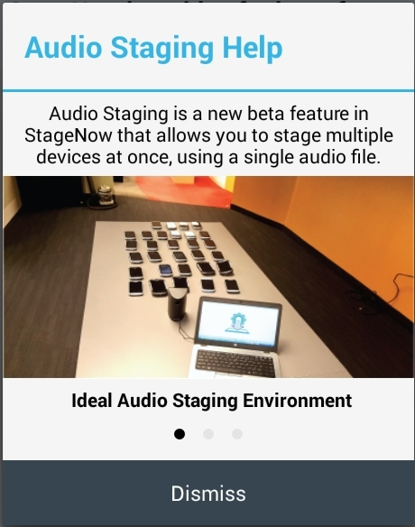

  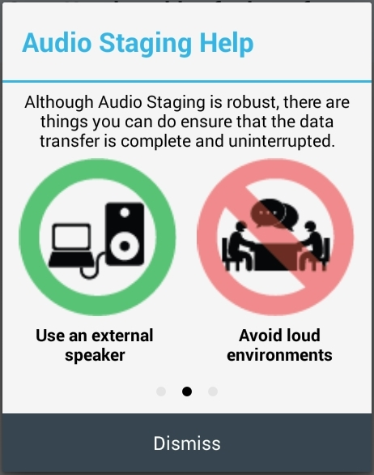

  
 
-----
-->

## Rapid Deployment Client

Devices running Jelly Bean and some running older versions of KitKat include the Rapid Deployment (RD) Client instead of StageNow. Such devices can scan a StageNow-generated barcode with the RD Client. This initiates a network connection for installing MX and the StageNow Client on the device and launches StageNow and the specified settings Profile. However, older OS versions might reduce available device functions and/or StageNow features.

Specifically, to stage a device that includes RD Client:

1. The administrator uses the StageNow Workstation Tool to generate RD or StageNow profile barcode(s).

2. The operator uses the device to scan the barcode(s). This downloads and installs other device components, including the MX Framework and the StageNow Client.

3. The device reboots, and the StageNow Client automatically launches and applies Profile settings to complete the staging process. 

>Note:  
>This SD Client staging process does not apply to re-branded devices.

  

