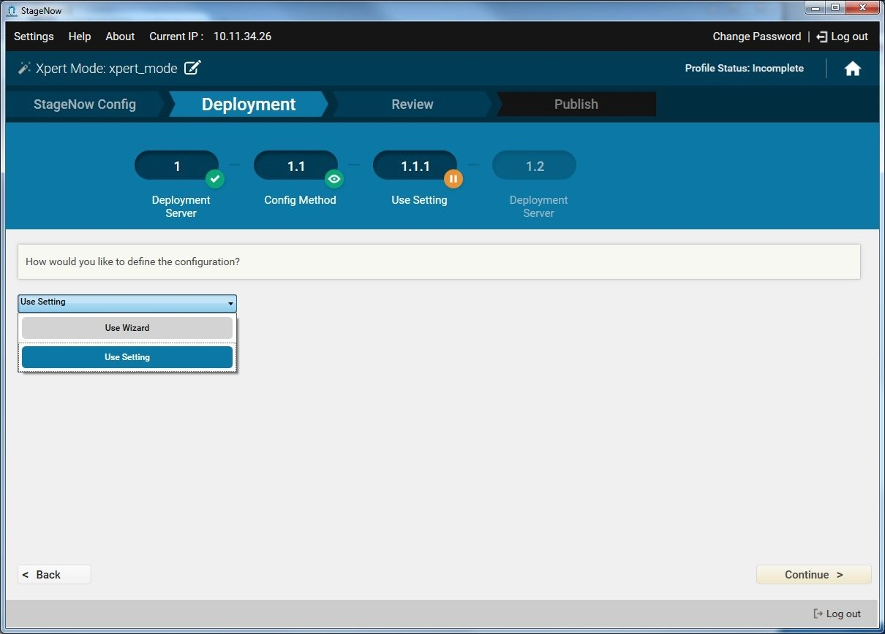
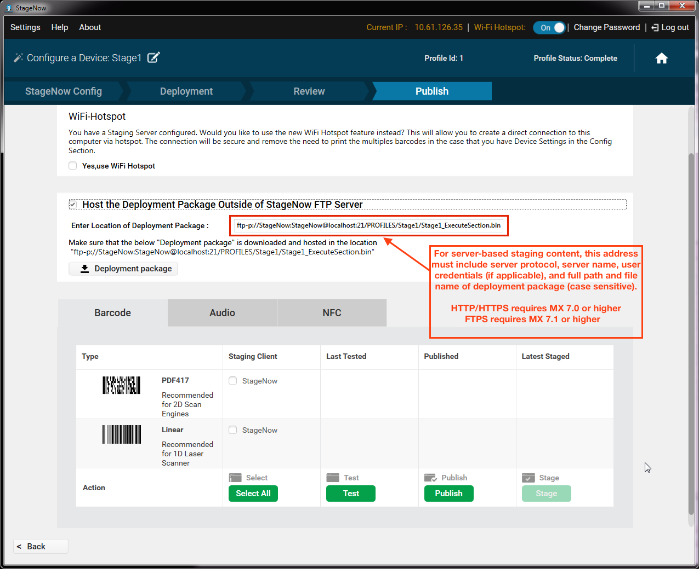
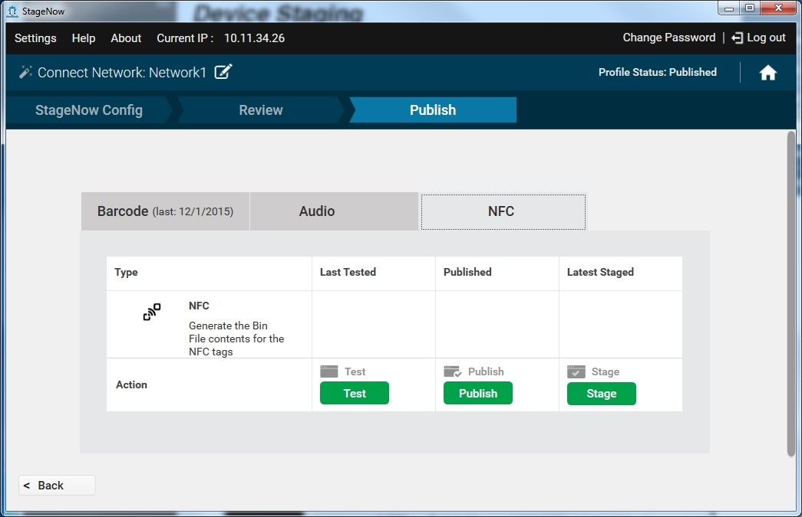
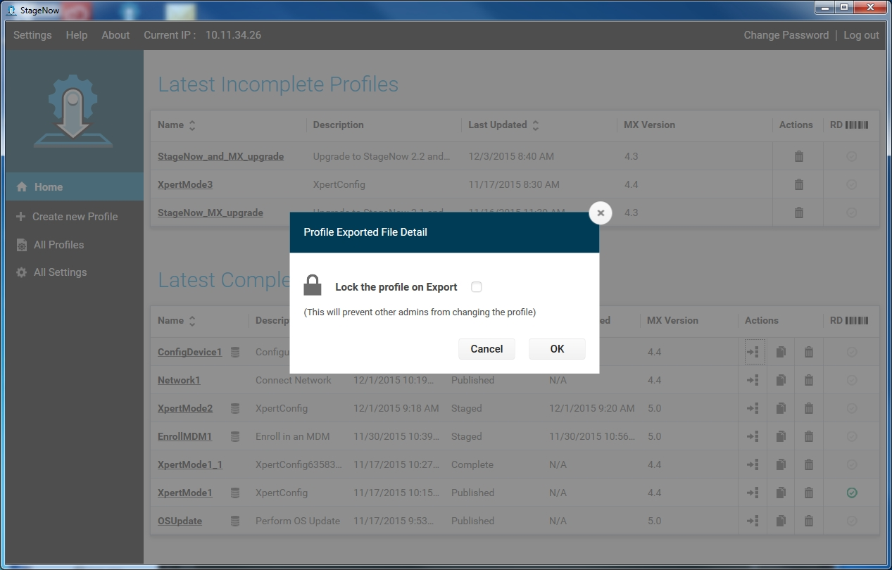

## Overview

**This section describes how to create, deploy and manage staging Profiles**, which are used to configure Zebra devices based on settings input by the staging administrator.

### Staging Process

* [Config](../stagingprofiles/#iiconfigure) (StageNow and RD) - The setting information entered in the StageNow Config section is stored within StageNow barcodes or binary (`.bin`) files for deployment through a USB port or NFC tag. The number of settings created in this section affects the number of barcodes and/or `.bin` files generated to configure device(s). 

* [Deployment](../stagingprofiles/#iiideployment) includes settings that do not reside in StageNow barcodes or NFC tags. It is represented as a file on the StageNow deployment server and therefore **requires a network connection**. Reading the barcode or NFC tag created in the Config section connects the client device to the server and points to this file for deployment. 

> **NOTE**: The Deployment section does NOT appear in "Connect Network," "Manage Device Security" or "Wipe a Device" Wizards.

* [Review](../stagingprofiles/#ivreview) presents all settings information entered in the Config and Deployment sections in a single page for easy confirmation. From here, the administrator can return to any setting to update it, add comments to the Profile and finish creating the Profile.

* [Publish](../stagingprofiles/#vpublish) allows the administrator to select the method of delivery (linear barcodes, PDF417 barcodes or NFC tags) for the completed Profile, as well as to test, publish and stage the Profile.

#### Also See

* **[Dynamic Profiles](../dynamicstaging)** | Create multiple config barcodes from a single Profile using imported data 
* **[Smart Profiles](../smartprofile)** | Automatically generate Profiles for device OS updates
* **[Trusted Staging](../trustedstaging)** | Protect devices from unauthorized configuration changes 

-----

## Alert Button

Zebra devices offer the ability to designate a key as a "panic button" that when long-pressed executes an intent to perform a customized task such as dialing an emergency phone number, summoning medical assistance or launching any custom Android app or activity.

### Required Services
Programming an Alert Button in the way recommended by Zebra requires use of all three CSPs shown below.   

* **<u>KeyMapping Manager</u>** assigns a Key Code to a Key Identifier.
* **<u>Intent</u>** assigns a Key Identifier to an intent to be sent when the Key Code assigned to that Key Identifier is long-pressed.
* **<u>Power Manager</u>** (optionally) assigns the key as a wake-up source to ensure that the Alert Button operates from suspend mode. **Zebra recommends setting the Alert Button as a wake-up source to ensure operation from all device states**. 

<iframe width="560" height="315" src="https://www.youtube.com/embed/WcVLvjBBDmE" frameborder="0" allow="accelerometer; autoplay; clipboard-write; encrypted-media; gyroscope; picture-in-picture" allowfullscreen></iframe>

### Summary of Steps
The steps for creating an Alert Button are listed below, and **<u>must be executed in the order shown</u>** for proper operation. Detailed instructions for the steps are provided in the sections that follow. 

**To create an Alert Button**:  

1. **Create a Profile**.
2. **Select MX version** (MX 10.2 or later is required).
3. **Select Xpert Mode** Wizard.
4. **Enter a Profile name** and **click "Start"** button.
5. **Select PowerMgr CSP** and **click (+)** button.
6. Select **KeyMappingMgr CSP** and **click (+)** button. 
7. Select **Intent CSP** and **click (+)** button.
8. **Click "Add"** to proceed.  `PLEASE READ BEFORE PROCEEDING:` **COMPATIBILITY NOTE**: Not all wake-up sources (buttons) are available on all devices. **For compatibility with the broadest array of devices, skip steps 9 and 10 (for programming a specific button as a wake-up source) and proceed to Step 11** to activate ***all* available wake-up sources**. 
9. **In PowerMgr "Wake-Up Action"** section, **select "Turn on"** option and click Continue.
10. **In the “Choose a key to control”** section, **select the desired key** to be designated as the Alert Button from the drop-down. **Click "Continue"** button.   **SKIP TO STEP 12**.
11. **In the "All Wake-up Sources" section, select "Turn on"** to activate wake-up keys on all available wake methods. 
12. **In PowerMgr "All Wake-up Method"** section, **select “Use Hardware Signals for Wake-Up**.”  When finished, **click "Continue"** button. 
13. **In KeyMappingMgr "Choose a Key to Modify"** section, **select the key designated as the Alert Button**. 
14. **In KeyMappingMgr "Key behavior"** section, **select "Send key-code"**. The key-code drop-down appears. 
15. **From the KeyMappingMgr key-code drop-down, select “none.”** 
16. `IMPORTANT:` To ensure Alert-Button functionality in any keyboard state, map “none” to ***every*** key behavior (“Key behavior in Blue mode,” “Key behavior in Orange mode,” etc.).  When finished, **click "Continue"** button. 
17. **In Intent "Mode"** section, **select "Schedule sending of intent on key presses"** option.  **Optional**: To prevent device from entering suspend mode, check the "Keep Device Awake" checkbox.
18. **In Intent "Key Identifier"** section, **select the key** designated as the Alert Button.
19. **In the Intent "Android Action Name"** section, **enter the desired action** for the use case. 
For example, `android.intent.action.CALL` summons the Android native dialer.
20. **Enter data for any additional required fields** for the desired use case. 
For example, entering "`tel:+18885551212`" in the Intent "URI" field places a call to 1-888-555-1212.
21. When finished entering data, **click Continue**.
22. **Generate a barcode** (or `.bin` file for deploying via NFC tag or SD card).
23. **Scan the barcode** (or deploy the `.bin` file) to configure the target device.
24. When staging is complete, **test Alert Button functionality** by short-pressing, then long-pressing the newly programmed key.

### Alert Button Notes
* **The intent function reads only the base state of a given key identifier**;  it does NOT read any of the keyboard-modifier states (i.e. ALT, SHIFT, color, etc.). To prevent the device from ignoring Alert key-presses if the keyboard is NOT in the base state, map "none" to all keyboard states. 
* **To send the desired key code in ALL keyboard states**, assign the desired Key Identifier to the key code in ALL keyboard states. [More about KeyMapping](/mx/keymappingmgr/).
* **If the key had been previously assigned a function** (i.e. as a scan trigger), assigning the "none" key code removes the pre-existing function. This dedicates the key to the Alert Button function only. 
* **To test Alert Button functionality**, short-press then long-press the designated button. 
* **To prevent changes to Alert Button settings**, block user access to the Android Settings panel. 
* **To prevent the device from entering suspend mode**, check the "Keep Device Awake" button in Intent Manager.  

-----

## I. Create a Profile
The staging administrator uses the provided StageNow Wizards to configure settings that define software configuration and installation for enterprise devices. When creating a Profile for staging the device, the administrator progresses through the following steps in the banner provided in the Workstation Tool:

_Click image to enlarge; ESC to cancel_.
 
> **NOTE: The Rapid Deployment (RD) Config section appears only if Legacy Mode is turned on in the [Settings](../gettingstarted/?settings#stagenowmenu) screen**. Setting information entered in the RD Config section is stored within RD barcodes.

-----

### Profile States
As progress is made through the Wizard, the top right corner of the window reflects the state of the Profile: 

_Click image to enlarge; ESC to cancel_.
 

* **Incomplete** - The Profile is not yet complete.

* **Complete** - All information required by the Wizard is included in the Profile, but it is not yet tested to ensure the Profile functions as intended.

* **Tested** - The Profile was tested to determine whether it is sufficiently operational for staging. It is not yet visible to the operator.

* **Published** - The Profile is visible to the operator.

* **Staged** - The operator has acquired the Profile, i.e., generated barcodes and exported data to write to an NFC tag.

### Navigating the Wizard
Following are tips for navigating through the Wizard.

Click on the sections of the primary banner (e.g., StageNow Config, RD Config) to view that section. Note that section must be completed before clicking ahead to the next section.

_Click image to enlarge; ESC to cancel_.
 

Use the "Back" button to return to the previous section and the "Continue" button to proceed to the next section.

_Click image to enlarge; ESC to cancel_.
 

Similarly, click on the oval buttons in the secondary banner to view that sub-section. Each sub-section must be completed before clicking ahead to the next one. 

_Click image to enlarge; ESC to cancel_.
 

The small round buttons adjacent to each oval button indicate the status of that section:

  *  **A green check icon** indicates that section is complete.

  *  **A green eye icon** indicates the section being viewed.

  *  **An orange icon** with a pencil indicates the section that is in process.

  *  **An orange icon** with a pause indicates the section that is in process while viewing another section.

  *  **A grayed-out oval** with no adjacent round button indicates a section not yet started.

Use the arrows at the beginning and end of the secondary banner to scroll through these sub-sections. 

_Click image to enlarge; ESC to cancel_.
 

When selecting "Yes" for a secondary banner item, additional subsections are added to the banner. 

_Click image to enlarge; ESC to cancel_.
 
To edit the Profile name, click the pencil icon next to the name.

_Click image to enlarge; ESC to cancel_.
 
At any point, click the Home button to return to the Home screen. 

_Click image to enlarge; ESC to cancel_.
 

When populating a setting template window within a Wizard, to make the setting available for selection when creating other Profiles, select the Save Setting for Re-use checkbox, and enter a name for the setting. See [Save for Reuse](../settingconfig?Save%20for%20Reuse) for more information.

-----

## II. Configure
To create a Profile, open the StageNow Workstation Tool and log in.

Select Create New Profile, and then select the device MX version from the drop-down menu. The tool retains the current selection when configuring future Profiles.

Initially, a warning appears indicating that selecting an incorrect version can cause staging to fail. If target devices contain different versions of MX, select the lowest version. Select the checkbox on this window to suppress display in the future.

_Click image to enlarge; ESC to cancel_.
 
Select one of the following Wizards and select Create.

* [Configure a Device](../Profiles/configdevice)

* [Connect Network](../Profiles/ConnectNetwork)

* [Enroll in an MDM](../Profiles/enrollmdm)

* [Manage Applications](../Profiles/manageapps)

* [Manage Device Security](../Profiles/managesecurity)

* [Perform OS Update](../Profiles/osupdate)

* [Wipe a Device](../Profiles/wipedevice)

* [Xpert Mode](../Profiles/xpertmode)

After completing the StageNow Config and RD Config sections of the Wizard, proceed to the next section of the Wizard.  Certain Wizards include a Deployment section, whereas others proceed to the Review section.

### MX Selection

Selecting MX 6.x or higher from the MX version drop-down menu supports a Wi-Fi hotspot option for some Wizards. If selecting MX 6.X for the applicable Wizards, the first Wizard window displays a prompt for selecting one of the following options from the drop-down menu:

* "The devices I wish to provision are currently not connected to a network. I will define a network with this Profile that will be used for staging."

* "The devices I wish to provision are already connected to a network that will be used for staging." 

* "I wish to use the WiFi Hotspot feature which will automatically create a network for staging using this computer's network card." 

_Click image to enlarge; ESC to cancel_.
 

Select an option and proceed to the instructions for the selected Wizard.

### MX Notes
* The second and third options above are supported only by Wizards that use the Deployment section of the tool.
* **StageNow 2.9 and higher supports plug-in CSPs**, which deliver additional MX features not included with a given StageNow version. 
* Plug-in CSPs are delivered as a `.zip` file. <u>DO NOT unzip</u>! 
* Copy the `.zip` file to the following folder on the StageNow admin PC:
   * `\Program Files (x86)\Symbol Technologies\Staging_Solution\SNCertFiles\`
* **If the plug-in CSP was unzipped or delivered as separate files, use the following steps to create a `.zip` file**:
  * **Use PKzip or a compatible compression utility** to zip the CSP and its corresponding DSD file into a single `.zip` archive file.
  * **Name the new file** `[CSPname].zip` (substituting "[CSPname]" for the real name. Example: `RfidMgr.zip`).  
  * **Copy the file to the folder shown above**. `NOTE:` **Do NOT drag the file** as described on the CSP Library screen. 
* On the CSP Library screen, **click the "OR, CHOOSE FILE" button** and select the desired CSP's `.zip` file. 
* The parameters of the plug-in CSP are now available using the standard process for creating a staging profile. 

_Click image to enlarge; ESC to cancel_.
 

-----

## III. Deployment
Use the Deployment section of the Wizard to specify the subset of the settings that define what the Profile does, and store these settings on a deployment server. See the specific [Profile Wizard](../ProfileWizards) for instructions. 

**Note**: This section is not available on some Wizards. 

Wizards that include the Deployment section require that device(s) access the Deployment Server in order to acquire the information provided there. Specifically, the device and the server should be on the same network, or there should be routing from the device network that allows connection to the Deployment Server. 

_Click image to enlarge; ESC to cancel_.
 

-----

## IV. Review
The Review section of the Wizard allows selection verification.

_Click image to enlarge; ESC to cancel_.
 

1. Select Expand to view the StageNow configuration and RD configuration settings. This setting list offers the following fields:
    * Step - The section step where the Administrator added the setting.
    * Description - A user-defined "friendly" description of the setting.
    * Last Updated - Last time the Profile was updated.
    * View - Click to view/modify the setting.

2. Select Change to make any changes to the settings.

3. Select the icon next to Profile Description to enter a description for the Profile.
    
    _Click image to enlarge; ESC to cancel_.
   

4. Enter the description and select Save.

5. Encryption for staging data is selected by default in order to protect the sensitive data encoded in the Profile barcode or NFC tag. See [StageNow Encryption](../gettingstarted?StageNow%20Encryption)  for more information. De-select this checkbox if necessary to save space.

6. Select Complete Profile to proceed to the Publish window. The Profile status at the top right of the screen is now Complete.

-----

## V. Publish
The Publish section of the Wizard permits selection of a staging method, testing of the method for Profile functionality, and making the Profile available to the staging operator. This window lists the available Profile delivery types, and displays dates and times when the Profile was Last Tested, Published and Staged.

-----

### Barcode Profile Staging
To stage a barcode Profile:

1. Select the Barcode tab: 
    
    _Click image to enlarge; ESC to cancel_.
 

2. To create a direct connection via hotspot instead of using the configured staging network, check the "Yes, use WiFi Hotspot" checkbox. This allows staging with a single staging barcode without requiring an external Wi-Fi network, and eliminates the need for reprinting barcodes if there is a Profile change.

3. To stage devices from content stored on a server, check the "Host the Deployment Package Outside of StageNow FTP Server" and enter the server address and fully qualified file name (including path, see image above) of server-based content using the Source URI syntax. For more information and examples of this syntax, see the [Source URI](../csp/file/#source-uri) and [Examples](../csp/file/#examples) sections of the [File Manager guide](../csp/file). This feature supports HTTP, HTTPS, FTP and FTPS (FTP over TLS or SSL) protocols and basic authentication of URL-embedded credentials (Devices with MX 4.4+ support FTP only; **HTTP/HTTPS requires MX 7.0 or higher on device**; FTPS requires MX 7.1 or higher). 

4. Select the checkbox for PDF417 or Linear to specify the type of barcode for deployment, or choose Select All to select all barcode types.

5. Select Test to test the functionality of the Profile before publishing. This generates a PDF of test staging barcode(s). While this step is optional, it is important to determine whether the Profile functions as intended before making it available to the operator(s) for staging devices.
    
    _Click image to enlarge; ESC to cancel_.
 

6. If the staging material functions properly, select "Publish" to publish the material for operator use. Note that the administrator can choose to publish only certain types of barcodes that were successfully tested, and publish the others when they are ready.

7. Enter staging instructions for the operator.
    
    _Click image to enlarge; ESC to cancel_. 
     

8. Select "Publish Now" to continue.
    
    _Click image to enlarge; ESC to cancel_.
     

9. To make the Profile available for staging, select "Stage" to generate a PDF of staging barcode(s) that devices can scan for staging. See [Device Staging](../stageclient).

10. To export the Profile for consumption by StageNow or an MDM, select the "Export For StageNow" or "Export For MDM" button. See [Exporting Staging Profiles](../stagingprofiles?Exporting%20Staging%20Profiles).

**Select "Unpublish" to unpublish a Profile** and remove operator access. 

-----

<!-- ### 
 Profile Staging

**NOTE: Audio staging is NOT supported on Zebra's "SD660-platform" devices, which currently includes**:
* PS20
* TC52
* TC57
* TC72
* TC77

**To stage an audio Profile**:

1. Select the Audio tab. If this is the first time using this feature, a tour provides help screens that specify technical and environmental requirements for audio staging. 
    
    _Click image to enlarge; ESC to cancel_.
     

2. Progress through the instruction screens and select DONE to dismiss the tour.
    
    _Click image to enlarge; ESC to cancel_.
     

3. To create a direct connection via hotspot instead of using the configured staging network, select the Yes, use Wifi Direct checkbox.

4. Select Test Audio to play the file in order to verify the functionality before publishing, or the Download icon to save the audio file before testing. While this step is optional, it is important to determine whether the Profile functions as intended before making it available to the operator(s) for staging devices.
    
    _Click image to enlarge; ESC to cancel_.
   

5. If the audio file functions properly, select Publish Profile to publish the audio file for operator use. 

6. Enter staging instructions for the operator, and select Publish Now.

7. To stage the clients using the audio file, select Play Audio, or Download to save the audio file for other administrators or operators to use. See [Device Staging](../stageclient).

8. To export the Profile for an MDM or for StageNow, select the Export For MDM or Export For StageNow button. See [Exporting Staging Profiles](../stagingprofiles?Exporting%20Staging%20Profiles).

To unpublish a Profile to remove operator access, select Unpublish.

-----
-->

### NFC Profile Staging
To stage an NFC Profile:

1. Select the NFC tab. 
    
    _Click image to enlarge; ESC to cancel_.
     

2. To create a direct connection via hotspot instead of using the configured staging network, select the Yes, use Wifi Direct checkbox.

3. Select Test to test the functionality of the Profile before publishing. This saves the NFC tag as a .bin file for testing. While this step is optional, it is important to determine whether the Profile functions as intended before making it available to the operator(s) for staging devices.

4. If the staging material functions properly, select Publish to publish the material for operator use. 

5. Enter staging instructions for the operator.

    

6. Select Publish Now.

7. To make the Profile available for staging, select Stage. This save the NFC tag as a .bin file that devices can read for staging. See [Device Staging](../stageclient).

8. To export the Profile for an MDM or for StageNow, select the Export For MDM or Export For StageNow button. See [Exporting Staging Profiles](../stagingprofiles?Exporting%20Staging%20Profiles).

To unpublish a Profile to remove operator access, select Unpublish.

-----

### USB and SD Card Profile Staging
<!-- 11/8/19- this doc section is also on the /stageclient page
 -->
StageNow 3.3 (and later) allows the `.bin` file(s) generated during the NFC Staging process to be used for staging a device from a USB drive or SD card.  

**To <u>automatically</u> stage a device from a USB drive or SD card**:

1. **Generate** `.bin` **file(s)** using the [NFC Profile Staging](#nfcprofilestaging) procedures above. 
2. **Create a folder called** `/Stagenow` on a USB drive or SD card.
3. **Copy the** `.bin` **file(s)** to the new folder's root level. 
3. **Attach (or insert) the storage device and boot** the (new or enterprise-reset) device to be staged. 

##### `IMPORTANT NOTES:` 

* **On devices with MX 9.0**, any `.bin` file causes Setup Wizard bypass. 
* **On devices with MX 9.1 and later**, a security check ensures that bypass occurs only if the StageNow Profile was created using MX 9.1 or later. 
* **Devices with MX 9.1 (or later) automatically skip the Android Set-up Wizard** and begin staging when a `.bin` file is found. About [SUW bypass limitations](../Profiles/wipedevice/#setupwizardmanualbypass).

>**Note**: Staging Profiles stored on an SD card take precedence over USB.

**To <u>manually</u> stage a device from a file on the device**:

1. **Generate** `.bin` **file(s)** using the [NFC Profile Staging](#nfcprofilestaging) procedures above. 
2. **Copy the** `.bin` **file(s)** to any location on the device. 
3. **Launch the StageNow client** and tap the "Browse" button.w
4. **Navigate to and tap the** `.bin` **file** copied in Step 2 to begin staging. 
<!-- 11/8/19- image file discovered to be missing

-->

-----

## Copying a Staging Profile

**To create a new Profile by copying an existing one**:

1. Select the Copy icon (shown below) next to the Profile. 
    
    _Click image to enlarge; ESC to cancel_.
     

2. Enter a new name for the Profile, and select Save. 
    
    _Click image to enlarge; ESC to cancel_.
     

3. A window indicates the Profile was copied successfully. Select OK.

4. See the next section for instructions on editing the new Profile.

-----

## Editing a Staging Profile

>Note:  
>In-progress Profiles created in StageNow 2.0 may not function after upgrading to the latest StageNow Tool.

To edit a Profile:

1. Select the Profile from the home screen. 

2. Use the navigation UI in the Wizard to locate the setting to update. See [Navigating the Wizard](../stagingprofiles?Navigating%20the%20Wizard).
   
    _Click image to enlarge; ESC to cancel_.
     

3. Select Edit to enable the fields for updating.

4. Make the required changes and select Save, or select Cancel to discard the changes.

5. Select Continue and proceed through the Wizard.

6. In the Review section, select Complete Profile to move to the Publish section to generate updated barcodes or NFC tags.

-----

## Exporting Staging Profiles

>Note:  
>Incomplete Profiles cannot be exported.

To export a single Profile for StageNow or for an MDM:

1. Select the Export icon next to the Profile. 
    
    _Click image to enlarge; ESC to cancel_.
     
    
    _Click image to enlarge; ESC to cancel_.
     

2. Select whether to export for an MDM or for within the StageNow tool.
    
    _Click image to enlarge; ESC to cancel_.
     

3. If selecting Export For StageNow, to lock the Profile so it cannot be changed and hide the details from other administrators, select the check box, and then select OK.

4. Select a location for the Profile and select Save. A window indicates that the Profile was exported successfully.

5. Select OK.

Note: RD settings are not exported and so cannot be imported.

### Exporting All Profiles

>Note:  
>Incomplete Profiles are not exported.

To export all staging Profiles:

1. Select All Profiles.
    
    _Click image to enlarge; ESC to cancel_.
   

2. Select the Export Profile(s) button.
    
    _Click image to enlarge; ESC to cancel_.
 

3. To lock the Profile so it cannot be changed and hide the details from other administrators, select the check box.

4. Select OK.
    
    _Click image to enlarge; ESC to cancel_.
 

5. The default name for the zip file containing all Profiles is MULTI_PROFILES.ZIP. Select a location for the Profile and select Save. A window indicates that the Profile was exported successfully.

6. Select OK.

-----

## Importing a Staging Profile

To import a Profile:

1. **Click "All Profiles"** in the Home screen's left-hand pane:
    
    _Click image to enlarge; ESC to cancel_.
 

2. **Click "Import Profile(s)"** button. A navigation dialog appears: 
    
    _Click image to enlarge; ESC to cancel_.
 

3. **Navigate to the file to be imported** and **click "Import"** button. A dialog appears to indicate that the Profile was imported successfully.  
**Click OK**. 

4. The imported Profile appears in the Profiles list. Profiles locked during export appear with a lock icon after import:
    
    _Click image to enlarge; ESC to cancel_.
 

> `IMPORTANT:` After importing a staging Profile, its settings counters are reset to zero (see image below).  

_Click image to enlarge; ESC to cancel_.
 

<!-- 2/26/19- removed lines below; obsolete. 

Profiles created in StageNow 2.0 are imported as MX 4.3 Profiles.

Note: RD settings are not exported and so cannot be imported.
-->
-----

## Deleting a Staging Profile

To delete a Profile:

1. Select the trash icon next to the Profile. 
    
 
    
    _Click image to enlarge; ESC to cancel_.
 

2. Select OK to confirm the deletion.

3. A window indicates that the Profile was successfully deleted. Select OK.

-----

## Upgrading Profiles

StageNow 2.3 and later allow the administrator to upgrade Profiles created in any released or beta StageNow version to the latest version, i.e., StageNow 2.5.

