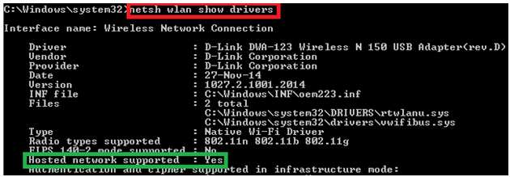

<iframe width="560" height="315" src="https://www.youtube.com/embed/HIHqXYVwFQ8" frameborder="0" allow="accelerometer; autoplay; encrypted-media; gyroscope; picture-in-picture" allowfullscreen></iframe>

This section covers common errors that can occur when using StageNow and offers advice on how to address them. 

-----

## XML Configuration Failure

####Problem
**The message "FMC download FTP File Read timed out"** (or something similar) appears in the device when staging completes. 

####Cause
**This error generally occurs when FTP is used during staging** to download a large file (greater than 1.5 GB) from a public server. 

####Solution
**Try using FTPS** instead of FTP for the file transfer. 

-----

## Wi-Fi Hotspot 

####Problem

**The message "Unable to turn on the Wi-Fi Hotspot"** (or something similar) appears when attempting to turn on the StageNow Wi-Fi Hotspot feature. 

####Cause
**This can occur if the Wi-Fi adapter in the host PC is not initialized** or is inactive when StageNow launches. 

####Solution 

Try the following steps to resolve the issue: 

##### Restart Wi-Fi Adapter

1. Right-click on the Network icon on the bottom right corner of the Windows host and select Open Network and Sharing Center to open the following screen.

   

2. On the left pane, select Change adapter settings.

   

3. Open a command prompt and enter "netsh wlan show drivers" to find the Wi-Fi driver adapter name.

   

4. Right-click on the network adapter in the Network Connections window and select Disable. 

5. Right-click again and select Enable. After a few minutes, try using the StageNow Tool.

##### Add Unsupported Hotspot

**Note**: Results that deviate from the following can be considered a Windows driver/software issue regarding the Wi-Fi hotspot. 

1. Open a command prompt as an Administrator.

2. Enter "netsh wlan show drivers" and locate the result message outlined in green below.

   

   The following message appears if the system does not support the Wi-Fi hotspot.

   

3. Enter the following command in the command prompt: 
"netsh wlan set hostednetwork mode=allow ssid=<HotspotName> key= <HotspotPassword>""

   Note: HotspotName is the name of Wi-Fi hotspot.

   HotspotPassword is the Wi-Fi hotspot password and must be at least 5 characters.

   The following result appears after successful creation of the Wi-Fi hotspot.
 
   

4. Enter "netsh wlan start hostednetwork" to start the hotspot. 
 
   

5. Enter "netsh wlan stop hostednetwork" to stop the hotspot. 
 
   

