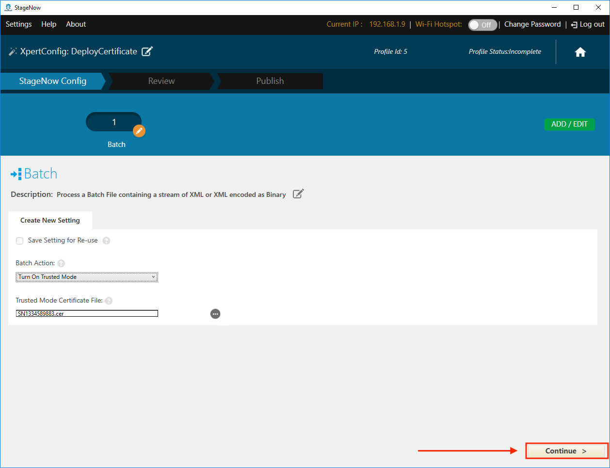
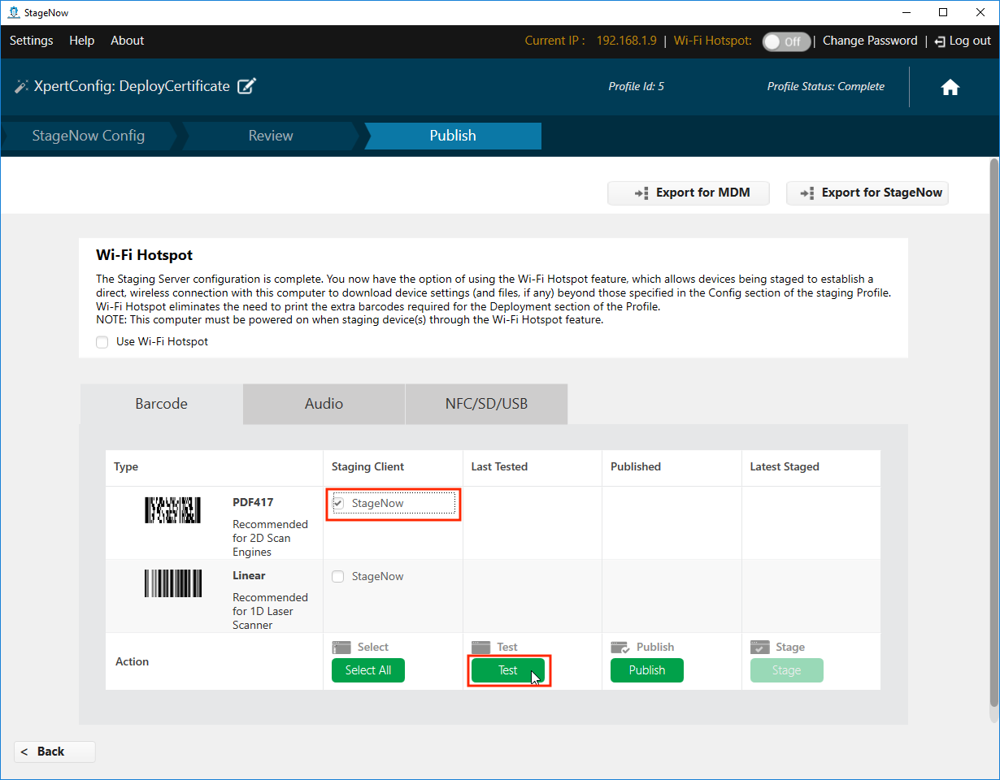
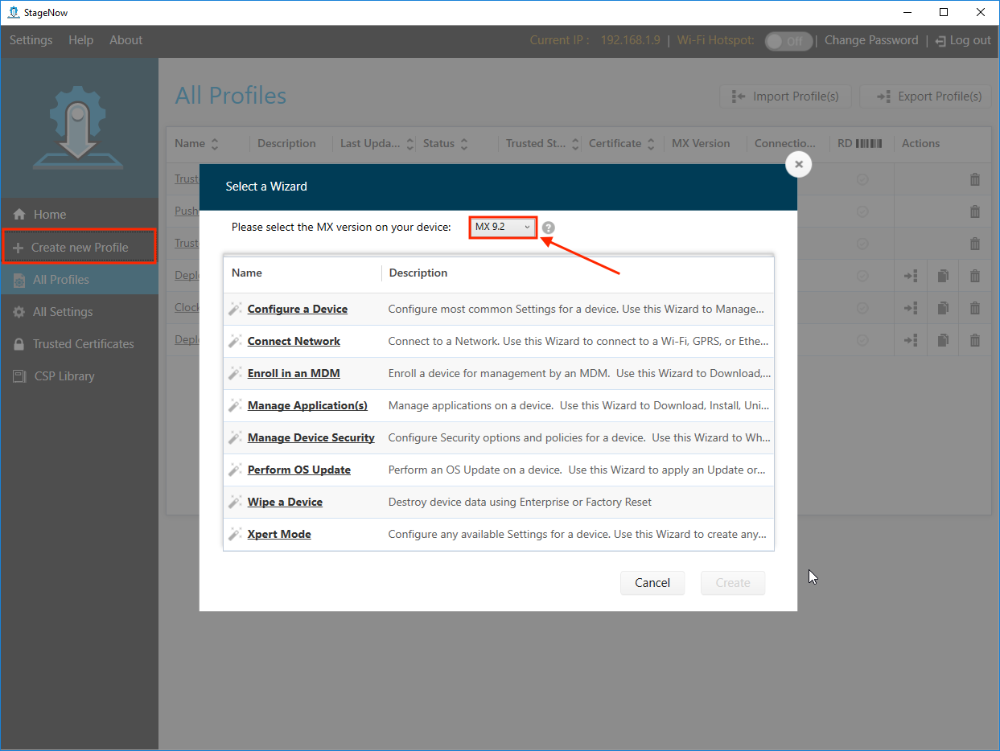
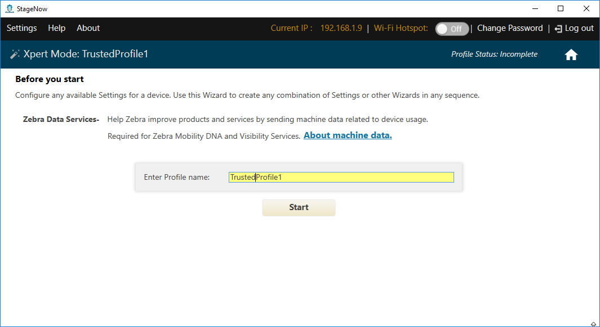
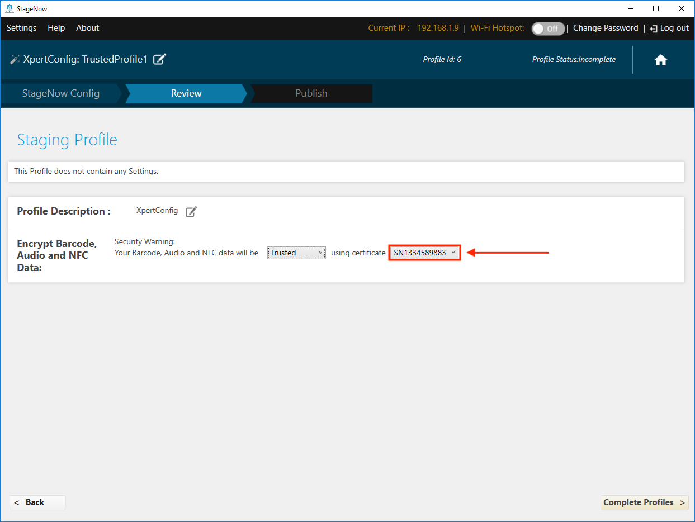
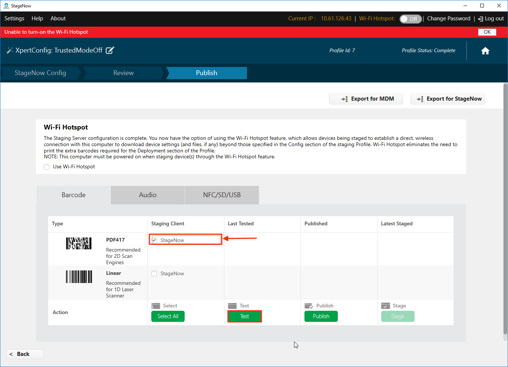
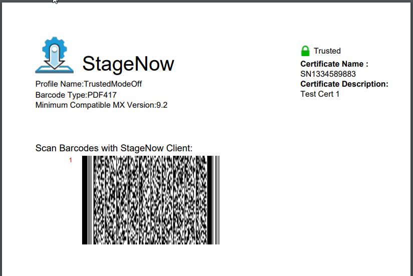

## Overview

**StageNow 4.0 (and higher) supports Trusted Staging**, which can protect devices with MX 9.2 and higher from unauthorized staging. Trusted devices are created from a security certificate. Once a certificate is used to create a trusted device, the device can be staged only from barcodes created using the same security certificate.

> **`IMPORTANT:`** Access to Trusted Staging and Trusted Devices is possible only by Windows users with administrative privileges.

#### Requirements: 

* StageNow 4.0 (or higher) installed
* Zebra device(s) with MX 9.2 or higher
* Self-signed security "Trusted Certificate" (`.pfx` file of 1024 bytes or less)

#### Process Snapshot:

1. Create a Trusted Certificate `.pfx` file (1024 bytes or less)
2. Import the Trusted Certificate into StageNow
3. Deploy the Trusted Certificate to device(s) to make them Trusted Device(s)  
 `NOTES:` 
 • This activates Trusted Staging on target device(s) 
 • Such device(s) no longer accept standard ("untrusted") Profiles
4. Create Trusted Profile(s) for use on Trusted Device(s)

-----

## Create a Trusted Device

### I. Import Certificate

> ***This process requires StageNow to be running in admin mode***. 

1. From the StageNow Home screen, **click the "Trusted Certificates" button**: 
 
 _Click image to enlarge; ESC to exit_. 
 
2. From the Trusted Certificates page, **select a previously imported certificate** from the list and skip to Step 5.  **To import a new certificate, click the "Import Certificate" button**: 
 
 _Click image to enlarge; ESC to exit_. 
 
 `CAUTION:` **Certificate files must NOT be greater than 1024 bytes in size**. 
3. **Navigate to the** `.pfx` **file being imported**:
  
  _Click image to enlarge; ESC to exit_. 
 
4. **Confirm that the imported file appears** in the list of Trusted Certificates similar to the image below. 
 **NOTE**: When imported, the `.pfx` file is encrypted and given a `.cer` file extension.
   
  _Click image to enlarge; ESC to exit_. 
 
5. **Create a staging profile that pushes the certificate to the device(s)** to become Trusted (next section).
 

#### Also see: [How to create a self-signed certificate](https://techdocs.zebra.com/enterprise-browser/latest/guide/certificates/)

-----

### II. Deploy Certificate to Device(s)

1. From the Home screen, **click the Create new Profile button**: 
  
  _Click image to enlarge; ESC to exit_. 
 
2. **Select "Xpert Mode" and the click "Create" button**: 
  
  _Click image to enlarge; ESC to exit_. 
 
3. **Enter a name** for the deployment profile and **click the "Start" button**:  
  
  _Click image to enlarge; ESC to exit_. 
 
4. **Click the plus (+) sign** on the "Batch" CSP line and **click the "Add" button**: 
  
  _Click image to enlarge; ESC to exit_. 
 
5. **Select "Turn On Trusted Mode"** from the drop-down menu:
  
  _Click image to enlarge; ESC to exit_. 
 
6. **Click the Navigation button** to bring up an "Open" dialog (shown in Step 7):
  
  _Click image to enlarge; ESC to exit_. 
 
7. **Navigate to and select the certificate file** (imported in Section I, Step 4) and **click the "Open" button**: 
 **NOTE**: When imported, the `.pfx` file is encrypted and given a `.cer` file extension.
  
  _Click image to enlarge; ESC to exit_. 
 
8. Confirm that the `.cer` file appears and **click the "Continue" button**: 
  
  _Click image to enlarge; ESC to exit_. 
 
9. **Select "Encrypted" from the drop-down menu** as shown and **click the "Complete Profiles" button**: 
  
  _Click image to enlarge; ESC to exit_. 
 
10. **Select the desired barcode type** for the staging client and **click the "Test" button** to generate barcodes: 
  
  _Click image to enlarge; ESC to exit_. 
 
11. **<u>Use the device(s) to be made Trusted</u> to scan the barcodes and deploy the certificate**: 
  
  _Click image to enlarge; ESC to exit_. 
 

> `IMPORTANT:` All devices that scan barcodes generated this way become "Trusted Devices" and can no longer be staged with standard "untrusted" staging Profiles; <u>they can be staged ONLY with Trusted Profiles created using the same certificate as was deployed to the device(s)</u>. 

-----

### III. Create Trusted Staging Profile

**Trusted Profiles are the same as standard ("untrusted") Profiles <u>with one important exception</u>**: The final step adds a "Trusted" designation and requires selection of a security certificate. 

#### To Create a Trusted Profile:

1. From the Home screen, **click the "Create new Profile" button**. Before selecting a Wizard, **be sure that MX 9.2 (or higher) is selected from the drop-down menu**: 
  
  _Click image to enlarge; ESC to exit_. 
 
1. When naming, **Zebra recommends selecting names that make the Profile easy to identify later**: 
  
  _Click image to enlarge; ESC to exit_. 
 
2. In the final step of Profile creation, **select "Trusted" from the drop-down menu**: 
  
  _Click image to enlarge; ESC to exit_. 
 
3. **From the the drop-down menu of certificates previously imported, <u>select the certificate that matches the one deployed to target device(s)</u>**: 
  
  _Click image to enlarge; ESC to exit_. 
 

**Trusted Profiles are identified in Profile lists by a green lock icon** as in the sample image below: 
  
  _Click image to enlarge; ESC to exit_. 
 

#### `IMPORTANT:` Trusted Devices can be staged ONLY with a Trusted Profile that contains the same certificate as was deployed to those devices. 

#### See the [Staging Profiles Guide](../stagingprofiles) for further details. 

-----

## Turn Off Trusted Mode

If it becomes necessary to remove a device from Trusted Mode, simply create a Trusted Profile and select "Turn Off Trusted Mode" using the Batch CSP. Details are below. 

#### To create a Trusted Profile turning off Trusted Mode: 

1. From the Home screen, **click the Create new Profile button**: 
  
  _Click image to enlarge; ESC to exit_. 
 
2. **Select "Xpert Mode" and the click "Create" button**: 
  
  _Click image to enlarge; ESC to exit_. 
 
3. **Enter a name** for the deployment profile and **click the "Start" button**:  
  
  _Click image to enlarge; ESC to exit_. 
 
4. **Click the plus (+) sign** on the "Batch" CSP line and **click the "Add" button**: 
  
  _Click image to enlarge; ESC to exit_. 
 
5. **Select "Turn Off Trusted Mode"** from the drop-down menu and **click the "Continue" button**:
  
  _Click image to enlarge; ESC to exit_. 
 
5. **Select "Trusted"** from the drop-down menu,   select the same certificate file used to put the device into Trusted Mode from its drop-down menu and  **click the "Complete Profiles" button**:
  
  _Click image to enlarge; ESC to exit_. 
 
6. **Select the desired barcode type** for the staging client and **click the "Test" button** to generate barcodes:
  
  _Click image to enlarge; ESC to exit_. 
 
11. **<u>Use the device(s) to be removed from Trusted Mode</u> to scan the barcodes**:
  
  _Click image to enlarge; ESC to exit_. 
 

**The device is now removed from Trusted Mode and can be staged using ordinary staging Profiles**. 

-----

